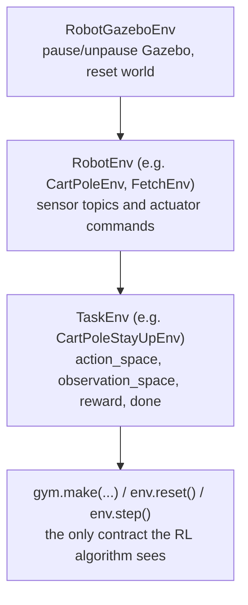

# Using OpenAI with ROS — Unit 1: Introduction to the Course

This course teaches `openai_ros`, a package originally built by The Construct that wraps ROS/Gazebo robot simulations behind the OpenAI Gym API, so you can point standard reinforcement-learning (RL) algorithms at a simulated robot exactly as you would at any Gym environment. This unit previews the architecture you'll be building against for the rest of the course and gets your workspace ready.

The diagram below shows how the three `openai_ros` layers inherit from each other and where the Gym-facing contract sits on top.



## Why bridge ROS and Gym-style RL

ROS is built around asynchronous topics, services, and callbacks — a good fit for real-time robot control, but a poor fit for RL libraries, which expect a synchronous `env.reset()` / `env.step(action)` loop that blocks until the next observation and reward are ready. `openai_ros` is the adapter layer: it drives Gazebo (pause/unpause physics, reset the world) and the robot's ROS interfaces underneath, while exposing the clean, synchronous Gym contract on top. Every algorithm you use later in this course — tabular Q-learning, DeepQ, HER — is written against that Gym contract and has no idea ROS exists underneath it.

Note on terminology: this course (and the underlying package) predates the split of OpenAI Gym into the community-maintained `gymnasium` fork. The `reset()`/`step()`/`action_space`/`observation_space` contract you'll learn is unchanged across both, so everything here transfers directly if your toolchain uses `gymnasium`.

## The layered architecture

`openai_ros` splits every environment into three layers, each a Python class that inherits from the one below it:

1. **`RobotGazeboEnv`** — the generic base. Knows how to pause/unpause Gazebo physics and reset the simulation world. You never touch this directly.
2. **`RobotEnv`** (one per *robot*, e.g. `CartPoleEnv`, `FetchEnv`) — knows the robot's topics: which topics to subscribe to for sensor data, which publishers/services to use to command actuators. No task logic lives here — no reward, no notion of "success."
3. **`TaskEnv`** (one per *task on that robot*, e.g. `CartPoleStayUpEnv`) — defines `action_space`, `observation_space`, the reward function, and the episode-termination condition. This is where your RL problem is actually specified.

```python
import gym
from openai_ros.task_envs.cartpole_stay_up import stay_up

env = gym.make("CartPoleStayUp-v0")
obs = env.reset()
obs, reward, done, info = env.step(env.action_space.sample())
```

Splitting `RobotEnv` from `TaskEnv` is the key idea to internalize now: it means you can define several different tasks (balance, swing-up, reach-a-target) for the same robot without rewriting how you talk to its sensors and motors, which is exactly the pattern you'll use in Units 3-5 when you port a new robot in yourself.

## What you'll need installed

- A working ROS installation with Gazebo, and a catkin or colcon workspace you can build into.
- Python's `gym` (or `gymnasium`) package, plus `numpy`.
- The `openai_ros` package itself, built into your workspace alongside the example robot packages (CartPole, Moving Cube, Fetch) used later in the course.
- For Units 7-10: OpenAI Baselines (or a modern equivalent implementing DeepQ / DDPG+HER) installed in the same Python environment your training scripts run in.

Check your Gym install works before touching ROS at all:

```bash
python3 -c "import gym; print(gym.__version__)"
```

## How the course is organized

Units 2 builds and runs a complete example (CartPole) so you see the whole pipeline end to end. Units 3-5 have you port a second robot (the Moving Cube, nicknamed "RoboCube") from scratch across all three layers, which is the skill that generalizes to any robot you'll want to train later. Unit 6 covers persisting what you've learned. Units 7-8 swap the learning algorithm from tabular Q-learning to a neural-network-based one. Units 9-10 tackle a more complex, goal-conditioned robot (Fetch). Unit 11 is a capstone project with no more hand-holding.

## Try it yourself

Create (or identify) a ROS workspace on your machine, confirm `gym` imports, and run `roscore` (or your distro's equivalent) alongside `gzserver` to confirm Gazebo starts headless. Write down, in your own words, which of the three `openai_ros` layers you'd expect a change to "make the cart heavier" to live in versus a change to "reward the agent for keeping the pole more precisely vertical."
