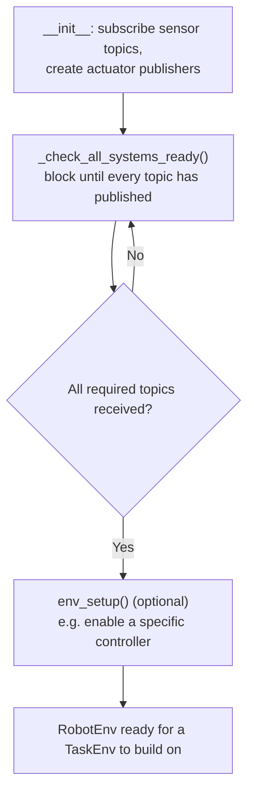

# Using OpenAI with ROS — Unit 3: Exploring the OpenAI Structure: RoboCube. Part 1

Unit 2 walked through an existing environment. This unit — the first of three on "RoboCube," a moving cube balanced on a single actuated disk — starts the more valuable skill: porting a robot you don't already have wired into `openai_ros`. Part 1 covers the scaffolding decisions you make before writing a line of environment logic.

The flowchart below shows the order every `RobotEnv` subclass follows before it can be considered ready, which is the contract this unit introduces.



## Anatomy of a new openai_ros robot package

A new robot integration is typically its own ROS package with a predictable layout:

```
my_cube_training/
├── config/           # hyperparameters, YAML for the task
├── launch/           # launch file that starts Gazebo + spawns the robot + starts training
├── scripts/          # training entry point (start_training.py)
└── src/my_cube_training/
    ├── robot_env.py  # RobotEnv subclass — sensors & actuators only
    └── task_env.py   # TaskEnv subclass — reward, obs, action spaces
```

Keeping `robot_env.py` and `task_env.py` as separate files (mirroring the two-layer split from Unit 1) isn't required by Gym, but it's what keeps a robot integration reusable: if you later want to train the cube to roll a specific distance instead of just staying balanced, you write a new `TaskEnv` and change nothing in `robot_env.py`.

## Required RobotEnv methods

Every `RobotEnv` subclass needs to implement a small, fixed contract that `RobotGazeboEnv` calls into:

- **`_check_all_systems_ready()`** — block until every sensor topic has published at least once. This prevents `reset()` from ever handing the agent a `None` or stale observation.
- **Sensor callbacks** — one per subscribed topic, each just storing `msg` on `self` for later reading.
- **`env_setup()`** *(optional)* — one-time setup that runs after the ROS connections are confirmed live but before training starts, useful for things like enabling a specific controller.

```python
class MyCubeSingleDiskEnv(RobotGazeboEnv):
    def __init__(self):
        super().__init__(robot_name_space="moving_cube", ...)
        rospy.Subscriber("/moving_cube/joint_states", JointState, self._joints_cb)
        self._cmd_pub = rospy.Publisher(
            "/moving_cube/inertia_wheel_roll_joint_velocity_controller/command",
            Float64, queue_size=1)
        self._check_all_systems_ready()

    def _joints_cb(self, msg):
        self.joints = msg
```

## Actuator interface: publishers and controller switching

Gazebo robots are commonly driven through `ros_control` controllers (position, velocity, or effort). Part of standing up a new `RobotEnv` is deciding — once, at the robot level, not the task level — which controller type you'll command through, and whether you need to switch controllers at runtime via the `controller_manager` service. Get this decision right here; every `TaskEnv` you build on top inherits it.

```bash
rosservice call /moving_cube/controller_manager/switch_controller \
  "{start_controllers: ['inertia_wheel_roll_joint_velocity_controller'], stop_controllers: [], strictness: 2}"
```

## Mapping RoboCube's topics into the RobotEnv

RoboCube has one actuated joint (the internal disk that rolls to shift the cube's center of mass) and reports its state on `/moving_cube/joint_states`, the same pattern as CartPole's rail joint. The mapping exercise — "which real topic feeds which `RobotEnv` field" — is exactly what you'll formalize into working code in Unit 4.

## Try it yourself

Run `rostopic list` and `rostopic info <topic>` against any robot description you have available (RoboCube, a TurtleBot, or even a simple diff-drive robot in simulation) and produce a two-column table: ROS topic name on the left, the `RobotEnv` responsibility it maps to (a sensor callback, an actuator publisher, or neither) on the right.
