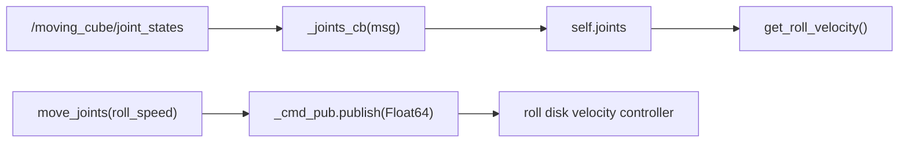

# Using OpenAI with ROS — Unit 4: Exploring the OpenAI Structure: RoboCube. Part 2

Part 1 planned the scaffolding; this unit fills in the actual `RobotEnv` for the Moving Cube — a cube that balances and rolls on one edge by spinning an internal disk in the roll axis. By the end you'll have a robot-level class that reads the disk's state and commands it, with no task or reward logic yet.

The diagram below maps how sensor data flows in from `/joint_states` and how commands flow out to the roll disk controller.



## The Moving Cube hardware/simulation model

The cube has a single revolute joint connecting the outer shell to an internal disk. Spinning that disk fast in one direction applies a reaction torque to the shell (conservation of angular momentum), which is how the cube rolls or rights itself — the same principle as a reaction-wheel or CMG-based attitude control system used on spacecraft, just applied at toy scale. Everything the `RobotEnv` needs to expose comes down to: what's the disk's current angle/velocity, and how do we command its speed.

## Reading joint state via /joint_states

`/joint_states` (a `sensor_msgs/JointState`) carries parallel arrays — `name`, `position`, `velocity`, `effort` — one entry per joint in the model. For a single-joint robot like this, index `[0]` is all you need, but always resolve by name rather than assuming index order, since Gazebo doesn't guarantee it stays stable across model changes.

```python
def _joints_cb(self, msg):
    self.joints = msg

def get_roll_velocity(self):
    idx = self.joints.name.index("inertia_wheel_roll_joint")
    return self.joints.velocity[idx]
```

## Commanding effort via a roll disk controller

Actuation goes the other direction: publish a `Float64` target to the disk's velocity (or effort) controller command topic. Wrap it in a method rather than letting the `TaskEnv` publish directly — that boundary is what keeps the `TaskEnv` ignorant of ROS message types entirely.

```python
def move_joints(self, roll_speed):
    self._cmd_pub.publish(Float64(data=roll_speed))
```

## Implementing MyCubeSingleDiskEnv (RobotEnv skeleton)

Putting it together, the `RobotEnv` layer for RoboCube is deliberately thin — it exposes primitive get/set operations and nothing that looks like a decision:

```python
class MyCubeSingleDiskEnv(RobotGazeboEnv):
    def __init__(self):
        super().__init__(controllers_list=["inertia_wheel_roll_joint_velocity_controller"],
                          robot_name_space="moving_cube")
        rospy.Subscriber("/moving_cube/joint_states", JointState, self._joints_cb)
        self._cmd_pub = rospy.Publisher(
            "/moving_cube/inertia_wheel_roll_joint_velocity_controller/command",
            Float64, queue_size=1)
        self.joints = None
        self._check_all_systems_ready()

    def _check_all_systems_ready(self):
        while self.joints is None and not rospy.is_shutdown():
            self.joints = rospy.wait_for_message(
                "/moving_cube/joint_states", JointState, timeout=5.0)
        return True

    def get_roll_velocity(self):
        return self.joints.velocity[self.joints.name.index("inertia_wheel_roll_joint")]

    def move_joints(self, roll_speed):
        self._cmd_pub.publish(Float64(data=roll_speed))
```

Notice this class compiles and runs standalone — you could drive the cube from a Python REPL using only `move_joints` and `get_roll_velocity` — before any Gym or RL code touches it at all. That's a useful way to sanity-check a `RobotEnv`: it should be testable with nothing but ROS.

## Try it yourself

Extend the skeleton above with a `get_cube_orientation()` method that reads the cube shell's tilt (from an IMU topic or `/gazebo/model_states`, whichever is available in your setup) and returns it as a single float angle. This is the sensor Unit 5's reward function will actually depend on.
