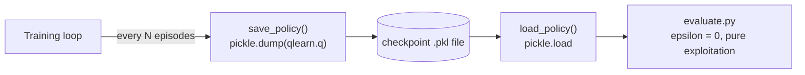

# Using OpenAI with ROS — Unit 6: Save and Load the Learned Policy

Training the RoboCube agent in Unit 5 is worthless if the result evaporates the moment the script exits. This unit covers persisting a learned policy to disk and loading it back for evaluation — a small piece of engineering that matters far more in practice than its size suggests, since every later unit (DeepQ, HER) needs the same checkpoint discipline.

The diagram below shows how a policy moves from the training loop to disk and back into an evaluation-only run.



## What "the policy" actually is for tabular Q-learning

For the `QLearn` class from Unit 5, the entire learned policy *is* the `self.q` dictionary — a mapping from `(discretized_state, action)` pairs to a float. There's no separate "model" to export; if you serialize that one dictionary, you've serialized everything the agent knows. This is worth stating explicitly because it changes in Unit 7: once you move to a neural network, "the policy" becomes a set of weight tensors instead of a dict, and the save/load mechanics change with it (framework checkpoint format instead of pickle).

## Saving the Q-table with pickle or JSON

`pickle` is the simplest option since the dict's keys are Python tuples, which JSON can't represent directly. If you want a human-readable format instead, convert tuple keys to strings first.

```python
import pickle
import rospkg

def save_policy(qlearn, filename="cube_policy.pkl"):
    pkg_path = rospkg.RosPack().get_path("my_cube_training")
    path = f"{pkg_path}/checkpoints/{filename}"
    with open(path, "wb") as f:
        pickle.dump(qlearn.q, f)
    print(f"saved {len(qlearn.q)} state-action entries to {path}")
```

Using `rospkg` to resolve the package path (rather than a hardcoded absolute path) is what keeps this portable across machines and CI.

## Loading a saved policy for evaluation-only runs

Loading is the mirror image, and it's what lets you write a separate `evaluate.py` script that never calls `qlearn.learn()` — it just loads the table and always exploits (epsilon forced to 0), which is exactly what you want when demonstrating or benchmarking a trained agent.

```python
def load_policy(qlearn, filename="cube_policy.pkl"):
    pkg_path = rospkg.RosPack().get_path("my_cube_training")
    with open(f"{pkg_path}/checkpoints/{filename}", "rb") as f:
        qlearn.q = pickle.load(f)
    qlearn.epsilon = 0.0  # pure exploitation, no more exploring
```

```python
# evaluate.py
qlearn = QLearn(actions=[0, 1, 2])
load_policy(qlearn)
state = discretize(env.reset())
for t in range(500):
    action = qlearn.choose_action(state)
    obs, reward, done, _ = env.step(action)
    state = discretize(obs)
    if done:
        break
```

## Versioning and organizing checkpoints

Once you're iterating on hyperparameters (Units 7-8 change the algorithm entirely), a single fixed filename becomes a liability — you'll overwrite a good policy with a worse one without noticing. Cheap habits that pay off: save with a timestamp or episode count in the filename, save periodically during training (not only at the end, in case a long run crashes), and keep a small text or JSON sidecar file recording the hyperparameters used, so a checkpoint is never separated from the config that produced it.

```python
import time
save_policy(qlearn, filename=f"cube_policy_ep{episode}_{int(time.time())}.pkl")
```

## Try it yourself

Modify the Unit 5 training loop to call `save_policy()` every 100 episodes instead of only once at the end, with the episode number in the filename. Then write a short `evaluate.py` that loads the *earliest* saved checkpoint and the *latest* one, runs one episode with each, and prints which survived longer.
