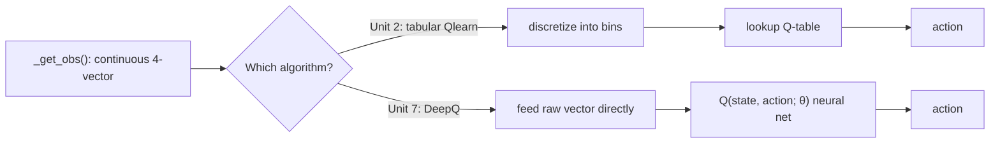

# Using OpenAI with ROS — Unit 7: Modifying the Learning Algorithm: CartPole

Everything so far has trained with tabular Q-learning, which only scales to a handful of discretized state buckets. This unit swaps the algorithm underneath the CartPole `TaskEnv` from Unit 2 for Deep Q-Networks (DQN), specifically OpenAI Baselines' `deepq` implementation — while changing nothing about the ROS or Gazebo side of the environment at all, which is the whole point of the Gym boundary from Unit 1.

The diagram below contrasts the old discretize-then-lookup path with the new raw-vector-into-network path this unit introduces.



## Why move from tabular Q-learning to Deep Q-Networks

A table entry per `(discretized_state, action)` pair works when the state space is small and coarse. Two problems show up as you scale it up: the table grows exponentially with the number of bins per dimension, and discretization throws away precision — two genuinely different pole angles that land in the same bucket are treated as identical states. A DQN replaces the table with a neural network, `Q(state, action; θ)`, trained so its output approximates the same Bellman target the tabular update used, but generalizing across *nearby* continuous states instead of requiring every state to be visited individually.

## Adjusting the Task Environment for continuous observations

This is the only change required inside `openai_ros` itself: stop discretizing. `_get_obs()` already returns a continuous 4-vector (cart position/velocity, pole angle/velocity) — in Unit 2 you fed that through a `discretize()` step before handing it to `QLearn`; for DeepQ you feed the raw vector straight into the network. `observation_space` should already be declared as a continuous `Box`, not touched by any binning helper:

```python
self.observation_space = spaces.Box(
    low=np.array([-2.5, -np.inf, -0.28, -np.inf]),
    high=np.array([2.5, np.inf, 0.28, np.inf]),
    dtype=np.float32,
)
```

## Calling baselines' deepq.learn on the ROS environment

Because `env` still satisfies the Gym interface, `deepq.learn` (or a modern equivalent DQN trainer, e.g. Stable-Baselines3's `DQN`) can be pointed at it directly — it has no idea the `step()` calls underneath are actually publishing ROS messages and stepping Gazebo physics.

```python
from baselines import deepq

def callback(lcl, glb):
    return lcl["episode_rewards"][-1] >= 195.0  # stop once solved

model = deepq.learn(
    env,
    network="mlp",
    lr=1e-3,
    total_timesteps=100_000,
    buffer_size=50_000,
    exploration_fraction=0.1,
    exploration_final_eps=0.02,
    print_freq=10,
    callback=callback,
)
model.save("cartpole_deepq.pkl")
```

## Key DeepQ hyperparameters to tune

- **`lr` (learning rate)** — too high and Q-values diverge/oscillate; too low and training crawls. Start around `1e-3` and adjust by 10x in either direction if training looks unstable or stalled.
- **`buffer_size` (replay buffer)** — DQN trains on randomly sampled past transitions, not just the latest one, which breaks the correlation between consecutive samples. Too small a buffer reintroduces that correlation.
- **`exploration_fraction` / `exploration_final_eps`** — controls how epsilon decays from 1.0 toward a small floor over training; decaying too fast means the agent commits to a bad policy before exploring enough of the state space.
- **`total_timesteps`** — ROS+Gazebo training is *slow* wall-clock time compared to a pure-software Gym env (real-time physics stepping), so budget accordingly and log progress rather than waiting for a fixed run to finish blind.

## Try it yourself

Take the `deepq.learn` call above and change it so it evaluates every 5,000 timesteps (run 5 episodes with exploration off, log average reward) instead of relying only on the built-in `callback`. Sketch the evaluation function's signature and what it needs to read from `model` to act greedily.
