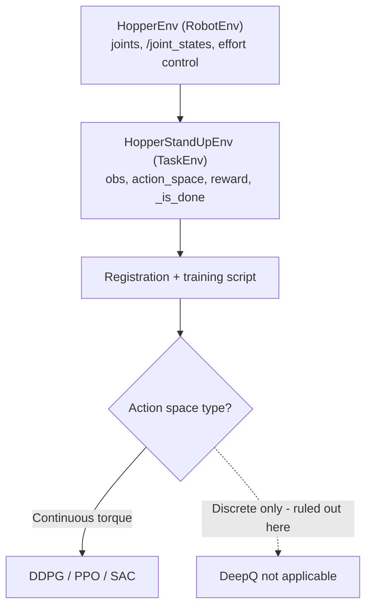

# Using OpenAI with ROS — Unit 11: Project: Training a Hopper Robot

This is the capstone: build the full `openai_ros` stack — `RobotEnv`, `TaskEnv`, algorithm choice, and reward design — for a robot the course hasn't already walked you through: a single-legged Hopper that has to hop forward without falling over. There's no scaffolding handed to you this time; the unit is a project brief plus the design questions you need to answer, in the order Units 3-10 taught you to answer them.

The diagram below traces the build order this capstone follows, from `RobotEnv` through to picking a continuous-control algorithm.



## Scoping the Hopper project: what layers you need to build

Work through the same layer order every prior robot used:

1. **`RobotEnv` (`HopperEnv`)** — what are the leg's joints (hip, knee, and often an ankle/foot spring), what does `/joint_states` give you, and what's the actuation interface (effort control at each joint is typical for legged robots, since velocity/position control fights the ballistic, bouncing nature of hopping).
2. **`TaskEnv` (`HopperStandUpEnv` or similar)** — define `action_space`, `observation_space`, reward, and `_is_done` for "hop forward without falling," mirroring the CartPole and RoboCube `TaskEnv`s from Units 2 and 5 in structure even though the physics is harder.
3. **Registration + training script** — same `register()` + Gym-loop pattern from Unit 2, pointed at whichever algorithm you choose below.

## Choosing an algorithm for continuous torque control

Hopper's action space — torque or target angle at each joint — is naturally continuous, which immediately rules out the DeepQ approach from Units 7-8 (DQN requires discrete actions). This leaves you the same family Unit 10 introduced for Fetch: a continuous-control algorithm such as DDPG, or a more modern and generally more stable choice like PPO or SAC if your Baselines-equivalent library offers them.

Unlike Fetch, Hopper's task isn't naturally goal-conditioned (there's no single "target position" — the goal is an ongoing behavior, forward hopping), so HER's relabeling trick from Unit 10 doesn't apply directly here. Reach for it only if you reframe the task as goal-conditioned (e.g. "hop to reach a specific x-position"); for straightforward forward locomotion, a dense, hand-shaped reward (below) is the more standard approach.

## Reward design for locomotion tasks

Locomotion rewards are usually a weighted sum of several terms, not one clean signal — this is the sharpest departure from every earlier unit's reward function:

```python
def _compute_reward(self, obs, done):
    forward_velocity = obs["torso_x_velocity"]
    upright_bonus = 1.0 if abs(obs["torso_tilt"]) < self.max_tilt else 0.0
    control_cost = 0.001 * np.sum(np.square(self.last_action))
    fall_penalty = -100.0 if done else 0.0
    return forward_velocity + upright_bonus - control_cost + fall_penalty
```

- **Forward velocity** rewards actual progress, which is the point of the task.
- **Upright bonus** discourages "successful" strategies that happen to involve toppling forward.
- **Control cost** (small penalty on large actions) discourages jittery, high-torque policies that would be unrealistic or damaging on real hardware.
- **Fall penalty** ends the episode decisively rather than letting the agent linger in a collapsed state accumulating whatever small reward remains available.

Each weight here is a hyperparameter you'll need to tune by observation — a fall penalty too small relative to forward velocity, for instance, can produce a policy that "dives" forward for a burst of velocity reward right before every fall.

## Debugging checklist for a from-scratch openai_ros environment

When a new environment like this doesn't train (a near-certainty on the first few attempts), work through this list before touching the algorithm's hyperparameters:

1. **Confirm the `RobotEnv` in isolation** — drive it manually (publish a few commands, read the resulting joint states) with no Gym or RL code involved at all, exactly as suggested in Unit 4.
2. **Log raw `_get_obs()` and `_compute_reward()` output** for a handful of random-action steps before starting real training — sanity-check the numbers are in the ranges you expect, not e.g. always zero because a topic name is wrong.
3. **Verify `_is_done()` actually triggers** — an episode that never ends (because your "fell over" condition is unreachable) silently breaks every algorithm's assumptions about episode boundaries.
4. **Start with a trivially short episode length** and confirm the loop runs end-to-end and checkpoints save (Unit 6) before committing to a long, expensive training run.

## Try it yourself

Write the project plan for Hopper as a short checklist covering, in order: the `RobotEnv` methods you'll implement, the `TaskEnv`'s observation/action/reward design, which algorithm you're choosing and why, and which item from the debugging checklist above you'd expect to catch first given how the rest of this course's environments have typically broken on a first attempt.
