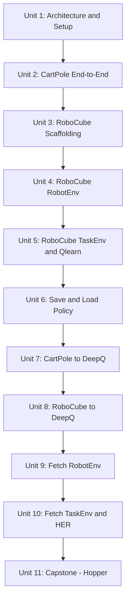

# Using OpenAI with ROS

This course teaches `openai_ros`, the framework (originally built by The Construct) that wraps ROS/Gazebo robot simulations behind the OpenAI Gym API so standard reinforcement-learning algorithms can train against them with a plain `reset()`/`step()` loop. You'll trace a complete example (CartPole), then port a second robot (the Moving Cube, "RoboCube") into the framework from scratch across its `RobotEnv`/`TaskEnv` layers, learn to persist and reload trained policies, swap the learning algorithm from tabular Q-learning to Deep Q-Networks, tackle a more complex goal-conditioned robot (Fetch) with Hindsight Experience Replay, and finish with an open-ended capstone project training a Hopper robot to locomote.

The diagram below traces how each unit builds on the skills and code produced by the one before it.

1. [Introduction to the Course](01-introduction-to-the-course.md) — The three-layer `openai_ros` architecture (`RobotGazeboEnv`, `RobotEnv`, `TaskEnv`), required tooling, and the course roadmap.
2. [Exploring the OpenAI Structure: CartPole](02-exploring-the-openai-structure-cartpole.md) — The full CartPole workflow end to end: sensors, actuators, reward/done logic, registration, and running a training loop.
3. [Exploring the OpenAI Structure: RoboCube. Part 1](03-exploring-the-openai-structure-robocube-part-1.md) — Scaffolding a new robot package and the required `RobotEnv` method contract.
4. [Exploring the OpenAI Structure: RoboCube. Part 2](04-exploring-the-openai-structure-robocube-part-2.md) — Implementing the Moving Cube's `RobotEnv`: reading joint state and commanding the roll disk.
5. [Exploring the OpenAI Structure: RoboCube. Part 3](05-exploring-the-openai-structure-robocube-part-3.md) — Designing the `TaskEnv` (obs, actions, reward), discretizing state, and training with tabular Qlearn.
6. [Save and Load the Learned Policy](06-save-and-load-the-learned-policy.md) — Persisting a Q-table with pickle, loading it for evaluation-only runs, and checkpoint hygiene.
7. [Modifying the Learning Algorithm: CartPole](07-modifying-the-learning-algorithm-cartpole.md) — Swapping tabular Q-learning for OpenAI Baselines DeepQ and the hyperparameters that matter.
8. [Modifying the Learning Algorithm: RoboCube](08-modifying-the-learning-algorithm-robocube.md) — Porting RoboCube to DeepQ, comparing against the Qlearn baseline, and diagnosing unstable training.
9. [Training a Fetch Robot. Part 1](09-training-a-fetch-robot-part-1.md) — Building Fetch's `RobotEnv`: joint state, end-effector pose via tf2, and joint-trajectory vs Cartesian control.
10. [Training a Fetch Robot. Part 2](10-training-a-fetch-robot-part-2.md) — Goal-conditioned observations, sparse rewards, and training with Hindsight Experience Replay (HER) + DDPG.
11. [Project: Training a Hopper Robot](11-project-training-a-hopper-robot.md) — Capstone: build every layer for a new legged robot, choose a continuous-control algorithm, design a locomotion reward, and debug a from-scratch environment.
