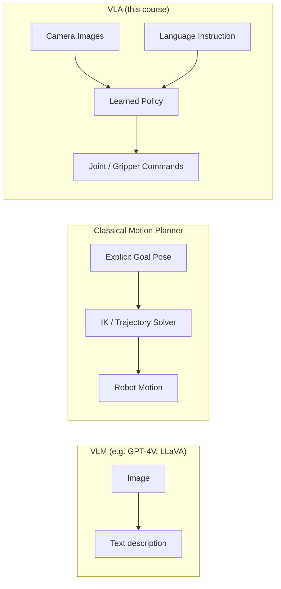

# VLAs with ALOHA for robotics — Unit 1: Introduction to the Course

This unit sets the map for everything that follows: what a Vision-Language-Action (VLA) model actually is, why ALOHA became a reference platform for learning manipulation from demonstration, and how the three learning techniques in this course — behavioral cloning, actor-critic reinforcement learning, and Action Chunking Transformers (ACT) — relate to each other rather than being three unconnected topics.

The diagram below contrasts a VLA's vision+language-to-action mapping with the two things it's often confused for.

## What a VLA is, and what it isn't
A Vision-Language-Action model takes camera images (vision) and, often, a natural-language instruction ("pick up the red block") as input, and outputs low-level robot actions — joint positions, end-effector deltas, or gripper commands — as output. This is different from two things people often conflate it with:

- **A VLM (Vision-Language Model)** like GPT-4V or LLaVA describes or reasons about images in text. It does not output motor commands.
- **A classical motion planner** (e.g. MoveIt with an inverse-kinematics solver) takes an explicit goal pose and computes a collision-free trajectory using geometry, not learned perception.

A VLA sits between these: it learns, from data, the mapping "what I see + what I'm told to do" -> "what my joints should do next." That mapping is learned end-to-end rather than hand-coded, which is both the appeal (it generalizes to visual variation a hard-coded planner can't) and the challenge (it needs training data and doesn't come with geometric guarantees).

## Why ALOHA specifically
ALOHA (A Low-cost Open-source Hardware System for Bimanual Teleoperation) is not itself a VLA model — it's a hardware and data-collection platform, originally from a Stanford/UC Berkeley research group, later extended by work at Google DeepMind (e.g. ALOHA Unleashed, Mobile ALOHA). It matters to this course for a practical reason: it made bimanual (two-arm) fine manipulation data collection cheap enough that many labs and hobbyists could reproduce it, which in turn made it the dataset/benchmark of choice for the ACT algorithm you'll build in Unit 4.

You don't need physical ALOHA hardware to follow this course. The concepts — behavioral cloning, actor-critic RL, action chunking — apply to any manipulator with a camera and teleoperation or scripted demonstration capability, including a simulated arm in Gazebo or MuJoCo.

## What "bimanual" adds to the difficulty
Most manipulation tutorials use a single arm. ALOHA's defining feature is two coordinated arms, and that changes the problem in ways worth naming up front:

- **Action space doubles**, and the two arms' actions are correlated — e.g. handing an object from one gripper to the other requires the two policies (or the one joint policy) to be mutually consistent at every timestep, not just individually reasonable.
- **Occlusion and viewpoint matter more.** A single wrist camera on one arm can be blocked by the other arm's own motion, which is part of why ALOHA setups typically use multiple cameras (e.g. one overhead, one per wrist).
- **Demonstration collection itself gets harder.** Teleoperating two arms at once with a keyboard or single joystick doesn't scale, which is precisely why ALOHA's leader-follower hardware (a human moves two small passive "leader" arms that are kinematically linked to the two active "follower" arms) exists as a physical solution — you'll see the data this produces referenced again in Unit 2.

## How the three units ahead connect
- **Unit 2 (Imitation Learning)** teaches the baseline approach: record a human (or scripted) demonstration, train a policy to copy it via supervised learning. This is behavioral cloning (BC) — simple, but brittle when the robot drifts off the demonstrated states.
- **Unit 3 (Actor-Critic RL)** introduces reward-driven learning as a complement: instead of only copying demonstrations, the policy (actor) improves through trial and error, guided by a learned value estimate (critic).
- **Unit 4 (ACT)** combines ideas from both worlds into the technique actually used to train ALOHA policies: imitation learning, but predicting whole *chunks* of future actions at once instead of one timestep at a time, which is what makes bimanual manipulation stable enough to work in practice.

By the end of the course you'll understand not just how to run ACT, but why each earlier piece (BC's supervised objective, actor-critic's value estimation) exists and where ACT departs from them.

## Try it yourself
Before writing any code, sketch (on paper or in a text file) the input/output signature of a VLA policy for a task you find interesting — e.g. "sort recycling" or "stack three blocks." Write out: (1) what sensor inputs it needs, (2) what the language instruction would look like, (3) what the action output vector contains (how many dimensions, what each one means for your robot). You'll reuse this sketch as the running example in Units 2-4.
