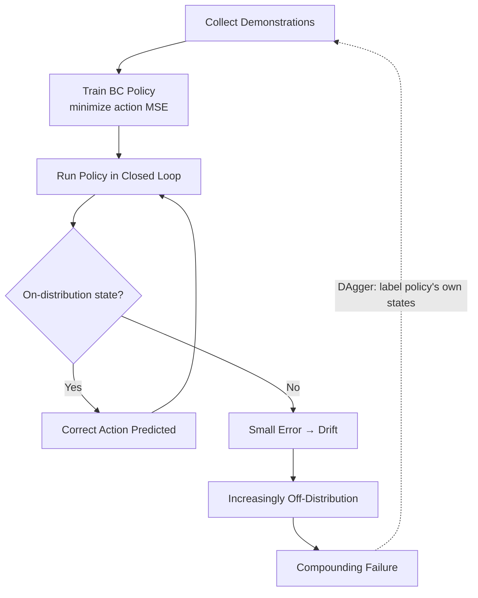

# VLAs with ALOHA for robotics — Unit 2: Imitation Learning

Imitation learning is the foundation everything else in this course builds on: instead of hand-coding a controller or defining a reward function, you collect examples of the behavior you want and train a model to reproduce it. This unit works through Behavioral Cloning (BC), the simplest and most widely used imitation learning algorithm, including why it breaks and the classic fixes.

The flowchart below traces how a small per-step error at deployment compounds into failure, and where DAgger closes the loop back to the training set.



## Framing manipulation as supervised learning
A demonstration is a sequence of (observation, action) pairs: at each timestep t, the robot was in some state (camera image, joint positions) and a demonstrator (human teleoperator, or a scripted policy) issued some action (target joint positions, gripper open/close). Behavioral cloning treats this exactly like any other supervised learning problem: the observations are your inputs `X`, the actions are your labels `y`, and you train a model to minimize the difference between its predicted action and the demonstrated one.

```python
import torch
import torch.nn as nn

class BCPolicy(nn.Module):
    def __init__(self, obs_dim, action_dim, hidden=256):
        super().__init__()
        self.net = nn.Sequential(
            nn.Linear(obs_dim, hidden), nn.ReLU(),
            nn.Linear(hidden, hidden), nn.ReLU(),
            nn.Linear(hidden, action_dim),
        )

    def forward(self, obs):
        return self.net(obs)

def bc_loss(policy, obs_batch, action_batch):
    pred = policy(obs_batch)
    return nn.functional.mse_loss(pred, action_batch)
```

For real ALOHA-style policies the "obs_dim" input is a CNN or vision-transformer encoding of camera frames plus proprioception (current joint angles), not a flat vector — but the training loop structure (predict action, compare to demonstrated action, backprop) is identical.

## Collecting demonstrations
Demonstration quality determines policy quality more than almost any hyperparameter. Two common collection methods:

- **Teleoperation** — a human drives the robot (joystick, VR controller, or a leader-follower arm setup like ALOHA's, where a human moves a passive "leader" arm and the "follower" arm mirrors it). This is how most ALOHA datasets are collected, because it captures natural human dexterity for fine bimanual tasks.
- **Scripted demonstrations** — for simple, well-defined tasks (e.g. a fixed pick-and-place in simulation) you can generate demonstrations from a known controller or motion planner instead of a human, which is cheaper and gives you unlimited data.

Whichever method you use, log every (observation, action) pair to disk in a consistent format (episode index, timestep, image, joint state, action) so downstream training code can replay it deterministically.

## The compounding error problem
BC's core weakness is distributional shift. The policy is trained only on states the demonstrator visited. The moment the policy makes a small error and drifts to a state slightly outside that distribution, it has never seen anything like it and is more likely to err again — errors compound rather than self-correct, unlike a controller with feedback around a setpoint.

Two standard mitigations:

1. **DAgger (Dataset Aggregation)** — run the trained policy, have the demonstrator label the *policy's own visited states* with correct actions, and add those to the training set. This directly closes the distribution gap but requires an available expert during training, not just up front.
2. **More diverse demonstrations up front** — deliberately include recovery behavior (e.g. demonstrations that start from slightly off-nominal positions) so the training distribution already covers small deviations.

ACT (Unit 4) attacks this same problem from a different angle — chunking actions to reduce compounding error frequency — so keep this failure mode in mind as motivation for that unit.

## Try it yourself
Take the `BCPolicy` class above and write a training loop skeleton (a `for epoch in range(...)` loop calling `bc_loss` and an optimizer step) for a toy dataset of 50 fabricated `(obs, action)` pairs using `torch.randn`. Then answer in a comment: if validation loss is low but the policy fails when actually run in closed loop, which of the two failure explanations above (distributional shift vs. simple underfitting) would you check first, and what evidence would distinguish them?
