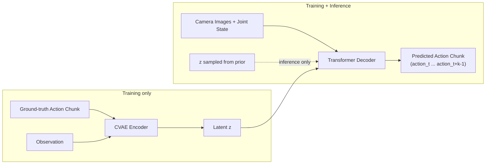

# VLAs with ALOHA for robotics — Unit 4: ACT Imitation Learning

This is the capstone unit: the Action Chunking Transformer (ACT), the algorithm that made ALOHA-style bimanual manipulation practical, and the technique most directly associated with "VLAs with ALOHA" as a topic. You'll see how it fixes BC's compounding-error problem (Unit 2) using a transformer architecture, and how the pieces assemble into a full training pipeline.

The diagram below shows the CVAE data flow: what only runs during training versus what also runs at inference.



## The core idea: predict action chunks, not single steps
Standard BC (Unit 2) predicts one action per observation: `obs_t -> action_t`. ACT instead predicts a *chunk* of k future actions from a single observation: `obs_t -> [action_t, action_t+1, ..., action_t+k-1]`. At execution time, the robot doesn't necessarily run all k actions blindly — a common strategy (temporal ensembling) is to re-predict a new chunk at every timestep and average overlapping predictions, which smooths out noise between chunks.

Why this helps with compounding error: single-step prediction has to be *exactly* right at every timestep or the robot drifts (Unit 2's core problem). Chunk prediction instead learns a locally consistent short trajectory segment, and human demonstrations are naturally smooth over short windows — so the model has an easier, more consistent target to learn, and small per-step errors are absorbed by the chunk rather than compounding independently at every step.

## Architecture: a conditional VAE with a transformer decoder
ACT is trained as a conditional Variational Autoencoder (CVAE):

- An **encoder** (only used during training) compresses the ground-truth action chunk plus the current observation into a latent style variable `z` — capturing things like "was this demonstration fast or careful" that pure state doesn't tell you.
- A **decoder** (a transformer, used at both training and inference) takes the current observations — multiple camera images plus joint state — and the latent `z`, and autoregressively/jointly predicts the action chunk.

```python
import torch
import torch.nn as nn

class ACTDecoder(nn.Module):
    def __init__(self, obs_embed_dim, action_dim, chunk_size=100, n_layers=4, n_heads=8):
        super().__init__()
        self.chunk_size = chunk_size
        decoder_layer = nn.TransformerDecoderLayer(
            d_model=obs_embed_dim, nhead=n_heads, batch_first=True
        )
        self.transformer = nn.TransformerDecoder(decoder_layer, num_layers=n_layers)
        self.action_head = nn.Linear(obs_embed_dim, action_dim)
        self.query_embed = nn.Parameter(torch.randn(chunk_size, obs_embed_dim))

    def forward(self, memory):
        # memory: encoded (images + joint state + latent z), shape (B, S, D)
        queries = self.query_embed.unsqueeze(0).expand(memory.size(0), -1, -1)
        decoded = self.transformer(tgt=queries, memory=memory)
        return self.action_head(decoded)  # (B, chunk_size, action_dim)
```

At inference time there's no ground truth to encode, so `z` is typically sampled from the CVAE's prior (e.g. zero vector), and only the decoder runs — cameras and joint state go in, an action chunk comes out.

## Training loss
The loss combines two terms, standard for a CVAE:

1. **Reconstruction loss** — L1 or MSE between predicted and demonstrated actions across the chunk (L1 is commonly preferred for ACT since it's less sensitive to occasional outlier demonstration frames than MSE).
2. **KL-divergence term** — regularizes the latent `z` toward a simple prior (e.g. standard normal), weighted by a small coefficient (often called beta, as in beta-VAE), so the latent space stays well-behaved rather than the encoder trivially memorizing training demonstrations.

```python
def act_loss(pred_actions, gt_actions, mu, logvar, kl_weight=10.0):
    recon = nn.functional.l1_loss(pred_actions, gt_actions)
    kl = -0.5 * torch.mean(1 + logvar - mu.pow(2) - logvar.exp())
    return recon + kl_weight * kl
```

## Putting it together: from ALOHA data to a running policy
A full ACT pipeline mirrors the demonstration-collection ideas from Unit 2, with chunk-specific bookkeeping added:

1. Collect bimanual teleoperation episodes (ALOHA leader-follower or equivalent), logging synchronized multi-camera images and both arms' joint states/actions at a fixed control rate.
2. Slice each episode into overlapping windows of `chunk_size` consecutive actions, paired with the observation at the window's start.
3. Train the CVAE encoder + transformer decoder end-to-end with `act_loss` above.
4. At deployment, run the decoder in closed loop: observe, predict a chunk, execute (with temporal ensembling if smoothness matters), repeat.

This is the same training loop shape as Unit 2's BC, extended with chunk prediction and CVAE regularization to fix Unit 2's compounding-error failure mode and Unit 3's insight that reward-shaped or return-based signals aren't required if the demonstrated behavior is diverse and consistent enough.

## Try it yourself
Modify the `ACTDecoder` skeleton to accept `chunk_size=1` and compare, in a short written note, what it degenerates to relative to Unit 2's `BCPolicy`. Then explain in your own words why `chunk_size=1` would bring back the exact compounding-error problem this unit opened with, and roughly what range of chunk sizes (relative to your robot's control frequency) would be too large to be useful.
