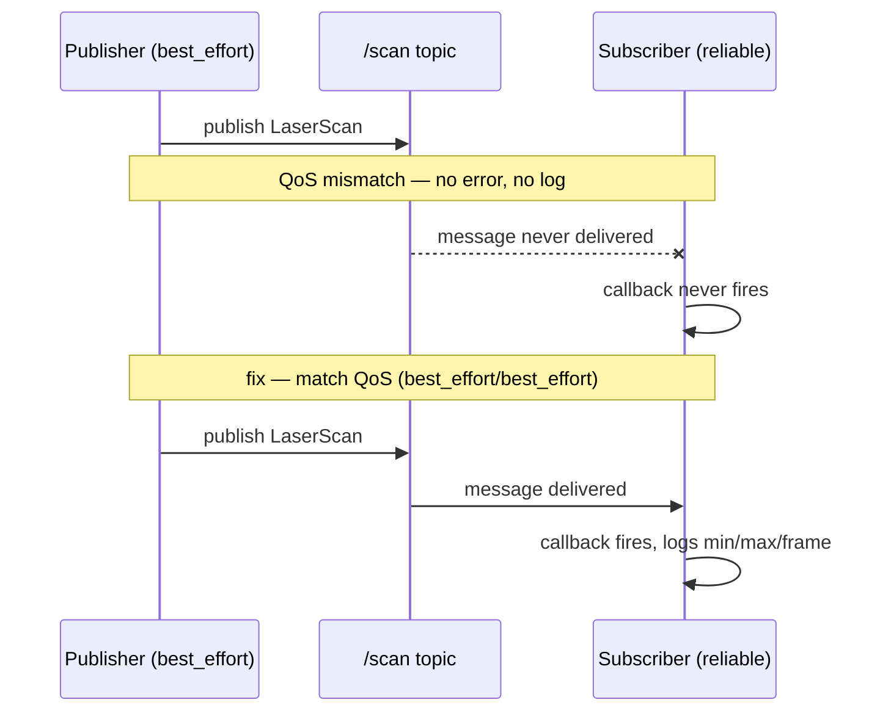

# Debug Cases — Unit 2: Case 1 Part 2. ROS Topics and Messages

Part 2 continues the topic/message debugging case, moving from read-only inspection to writing small diagnostic nodes and scripts of your own. Where Part 1 was about querying a running system from the shell, this unit is about programmatically consuming and validating that data — the next step once command-line inspection isn't enough.

The sequence below shows why a QoS mismatch is silent instead of erroring — and how the same publisher and subscriber start working the moment their QoS profiles agree.



## Writing a throwaway subscriber node

The fastest way to confirm your understanding of a topic's data is to subscribe to it yourself in a few lines of code, rather than trusting a large existing node:

```python
import rclpy
from rclpy.node import Node
from sensor_msgs.msg import LaserScan

class ScanProbe(Node):
    def __init__(self):
        super().__init__('scan_probe')
        self.create_subscription(LaserScan, '/scan', self.cb, 10)

    def cb(self, msg: LaserScan):
        self.get_logger().info(
            f'ranges={len(msg.ranges)} min={min(msg.ranges):.2f} '
            f'max={max(msg.ranges):.2f} frame={msg.header.frame_id}'
        )

def main():
    rclpy.init()
    rclpy.spin(ScanProbe())
```

This kind of throwaway node is disposable diagnostic scaffolding — write it, run it, delete it. It's faster than adding print statements to production code and safer than editing a node you don't fully understand yet.

## Filtering and analyzing messages from the shell

For quick numeric checks you don't need Python at all. `ros2 topic echo` supports field filtering:

```bash
ros2 topic echo /scan --field ranges
ros2 topic echo /scan --field header.frame_id
```

Piping into standard Unix tools extends this further — e.g. `ros2 topic echo /scan --once | grep frame_id` to pull a single field without parsing YAML in your head.

## Debugging basic ROS programs

When a node subscribed to correct data still misbehaves, isolate the failure with these checks, roughly in order:

1. **Is the callback firing at all?** Add a log line at the very top of the callback. If it never prints, the problem is subscription/QoS, not your logic.
2. **QoS mismatches are silent.** A publisher on `best_effort` and a subscriber requesting `reliable` (or vice versa) simply never connects — no error, no message. `ros2 topic info /scan --verbose` shows the QoS profile in use on each side.
3. **Print the data you actually received**, not what you assume you received, immediately inside the callback before any processing.
4. **Check node and topic names for namespace issues** — `ros2 node list` and `ros2 topic list` reveal whether a launch file remapped something you didn't expect.

## Try it yourself

Write a minimal subscriber node (in Python or C++) for any topic in your simulation that logs the message count received per second and the min/max of one numeric field. Deliberately mismatch the QoS reliability setting from the publisher's and observe that your node receives nothing — then fix it and confirm data starts flowing.
