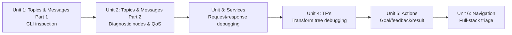

# Debug Cases

This course is a set of hands-on debugging case studies rather than a linear tutorial: each unit hands you a category of ROS-related problem — topics and messages, services, transforms, actions, and navigation — and walks through the diagnostic tools and reasoning you need to find and fix it yourself. The goal is not to memorize fixes but to build a repeatable habit of inspecting a running ROS system from the command line before guessing at code changes.

The diagram below shows how each unit builds on the diagnostic skills of the one before it, culminating in the full-stack navigation triage of Unit 6.

1. [Case 1 Part 1. ROS Topics and Messages](01-case-1-part-1-ros-topics-and-messages.md) — How to get data from topics, how to get data from messages, how to debug basic ROS programs and how to analyze Laser message particularities.
2. [Case 1 Part 2. ROS Topics and Messages](02-case-1-part-2-ros-topics-and-messages.md) — How to get data from topics, how to get data from messages, how to debug basic ROS programs and how to analyze Laser message particularities.
3. [Case 2: ROS Services and Messages](03-case-2-ros-services-and-messages.md) — Compilation of a custom service message, particularities of the messages used by Services and how to Debug basic ROS programs.
4. [Case 3: ROS TF's](04-case-3-ros-tfs.md) — How to get data about the transforms of the robot, how to get data about the frames of the robot and how to generate the transforms of a robot.
5. [Case 4: ROS Actions and Messages](05-case-4-ros-actions-and-messages.md) — How to get data from topics, how to get data from messages, how to debug intermediate ROS programs and Action messages particularities.
6. [Case 5: ROS Navigation](06-case-5-ros-navigation.md) — How to analyze ROS Navigation parameters, the importance of frame names and common ROS Navigation Issues.
