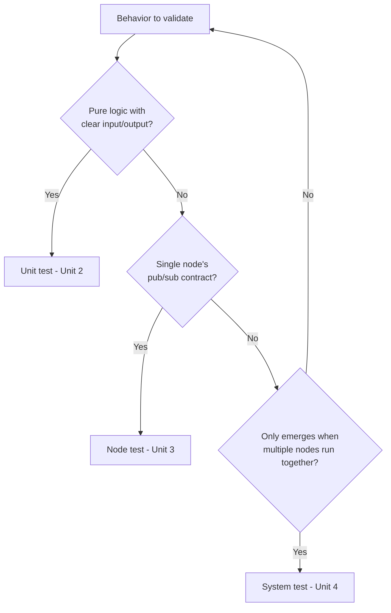

# GTest Framework for ROS2 — Unit 5: Course Project

This closing unit is deliberately less prescriptive than the others: you take a ROS2 package (yours, or one you build for the purpose) and write a test suite that proves it behaves as expected, applying everything from Units 2 through 4 without step-by-step hand-holding.

The flowchart below captures the decision process for choosing the right level of test for a given behavior, which is the core skill this course has been building.



## The brief

Pick (or build) a small ROS2 package with at least: one piece of pure logic worth unit testing (a transform, a filter, a planner utility — anything with clear inputs and outputs), and one node with a publisher and/or subscriber worth testing in isolation. If you want to push further, add a second node so you have something worth a system test. Your goal is not to test *everything* — it is to demonstrate you can choose the *right level* of test for each piece of behavior, which is the actual skill this course has been building.

## Planning your test suite before writing code

Resist the urge to start typing `TEST()` immediately. Spend ten minutes listing the behaviors that matter:

- What are the pure-logic pieces, and what are their edge cases (zero input, max input, invalid input)? These map to Unit 2 unit tests.
- What does each node publish, and under what conditions? What should it do when it receives a malformed or out-of-range message? These map to Unit 3 node tests.
- Is there an end-to-end behavior — a goal reached, a command acknowledged, a state machine transitioning correctly — that only shows up when multiple nodes run together? That maps to a Unit 4 system test, and you should only write one if the behavior genuinely cannot be verified at a lower level.

Write this list down as plain bullet points before touching CMake. A test plan you can read in thirty seconds is worth more than a test suite you had to reverse-engineer from code.

## Implementing and running the suite

Wire it up the same way as every prior unit: `ament_add_gtest` targets for your C++ unit and node tests, `add_launch_test` for any system test, all declared in `CMakeLists.txt` with matching `test_depend`s in `package.xml`. Build and run the whole thing as one pass:

```bash
colcon build --packages-select my_project_pkg
colcon test --packages-select my_project_pkg
colcon test-result --all --verbose
```

Aim for output where every test you planned actually appears in the report — a test that silently fails to register (wrong CMake target name, missing `find_package`) is worse than a failing test, because it gives you false confidence.

## Self-review checklist

Before considering the project done, check yourself against these questions, which mirror how a reviewer would read your test suite:

- Does every `EXPECT_*`/`ASSERT_*` in your tests have a clear reason for being there, or did you copy-paste an assertion that no longer tests anything meaningful?
- Do your node tests use bounded timeouts (Unit 3) rather than fixed `sleep()` calls that are either too short (flaky) or too long (slow)?
- Does at least one test cover a *failure* path (invalid input, missing data, timeout) rather than only the happy path?
- If you wrote a system test, could the same behavior have been verified more cheaply at the unit or node level? If so, consider whether it's pulling its weight.
- Can someone unfamiliar with the package understand what's being validated just from reading test names and assertions, without reading the implementation?

## Try it yourself

Take the package you built for this project and deliberately introduce one realistic bug — flip a comparison operator, off-by-one a loop bound, or swap two fields in a message. Run `colcon test` again. If nothing fails, your suite has a coverage gap; go back and write the test that would have caught it. This is the single most useful habit from the whole course: treat "would this test suite have caught that bug?" as your default sanity check whenever you add new logic.
