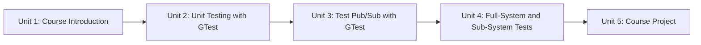

# GTest Framework for ROS2

This course builds up automated testing for ROS2 robotics software from first principles: why testing matters when the code you write ends up controlling physical hardware, how to structure a CMake build so logic is testable at all, how to use Google Test (GTest) for unit and node-level testing, how to move up to full system tests with simulation in the loop, and finally how to apply the whole toolkit to validate a real package end to end.

The diagram below shows how each unit builds directly on the skills from the one before it, moving from testing theory to a fully tested project.

1. [Course Introduction](01-course-introduction.md) — Why software testing matters in robotics, the unit/integration/system testing pyramid, and how ROS2's build tooling (`colcon test`) fits testing into everyday development.
2. [Unit Testing with Google Test](02-unit-testing-with-google-test.md) — CMake basics for building testable shared libraries, wiring GTest into a package with `ament_cmake_gtest`, writing assertions with `TEST()`/`TEST_F()`, and running tests via `colcon test`.
3. [Test Subscribers and Publishers using GTest](03-test-subscribers-and-publishers-using-gtest.md) — Testing a live ROS2 node's publish/subscribe behavior in isolation, using an executor and a harness node to drive and observe it without races.
4. [Full-System and Sub-System Tests](04-full-system-and-sub-system-tests.md) — Using `launch_testing` to bring up multi-node systems (including Nav2 over Gazebo) and assert on end-to-end behavior.
5. [Course Project](05-course-project.md) — Apply unit, node, and system testing together to validate a complete ROS2 package, with a self-review checklist for judging your own test suite.
