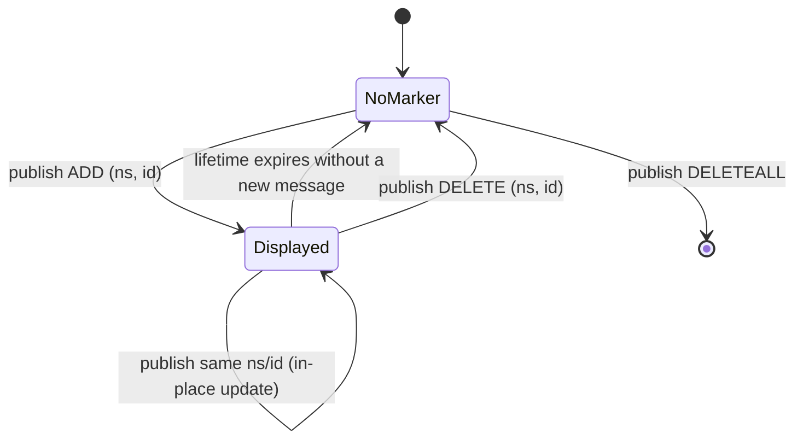

# ROS RViz Advanced Markers — Unit 2: RvizMarkers Unit 1: Basic Markers

Every advanced visualization in this course — bounding boxes, footsteps, overlays, pictograms — is built out of the same fundamental building block: the `visualization_msgs/Marker` message. This unit teaches you to publish that message correctly before you move on to anything fancier.

The diagram below shows the lifecycle a marker goes through in RViz, keyed entirely off its `ns`/`id` pair, `lifetime`, and `action` field.



## The `Marker` and `MarkerArray` messages
A `Marker` describes one drawable shape: its type, pose, scale, color, and lifetime. Key fields you'll set on nearly every marker:

- `header.frame_id` / `header.stamp` — which TF frame the marker's pose is expressed in, and when.
- `ns` (namespace) + `id` — together they uniquely identify a marker; publishing a new marker with the same `ns`/`id` **replaces** the old one instead of adding a new one.
- `type` — `SPHERE`, `CUBE`, `ARROW`, `LINE_STRIP`, `TEXT_VIEW_FACING`, `MESH_RESOURCE`, and more.
- `action` — `ADD` (or `MODIFY`, same value), `DELETE` (remove this one marker), `DELETEALL`.
- `pose`, `scale`, `color` — standard geometry and an RGBA color in the 0–1 range.
- `lifetime` — how long the marker stays visible after being received before RViz auto-deletes it (zero means forever, until replaced or deleted).

For more than one shape at a time, `visualization_msgs/MarkerArray` is simply a list of `Marker` messages published together — the workhorse message for anything beyond a single shape.

## Marker types: geometry primitives, text and meshes
The primitive types cover most needs: `SPHERE`/`SPHERE_LIST`, `CUBE`/`CUBE_LIST`, `CYLINDER`, `ARROW` (either two points or a pose+scale), `LINE_STRIP`/`LINE_LIST` for wireframes and trails, `POINTS` for point clouds you build yourself, and `TEXT_VIEW_FACING` for a text label that always faces the camera — useful for labeling detections. `MESH_RESOURCE` loads an actual 3D model file (`.dae`/`.stl`) from a `package://` URI, handy for drawing recognizable objects (a chair, a person) instead of a box.

## Publishing markers from Python
```python
import rclpy
from rclpy.node import Node
from visualization_msgs.msg import Marker
from geometry_msgs.msg import Point

class BasicMarkerPublisher(Node):
    def __init__(self):
        super().__init__('basic_marker_publisher')
        self.pub = self.create_publisher(Marker, 'basic_marker', 10)
        self.timer = self.create_timer(0.5, self.publish_marker)

    def publish_marker(self):
        m = Marker()
        m.header.frame_id = 'map'
        m.header.stamp = self.get_clock().now().to_msg()
        m.ns = 'course'
        m.id = 0
        m.type = Marker.SPHERE
        m.action = Marker.ADD
        m.pose.position = Point(x=1.0, y=0.0, z=0.5)
        m.pose.orientation.w = 1.0
        m.scale.x = m.scale.y = m.scale.z = 0.3
        m.color.r, m.color.g, m.color.b, m.color.a = 0.1, 0.8, 0.2, 1.0
        m.lifetime.sec = 0
        self.pub.publish(m)

def main():
    rclpy.init()
    rclpy.spin(BasicMarkerPublisher())

if __name__ == '__main__':
    main()
```

In RViz, add a `Marker` display and set its topic to `basic_marker` (or a `MarkerArray` display for arrays). You should see a green sphere appear at `(1, 0, 0.5)` in the `map` frame.

## Namespaces, IDs, lifetimes and marker actions (ADD/DELETE)
Getting flicker-free, correctly-updating markers comes down to three habits: reuse the same `ns`/`id` pair for a marker you intend to *update* (a moving robot pose indicator, say) rather than incrementing `id` forever, which leaks memory in RViz; set a `lifetime` slightly longer than your publish period so a marker never blinks out between updates if a message is briefly delayed; and explicitly publish `action = Marker.DELETE` for a specific `ns`/`id` (or `DELETEALL`) when something genuinely goes away, rather than just stopping publication and hoping the lifetime timeout handles it.

## Try it yourself
Extend the publisher above into a `MarkerArray` of five spheres arranged in a circle of radius 1 m around the origin, each with a distinct `id`, that all rotate around the circle over time (recompute positions in the timer callback using `math.sin`/`math.cos` and elapsed time). Confirm in RViz that all five move smoothly with no flicker or leftover ghost markers.
