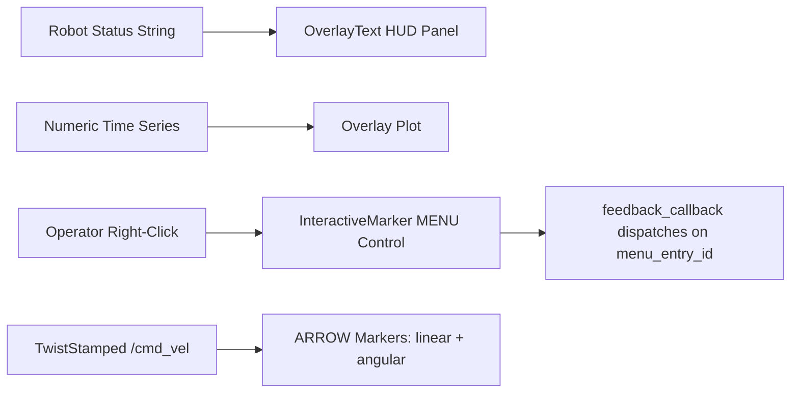

# ROS RViz Advanced Markers — Unit 4: RvizMarkers Unit3: Add Overlays

3D markers place data *in* the world, but sometimes you want a heads-up-display element that stays fixed on screen regardless of camera angle — status text, a live plot, a menu, or an arrow showing a velocity command. This unit covers RViz's screen-space overlay tools.

The diagram below shows how each data source in this unit is routed to its corresponding screen-space or in-scene overlay.



## OverlayText: HUD-style text panels
Plain `TEXT_VIEW_FACING` markers still live in 3D and shrink/move with the camera. For a genuine 2D HUD panel (think "battery: 87%, state: NAVIGATING" pinned to a screen corner), you need an overlay display rather than a 3D marker. Community overlay plugin packages (for example `rviz_2d_overlay_plugins` and, historically on ROS 1, `jsk_rviz_plugins`) add an `OverlayText` display type that subscribes to a custom string/formatted message and draws it as fixed 2D text with configurable position, font size, and background color:

```python
from jsk_rviz_plugins.msg import OverlayText  # or the equivalent in your overlay plugin package

msg = OverlayText()
msg.text = "state: NAVIGATING\nbattery: 87%"
msg.width, msg.height = 300, 80
msg.left, msg.top = 10, 10
msg.bg_color.a = 0.6
msg.fg_color.r = msg.fg_color.g = msg.fg_color.b = 1.0
msg.fg_color.a = 1.0
overlay_pub.publish(msg)
```

If no overlay plugin is installed for your distro, a lightweight fallback is publishing diagnostics to `/diagnostics` and using RViz's `Diagnostics` display, or writing a small custom panel (covered in Unit 5) that renders arbitrary Qt widgets instead of a 3D overlay.

## Overlay graphs and plots
The same family of overlay plugins typically ships a plotting display (an `OverlayText`-like display specialized for numeric time series) so you can watch a value — say, tracking error or joint torque — scroll across the screen the same way you'd watch it in `rqt_plot`, but without leaving the RViz window. This is most useful during live debugging sessions where you're already staring at RViz to correlate a spike in a value with what's happening spatially in the scene. If a plotting overlay isn't available, running `ros2 run rqt_plot rqt_plot /your/topic/field` alongside RViz is a perfectly good substitute — the overlay is a convenience, not a hard requirement.

## Interactive menus in RViz
`interactive_markers` lets a marker carry a right-click context menu, built from `visualization_msgs/MenuEntry` items attached to an `InteractiveMarkerControl`:

```python
from interactive_markers import InteractiveMarkerServer
from visualization_msgs.msg import InteractiveMarker, InteractiveMarkerControl, Marker, MenuEntry

server = InteractiveMarkerServer(node, 'menu_marker_server')

int_marker = InteractiveMarker(name='robot_menu', description='Robot actions')
int_marker.header.frame_id = 'map'
int_marker.pose.position.z = 0.5

menu_control = InteractiveMarkerControl(interaction_mode=InteractiveMarkerControl.MENU,
                                         always_visible=True)
menu_control.markers.append(Marker(type=Marker.SPHERE, scale=Marker().scale))
int_marker.controls.append(menu_control)

int_marker.menu_entries = [
    MenuEntry(id=1, title='Send home', command_type=MenuEntry.FEEDBACK),
    MenuEntry(id=2, title='Stop', command_type=MenuEntry.FEEDBACK),
]

server.insert(int_marker, feedback_callback=lambda fb: handle_menu(fb))
server.applyChanges()
```

The `feedback_callback` fires with the selected `menu_entry_id`, so your node dispatches on that ID — this is the same mechanism Unit 5 builds on for interactive panels that trigger real robot actions.

## Visualizing TwistStamped commands
A velocity command (`geometry_msgs/TwistStamped` or plain `Twist`) is easy to misjudge from numbers alone — "linear.x=0.3, angular.z=0.8" doesn't immediately read as "turning sharply while barely moving forward." Render it as two `ARROW` markers anchored at the robot's base frame: one scaled by `linear.x` pointing forward, one curved/offset scaled by `angular.z` to suggest rotation, updated every time a new `Twist` arrives:

```python
def twist_to_marker(twist, frame_id='base_link'):
    m = Marker(type=Marker.ARROW, action=Marker.ADD, id=100)
    m.header.frame_id = frame_id
    m.scale.x, m.scale.y, m.scale.z = 0.05, 0.1, 0.1  # shaft/head width
    m.points = [Point(x=0.0, y=0.0, z=0.1),
                Point(x=twist.linear.x, y=0.0, z=0.1)]
    m.color.g, m.color.a = 1.0, 1.0
    return m
```

This is invaluable when debugging a controller that's producing subtly wrong commands — you see the arrow lengthen or swing the moment the bad command is published, rather than scrolling `ros2 topic echo` output.

## Try it yourself
Build an `OverlayText`-equivalent HUD (use the real plugin if installed, otherwise a `TEXT_VIEW_FACING` marker pinned near the camera as a fallback) that shows the current linear and angular velocity as text, alongside a `TwistStamped` arrow marker, both updating live as you publish test commands with `ros2 topic pub /cmd_vel geometry_msgs/msg/Twist "{linear: {x: 0.3}, angular: {z: 0.5}}"`.
