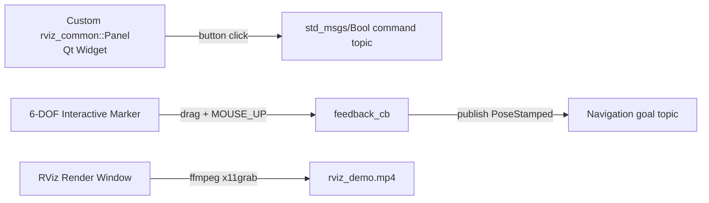

# ROS RViz Advanced Markers — Unit 5: RvizMarkers Unit 4: Add Custom Panels to RVIZ and Extras

The final unit moves past subscribing to markers and into extending RViz itself: writing your own dockable panel, wiring interactive markers to real commands, and capturing your visualizations as shareable video.

The diagram below shows how this unit's three extensions each turn RViz from a passive viewer into an active output: a panel, a draggable interactive marker, and the render window itself.



## Writing a custom RViz panel plugin
A panel is a `pluginlib`-loaded C++ class deriving from `rviz_common::Panel`, which is itself a `QWidget` — meaning you build its UI with ordinary Qt widgets (buttons, sliders, labels) and back it with a ROS 2 node for publishing/subscribing:

```cpp
// robot_control_panel.hpp
#include <rviz_common/panel.hpp>
#include <rclcpp/rclcpp.hpp>
#include <QPushButton>

class RobotControlPanel : public rviz_common::Panel
{
  Q_OBJECT
public:
  explicit RobotControlPanel(QWidget * parent = nullptr);

private Q_SLOTS:
  void onStopClicked();

private:
  rclcpp::Node::SharedPtr node_;
  rclcpp::Publisher<std_msgs::msg::Bool>::SharedPtr stop_pub_;
  QPushButton * stop_button_;
};
```

Register it so RViz can discover it, via `pluginlib_description.xml`:

```xml
<library path="robot_control_panel">
  <class name="rviz_markers_course/RobotControlPanel"
         type="RobotControlPanel" base_class_type="rviz_common::Panel">
    <description>Send high-level commands to the robot</description>
  </class>
</library>
```

...declared in `package.xml` with `<export><rviz2 plugin="${prefix}/plugin_description.xml"/></export>` and built as a shared library in `CMakeLists.txt`. Once installed, **Panels → Add New Panel** in RViz lists it alongside the built-in ones. See the RViz plugin developer guide on docs.ros.org for the full CMake/pluginlib boilerplate.

## Interactive markers that trigger real actions
Combine the `interactive_markers` server from Unit 4 with actual command publishing instead of just a menu: a 6-DOF interactive marker lets an operator drag a goal pose in 3D, and the feedback callback publishes that pose as a navigation goal the moment the operator releases the drag:

```python
def feedback_cb(feedback):
    if feedback.event_type == InteractiveMarkerFeedback.MOUSE_UP:
        goal_pub.publish(PoseStamped(header=feedback.header, pose=feedback.pose))
```

This turns RViz from a passive viewer into a lightweight operator console — genuinely useful for early integration testing before a full teleoperation UI exists, since you get drag-to-command for free from a marker you already had to draw anyway.

## Custom icons and context menus
Interactive marker controls accept any `Marker` as their visual, including a `MESH_RESOURCE` pointing at a small icon-shaped model or a colored `TEXT_VIEW_FACING` glyph, so a "commandable" marker can look distinct from a purely informational one at a glance (e.g. a wrench icon for "send to maintenance dock," a house icon for "return home"). Pair that visual with the `MENU` interaction mode from Unit 4 so right-clicking the icon offers the relevant actions for that specific object — this is how you build an RViz-based control surface that scales past two or three buttons without cluttering the scene with separate panels for everything.

## Recording RViz sessions to video
For sharing a debugging session or a demo, screen-capture RViz's render window directly rather than trying to script frame exports. On Linux, generic screen recorders work fine since RViz is just another OpenGL window:

```bash
ffmpeg -f x11grab -video_size 1920x1080 -i :0.0+0,0 -framerate 30 -c:v libx264 -preset ultrafast rviz_demo.mp4
```

or a GUI tool like SimpleScreenRecorder/OBS Studio if you want to trim and annotate afterward. If you need frame-accurate captures synced to simulation time (e.g. for a paper figure), it's more reliable to drive the camera programmatically (RViz's `ViewController` can be set via a published `Pose` on some configurations) and grab still images at known simulation timestamps rather than relying on wall-clock screen recording.

## Try it yourself
Sketch (in comments or pseudocode, no need to fully build the Qt/CMake plumbing) a custom panel with one button labeled "Publish Home Marker" that, when clicked, publishes a `Marker` at the origin — then separately record a 10-second `ffmpeg` screen capture of RViz while you manually drag an interactive marker around, and confirm the resulting video plays back cleanly.
