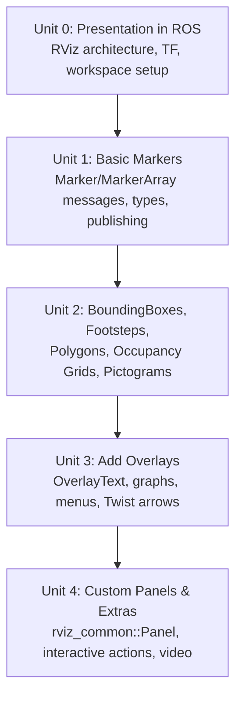

# ROS RViz Advanced Markers

RViz turns opaque streams of pose, sensor, and planning data into something you can actually look at, and `visualization_msgs/Marker` is the tool that lets you draw *your own* data — not just the built-in message types — into that same 3D scene. This course starts from a working RViz session and the basic marker types, builds up to compound visualizations robotics engineers rely on daily (bounding boxes, footsteps, occupancy grids, HUD overlays, interactive commands), and finishes by extending RViz itself with custom panels and screen-recorded demos.

The diagram below shows how each unit builds on the previous one, from a working RViz session up to a fully custom-extended RViz.

1. [RvizMarkers Unit 0: Presentation in ROS](01-rvizmarkers-unit-0-presentation-in-ros.md) — RViz's architecture, TF and fixed frames, and getting a workspace and live session running.
2. [RvizMarkers Unit 1: Basic Markers](02-rvizmarkers-unit-1-basic-markers.md) — the `Marker`/`MarkerArray` messages, marker types, publishing from Python, and correct namespace/ID/lifetime hygiene.
3. [RvizMarkers Unit 2: BoundingBoxes, RobotFootsteps, PolygonArray, Ocupancy grids, Pictograms](03-rvizmarkers-unit-2-boundingboxes-robotfootsteps-polygonarray-ocupancy-grids-pictograms.md) — dynamic wireframe bounding boxes, footstep trails, polygon regions, occupancy grids, and icon-based pictograms.
4. [RvizMarkers Unit3: Add Overlays](04-rvizmarkers-unit3-add-overlays.md) — OverlayText HUD panels, overlay graphs, interactive right-click menus, and visualizing `TwistStamped` commands as arrows.
5. [RvizMarkers Unit 4: Add Custom Panels to RVIZ and Extras](05-rvizmarkers-unit-4-add-custom-panels-to-rviz-and-extras.md) — writing a custom `rviz_common::Panel` plugin, action-triggering interactive markers, custom icons, and recording RViz sessions to video.
