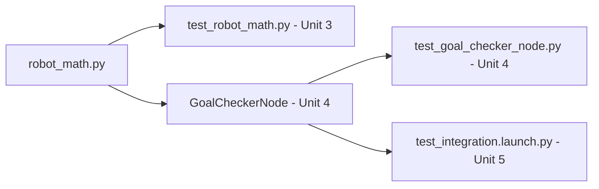

# Unit Testing with ROS — Unit 2: Basic Concepts

Before writing a single test, you need the vocabulary and a running example. This unit covers the core testing terminology you'll reuse throughout the course, and sets up the small Python module you'll test in every subsequent unit.

The diagram below traces how the `robot_math.py` module set up in this unit gets tested at each later course level.



## Core testing vocabulary
A few terms recur constantly in ROS testing discussions, borrowed from general software testing but applied to robots:

- **Unit under test** — the smallest piece of code a given test is verifying: a function, a class method, or (later) a single node.
- **Fixture / setup and teardown** — code that runs before and after a test to create a known starting state (e.g. instantiate a class, start a node, reset a parameter) and clean it up afterward so tests don't leak state into each other.
- **Assertion** — a statement that a condition must hold (`assertEqual`, `assertTrue`, ...); a test fails the moment one assertion fails.
- **Test fixture isolation** — the principle that one test's failure or side effects should never affect another test's outcome. This matters more in ROS than in plain Python because nodes have background threads, timers, and open sockets that can leak between tests if you're not careful.
- **Flaky test** — a test that sometimes passes and sometimes fails with no code change, usually caused by timing assumptions (e.g. "the message will definitely have arrived after 0.1 seconds"). Robotics tests are especially prone to flakiness because of asynchronous message passing — you'll see how to guard against this in Units 4 and 5.

## The example script
Throughout the course you'll test a small, deliberately simple Python module — a distance/velocity utility that a robot's motion-planning code might use. Create `robot_math.py`:

```python
# robot_math.py
import math


def euclidean_distance(p1, p2):
    """Distance between two (x, y) points."""
    return math.hypot(p2[0] - p1[0], p2[1] - p1[1])


def clamp_velocity(v, v_max):
    """Clamp a velocity command to +/- v_max."""
    if v_max < 0:
        raise ValueError("v_max must be non-negative")
    return max(-v_max, min(v, v_max))


def is_goal_reached(current, goal, tolerance=0.05):
    """True if current position is within tolerance of goal."""
    return euclidean_distance(current, goal) <= tolerance
```

This module has zero ROS imports on purpose — it's pure logic that a `move_to_goal` node might call internally. That's exactly the kind of code Unit 3 will teach you to test in isolation, and Unit 4 will show wrapped inside an actual node.

## Where tests live in a ROS package
A typical `ament_python` or `ament_cmake` package keeps its tests in a `test/` directory alongside `package.xml` and `setup.py`/`CMakeLists.txt`:

```
my_robot_pkg/
├── my_robot_pkg/
│   ├── __init__.py
│   └── robot_math.py
├── test/
│   ├── test_robot_math.py       # Unit 3 style
│   ├── test_move_to_goal_node.py  # Unit 4 style
│   └── test_integration.launch.py # Unit 5 style
├── package.xml
└── setup.py
```

`colcon test` (for `ament_python`) or `colcon test` with CTest/`ament_cmake_pytest` (for `ament_cmake`) discovers and runs everything under `test/` automatically as part of your build pipeline — you don't invoke each test file by hand once this is wired up.

## Try it yourself
Save `robot_math.py` into a scratch ROS package's Python module directory (or a plain directory if you just want to experiment first). Manually verify, in a Python REPL, that `clamp_velocity(1.5, 1.0)` returns `1.0`, `clamp_velocity(-5, 1.0)` returns `-1.0`, and `is_goal_reached((0,0), (0.03, 0.04))` returns `True`. You'll turn these exact checks into real assertions in Unit 3.
