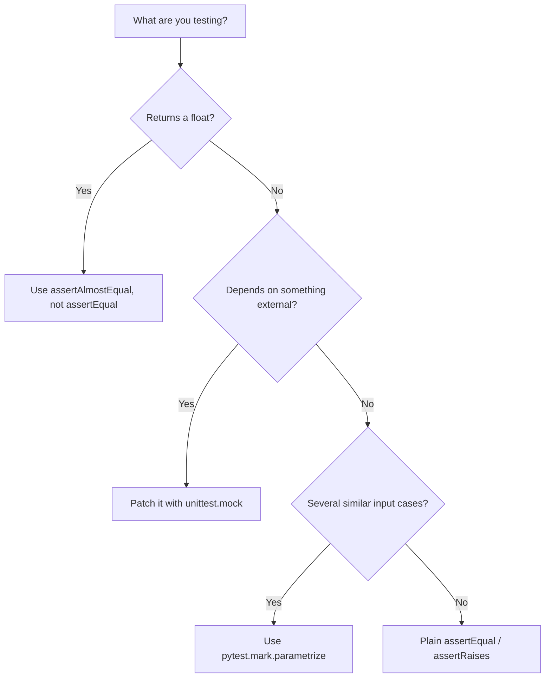

# Unit Testing with ROS — Unit 3: Library Unit Tests

This unit is about testing plain Python — the `robot_math.py` module from Unit 2 — with no ROS involved. These are the cheapest, fastest tests you'll write, and they should cover the bulk of your logic.

The flowchart below shows how to pick the right technique from this unit for a given kind of function under test.



## Writing tests with `unittest`
Python's standard library ships `unittest`, and it's what `ament_python`/`colcon` tooling expects to discover by default. A test file is a class of test methods, each starting with `test_`:

```python
# test/test_robot_math.py
import unittest
from my_robot_pkg.robot_math import (
    euclidean_distance, clamp_velocity, is_goal_reached
)


class TestRobotMath(unittest.TestCase):
    def test_euclidean_distance_zero(self):
        self.assertEqual(euclidean_distance((0, 0), (0, 0)), 0.0)

    def test_euclidean_distance_3_4_5(self):
        self.assertAlmostEqual(euclidean_distance((0, 0), (3, 4)), 5.0)

    def test_clamp_velocity_within_range(self):
        self.assertEqual(clamp_velocity(0.5, 1.0), 0.5)

    def test_clamp_velocity_clips_high(self):
        self.assertEqual(clamp_velocity(2.0, 1.0), 1.0)

    def test_clamp_velocity_clips_low(self):
        self.assertEqual(clamp_velocity(-2.0, 1.0), -1.0)

    def test_clamp_velocity_rejects_negative_max(self):
        with self.assertRaises(ValueError):
            clamp_velocity(1.0, -1.0)

    def test_is_goal_reached_true_within_tolerance(self):
        self.assertTrue(is_goal_reached((0, 0), (0.03, 0.04)))

    def test_is_goal_reached_false_outside_tolerance(self):
        self.assertFalse(is_goal_reached((0, 0), (1, 1)))


if __name__ == '__main__':
    unittest.main()
```

Run it directly during development with `python3 -m pytest test/test_robot_math.py -v` (pytest can run `unittest`-style tests directly, and gives nicer output) or `python3 test/test_robot_math.py` for plain `unittest`.

## Testing floating point correctly
Note `assertAlmostEqual` above instead of `assertEqual` for the 3-4-5 triangle check — floating point math rarely produces exact equality, and robotics code is full of trigonometry and distance calculations. Using exact `assertEqual` on floats is one of the most common sources of flaky-looking failures in numeric test suites. Prefer `assertAlmostEqual(a, b, places=6)` or, for numpy-heavy code, `numpy.testing.assert_allclose`.

## Test doubles: stubs, fakes, and mocks
Once your logic starts depending on something external — a config file, the system clock, a hardware driver — you don't want your unit test to depend on it too. Python's `unittest.mock` lets you substitute a controllable fake:

```python
from unittest.mock import patch

def test_is_goal_reached_uses_default_tolerance():
    with patch('my_robot_pkg.robot_math.euclidean_distance', return_value=0.04):
        assert is_goal_reached((0, 0), (10, 10))  # distance is faked to 0.04
```

Use mocking sparingly at this level — most library-level functions should be pure enough not to need it. Save heavier mocking for Unit 4, where you'll need to fake ROS infrastructure like publishers and the clock.

## Parametrized and edge-case testing
Rather than writing near-duplicate test methods, use `pytest.mark.parametrize` to cover several inputs concisely and make edge cases explicit:

```python
import pytest
from my_robot_pkg.robot_math import clamp_velocity

@pytest.mark.parametrize("v,v_max,expected", [
    (0.0, 1.0, 0.0),
    (1.0, 1.0, 1.0),      # exactly at the limit
    (-1.0, 1.0, -1.0),    # exactly at the negative limit
    (1e9, 1.0, 1.0),      # extreme input
])
def test_clamp_velocity_cases(v, v_max, expected):
    assert clamp_velocity(v, v_max) == expected
```

Deliberately test boundary values (exactly at the limit), not just "normal" values — off-by-one and off-by-epsilon errors in clamping/tolerance logic are common in motion code.

## Try it yourself
Add a `test_is_goal_reached_boundary` test that checks the exact boundary case — a point at *precisely* `tolerance` distance from the goal (e.g. `(0.05, 0)` against goal `(0,0)` with default tolerance `0.05`). Decide, and assert, whether it should count as reached (`<=`) or not, and make sure your assertion matches what `robot_math.py` actually implements.
