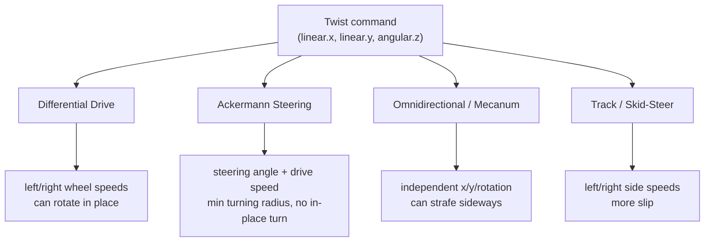

# Basics of Robotics with LIMO — Unit 4: Introduction to Robot Kinematics

Kinematics is the study of how a robot's motion in its own frame relates to what its actuators are doing, without worrying about the forces involved. For a wheeled robot this boils down to one question: given a desired velocity command, what should each wheel/motor do — and, just as importantly, what velocities is the robot physically *incapable* of producing at all?

The diagram below shows how the same `Twist` command is converted into different wheel behavior depending on which drive mode is active.



## The unicycle model and Twist

Almost every mobile robot control interface, regardless of its underlying chassis, is commanded through the same abstraction: a `geometry_msgs/msg/Twist`, carrying a linear velocity and an angular velocity:

```python
from geometry_msgs.msg import Twist

cmd = Twist()
cmd.linear.x = 0.3    # m/s, forward
cmd.angular.z = 0.5   # rad/s, turning left
cmd_vel_pub.publish(cmd)
```

This is the **unicycle model**: conceptually, "go this fast forward, turn this fast." It's a convenient, chassis-agnostic contract — your navigation stack only ever needs to produce a `Twist`. What differs between drive types is how the robot's own low-level controller converts that `Twist` into individual wheel commands, and which `Twist` values are even achievable.

## Differential drive

A differential-drive robot has two independently driven wheels (left/right), possibly with passive casters for support. Turning comes purely from spinning the two wheels at different rates:

```
v_left  = linear.x - (angular.z * wheel_base / 2)
v_right = linear.x + (angular.z * wheel_base / 2)
```

Differential drive can rotate in place (`linear.x = 0`, `angular.z != 0`), which makes it very maneuverable, but it cannot move sideways — it's constrained to what it's currently facing, or an arc of it.

## Ackermann steering

Ackermann steering — the same principle as a car — has fixed rear (or front) drive wheels and separately steered front wheels, each turning at a slightly different angle so all four wheels trace concentric circles around a common center without scrubbing. It cannot rotate in place: any turn requires forward or backward motion and has a minimum turning radius set by the steering geometry and wheelbase. LIMO can operate in Ackermann mode, which is the more realistic analogue for outdoor/car-like vehicles and for testing navigation stacks meant for full-size autonomous cars.

## Omnidirectional and track (mecanum/skid) modes

**Omnidirectional** drive (via mecanum wheels, LIMO's other mode) can produce `linear.x`, `linear.y`, *and* `angular.z` simultaneously — it can strafe sideways or move diagonally without turning to face that direction, at the cost of more complex wheel dynamics and reduced traction/payload compared to differential drive. **Track/skid-steer** drive, common on tracked or 4WD-skid platforms, behaves kinematically much like differential drive (velocity difference between the left and right side produces turning) but with more friction-induced slip, since the tracks/wheels can't pivot freely.

## Switching modes on LIMO

LIMO is unusual in supporting multiple drive modes on the same chassis — you select the active mode (differential, Ackermann, omnidirectional/mecanum, or tracked) typically via a parameter or a mode-select topic/service exposed by the base driver, e.g.:

```bash
ros2 param set /limo_base motion_mode 1   # exact param/values depend on the driver in use
```

The important conceptual point, independent of the exact interface: switching modes changes what the *same* `Twist` command physically accomplishes, because the underlying wheel-command conversion changes. Code that publishes `Twist` doesn't need to know or care which mode is active — that's the entire point of the abstraction — but you as the operator absolutely do, especially the fact that only omnidirectional mode can honor a nonzero `linear.y`.

## Try it yourself

With LIMO in differential mode, publish a `Twist` with a small `angular.z` and no `linear.x`, and confirm it rotates in place. Then (if your LIMO/simulation supports mode switching) switch to Ackermann mode and publish the exact same message — describe what happens differently, and why, in terms of the wheel constraints above.
