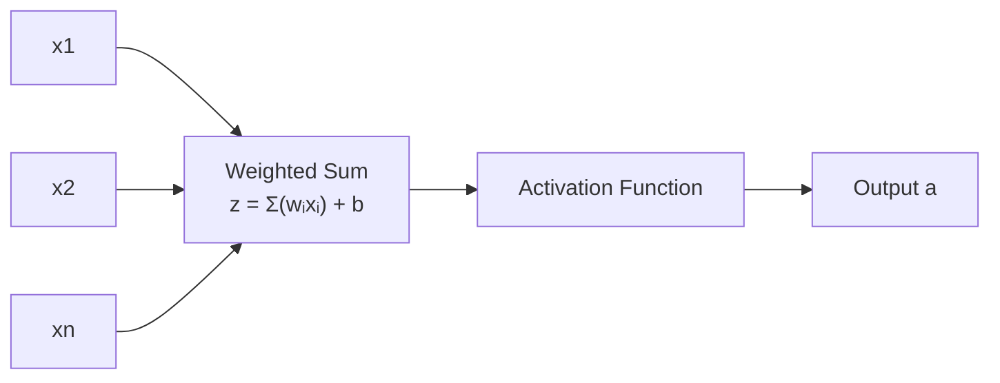

# Mastering Deep Learning with LIMO-Robot — Unit 2: Deep Learning Basics

This unit builds the mathematical vocabulary of neural networks from a single neuron up to a small multi-layer network, then applies it to two robotics-shaped problems — a regression task and a classification task — using Keras.

The diagram below traces how a single neuron turns its inputs into an output, the core computation this unit builds everything else on:



## The math of a single neuron

A neuron computes a weighted sum of its inputs, adds a bias, and passes the result through a nonlinear **activation function**:

```
z = w1*x1 + w2*x2 + ... + wn*xn + b
a = activation(z)
```

The weights `w` and bias `b` are the learnable parameters — training is the process of searching for values of `w` and `b` that make the network's output match the desired output across many examples. Without the activation function, stacking layers would collapse into a single linear transformation no matter how many layers you add, since a composition of linear functions is still linear. Common activations: **ReLU** (`max(0, z)`) for hidden layers, **sigmoid** for binary outputs (squashes to 0-1), and **softmax** for multi-class outputs (a probability distribution over classes).

A network is a graph of these neurons arranged in layers: an **input layer** (just the raw features, no computation), one or more **hidden layers**, and an **output layer** whose shape matches the problem — one unit for a scalar regression, one unit with sigmoid for binary classification, N units with softmax for N-class classification.

## Loss functions and gradient descent

Training needs a way to measure "how wrong" a prediction is — the **loss function**. For regression, mean squared error (`mse`) is standard. For classification, cross-entropy (`binary_crossentropy` or `categorical_crossentropy`) is standard. **Gradient descent** repeatedly computes how the loss changes with respect to each weight (the gradient, via backpropagation) and nudges every weight a small step (the **learning rate**) in the direction that reduces the loss. This happens automatically inside Keras's `.fit()` — you choose the loss and an optimizer (commonly `adam`, an adaptive variant of gradient descent), and the framework handles the calculus.

## A regression example: distance-to-collision from LiDAR

Imagine predicting the minimum obstacle distance in a forward-facing arc directly from a subset of a LiDAR scan — a toy stand-in for a learned range estimator:

```python
import numpy as np
from tensorflow import keras

# synthetic stand-in: X = 5 range readings, y = true minimum distance
X = np.random.uniform(0.2, 5.0, size=(2000, 5))
y = X.min(axis=1)

model = keras.Sequential([
    keras.layers.Dense(16, activation="relu", input_shape=(5,)),
    keras.layers.Dense(8, activation="relu"),
    keras.layers.Dense(1),  # linear output for regression
])
model.compile(optimizer="adam", loss="mse", metrics=["mae"])
model.fit(X, y, epochs=20, validation_split=0.2, verbose=0)
```

Note the output layer has no activation — regression outputs are unbounded, so a linear (identity) output is correct here.

## A classification example: "safe to move forward" from sensor data

Now a binary decision — given a small feature vector, will moving forward collide within the next second?

```python
X_cls = np.random.uniform(0.0, 5.0, size=(2000, 5))
y_cls = (X_cls.min(axis=1) < 0.5).astype(int)  # 1 = obstacle too close

clf = keras.Sequential([
    keras.layers.Dense(16, activation="relu", input_shape=(5,)),
    keras.layers.Dense(1, activation="sigmoid"),  # probability of class 1
])
clf.compile(optimizer="adam", loss="binary_crossentropy", metrics=["accuracy"])
clf.fit(X_cls, y_cls, epochs=20, validation_split=0.2, verbose=0)
```

The sigmoid output and `binary_crossentropy` loss are the standard pairing for two-class problems — swap to `softmax` + `categorical_crossentropy` when you have more than two mutually exclusive classes (you'll use exactly that combination in Unit 6 for object classes).

## Try it yourself

Replace the synthetic `X`/`y` in the regression example with real data pulled from a LiDAR scan on your LIMO (real or simulated): subscribe to `/scan`, sample five evenly-spaced ranges per message, and log the true minimum range alongside them for a few hundred messages while driving the robot around. Train the same small regression network on this real data and compare its `mae` to the synthetic version — real sensor noise usually makes the task harder than the synthetic toy.
