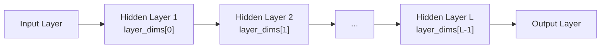

# Mastering Deep Learning with LIMO-Robot — Unit 3: How to Program an L-layer Neural Network in Python

Unit 2 used networks with one or two hidden layers hardcoded directly. This unit generalizes that to an **L-layer network** — a network whose depth and width are parameters you choose, not baked into the code — and covers the two idiomatic ways to build one in Keras.

The diagram below shows how a `layer_dims` list drives the shape of the network built by `build_l_layer_model`, with `L` hidden layers generated programmatically instead of hardcoded:



## Why "L-layer" instead of a fixed architecture

In practice you rarely know the right number of layers or units up front; you experiment. Writing your model-building code so that `L` (the number of layers) and the width of each layer are variables — rather than copy-pasted `Dense` calls — makes that experimentation fast and lets you loop over architectures programmatically, which you'll want in Unit 4 when tuning hyperparameters.

## Building an L-layer network with the Sequential API

The simplest approach: describe the layer sizes as a list and build the model in a loop.

```python
from tensorflow import keras

def build_l_layer_model(input_dim, layer_dims, output_activation=None):
    """layer_dims: list of hidden layer widths, e.g. [64, 32, 16].
    The output layer is added separately so its size/activation is explicit."""
    model = keras.Sequential()
    model.add(keras.layers.Input(shape=(input_dim,)))
    for units in layer_dims:
        model.add(keras.layers.Dense(units, activation="relu"))
    model.add(keras.layers.Dense(1, activation=output_activation))
    return model

model = build_l_layer_model(input_dim=5, layer_dims=[64, 32, 16, 8])
model.compile(optimizer="adam", loss="mse")
model.summary()
```

`model.summary()` is worth running every time you change an architecture — it prints each layer's output shape and parameter count, which catches shape mistakes before you burn time training.

## Building the same network with the Functional API

The Sequential API only handles a straight stack of layers. The **Functional API** treats layers as callables applied to tensors, which is more verbose for a simple stack but scales to architectures with multiple inputs/outputs or skip connections (which you'll want later for CNNs and beyond):

```python
inputs = keras.Input(shape=(5,))
x = inputs
for units in [64, 32, 16, 8]:
    x = keras.layers.Dense(units, activation="relu")(x)
outputs = keras.layers.Dense(1)(x)

model = keras.Model(inputs=inputs, outputs=outputs)
model.compile(optimizer="adam", loss="mse")
```

Both models above are functionally identical; the Functional version is worth knowing because it's the version you'll extend when a model needs branches — for instance, a model that takes both a camera image and a LiDAR vector as separate inputs and merges them partway through.

## Inspecting weights and forward passes directly

It's useful to occasionally step outside `.fit()`/`.predict()` and look at what a layer is actually doing, especially when debugging shape errors or NaN losses:

```python
first_dense = model.layers[1] if isinstance(model, keras.Sequential) else model.layers[1]
weights, biases = first_dense.get_weights()
print("weight matrix shape:", weights.shape)  # (input_dim, units)
print("bias vector shape:", biases.shape)     # (units,)

import numpy as np
sample = np.random.uniform(0, 5, size=(1, 5))
print("prediction:", model.predict(sample, verbose=0))
```

The weight matrix shape `(input_dim, units)` is a common source of confusion when reading papers that write it transposed — Keras stores it so that `output = input @ weights + biases`.

## Try it yourself

Write `build_l_layer_model` so it also accepts a `dropout_rate` argument and inserts a `keras.layers.Dropout(dropout_rate)` after every hidden `Dense` layer when the rate is greater than 0. Build two models — one with `layer_dims=[128, 64, 32]` and dropout 0.0, another with the same dims and dropout 0.3 — and confirm with `model.summary()` that the dropout layers appear (they add no parameters, but they do appear as separate layers in the summary).
