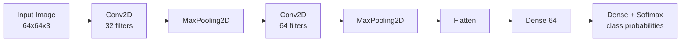

# Mastering Deep Learning with LIMO-Robot — Unit 5: Convolutional Neural Networks

The `Dense` networks from Units 2-4 treat every input as an unstructured vector — fine for a handful of sensor readings, hopeless for a 640x480 camera image, where flattening pixels into a vector throws away all spatial structure and produces an unmanageable number of weights. This unit introduces convolutional neural networks (CNNs), the architecture that makes learning directly from images practical, and prepares you for the object-detection work in Unit 6.

The diagram below shows how data flows through the classic `Conv2D → Conv2D → MaxPooling2D` pattern used later in this unit, from raw image to class probabilities:



## The convolution operation

A **convolution** slides a small matrix of learnable weights — a **filter** or **kernel** (e.g. 3x3) — across the image, computing a weighted sum at each position. This is the same mathematical operation behind classical computer vision edge detectors (a Sobel or Laplacian kernel is a fixed, hand-designed filter); a CNN's difference is that the filter values are learned from data instead of hand-designed, and a layer typically learns dozens of filters in parallel, each specializing in detecting a different pattern (edges, corners, textures, and in deeper layers, more complex shapes).

Two parameters control how the filter moves: **stride** (how many pixels it shifts each step — stride 2 roughly halves the output resolution) and **padding** (whether to pad the image edges so the output stays the same size, `"same"`, or shrinks, `"valid"`). Because the same filter weights are reused at every position, a convolutional layer has vastly fewer parameters than a `Dense` layer would for the same input size, and it's naturally **translation invariant** — a learned edge detector fires on an edge no matter where it appears in the image.

## Pooling: reducing resolution deliberately

A **pooling** layer (most commonly `MaxPooling2D`) reduces the spatial resolution by taking the max (or average) over small windows, e.g. 2x2. This reduces computation for later layers, and provides a small amount of additional translation invariance — a feature detected slightly off-position still survives a max-pool.

## A typical CNN architecture

The classic pattern stacks `Conv2D → Conv2D → MaxPooling2D` blocks, increasing the number of filters as spatial resolution shrinks, then flattens into `Dense` layers for the final classification:

```python
from tensorflow import keras

model = keras.Sequential([
    keras.layers.Input(shape=(64, 64, 3)),  # height, width, RGB channels

    keras.layers.Conv2D(32, kernel_size=3, activation="relu", padding="same"),
    keras.layers.MaxPooling2D(pool_size=2),

    keras.layers.Conv2D(64, kernel_size=3, activation="relu", padding="same"),
    keras.layers.MaxPooling2D(pool_size=2),

    keras.layers.Flatten(),
    keras.layers.Dense(64, activation="relu"),
    keras.layers.Dropout(0.3),
    keras.layers.Dense(10, activation="softmax"),  # e.g. 10 object classes
])
model.compile(optimizer="adam", loss="sparse_categorical_crossentropy",
              metrics=["accuracy"])
model.summary()
```

Run `model.summary()` here specifically to watch spatial dimensions shrink and channel counts grow through the network — it's the fastest way to build intuition for how a CNN "sees" progressively more abstract, lower-resolution features.

## Preparing image data

Images need to be loaded, resized to a consistent shape, and normalized (pixel values typically scaled to [0, 1]) before feeding a CNN. Keras provides a convenient loader for a directory of labeled image folders:

```python
train_ds = keras.utils.image_dataset_from_directory(
    "data/train", image_size=(64, 64), batch_size=32, label_mode="int")
val_ds = keras.utils.image_dataset_from_directory(
    "data/val", image_size=(64, 64), batch_size=32, label_mode="int")

normalize = keras.layers.Rescaling(1.0 / 255)
train_ds = train_ds.map(lambda x, y: (normalize(x), y))
val_ds = val_ds.map(lambda x, y: (normalize(x), y))

model.fit(train_ds, validation_data=val_ds, epochs=10)
```

`image_dataset_from_directory` expects one subdirectory per class, each containing that class's images — a convention worth adopting when you collect your own images from the LIMO camera in Unit 7.

## Try it yourself

Take the CNN above and use `model.predict()` on a single held-out image to inspect the intermediate feature maps rather than the final output: build a second `keras.Model` whose `outputs` is the first `Conv2D` layer's output (`model.layers[0].output`), run one image through it, and visualize a few of the 32 output channels with `matplotlib.pyplot.imshow`. You should see simple edge- and blob-like patterns — direct visual evidence of what those early filters learned.
