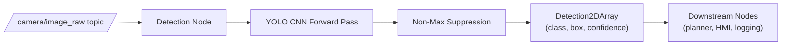

# Mastering Deep Learning with LIMO-Robot — Unit 6: Object and People Recognition with Convolutional Networks

Unit 5 built CNNs that classify an entire image into one of several classes. Real robot perception usually needs more: *which* objects are in the scene, *where* they are, and sometimes *how* a person is posed. This unit covers YOLO, the family of CNN-based detectors that make this practical in real time on a moving robot.

The diagram below shows how a camera frame flows through a YOLO-based ROS detection node to become a published list of detections for downstream nodes:



## From classification to detection

A classifier answers "what is the single dominant thing in this image?" — one label per image. **Object detection** answers "what objects are present, and where is each one?" — a variable number of (class, bounding box, confidence) tuples per image. Sliding a classifier over every possible window and scale in an image is one way to get there, but it's far too slow for anything real-time. **YOLO** ("You Only Look Once") instead runs a single CNN forward pass over the whole image and directly predicts, for a grid of cells overlaid on the image, whether an object's center falls in that cell, what its bounding box is, and how confident the model is — hence "you only look once," as opposed to scanning the image many times.

## How YOLO's output works, conceptually

YOLO divides the image into a grid; each grid cell predicts a fixed number of candidate bounding boxes plus a class probability distribution and an "objectness" confidence score. Because many cells and candidate boxes will fire near the same real object, a post-processing step called **non-maximum suppression (NMS)** discards overlapping lower-confidence boxes, keeping only the best box per detected object. The practical upshot: you don't need to implement any of this by hand — you load a pretrained (or your own fine-tuned) YOLO model and call it on a frame, and it returns a clean list of detections.

## Running inference with a pretrained detector

Two common paths to running YOLO from Python: OpenCV's DNN module loading a pretrained ONNX/Darknet model, or a dedicated detection library. Using OpenCV's DNN module keeps the dependency footprint small and is a reasonable default when you already depend on OpenCV for other perception work:

```python
import cv2

net = cv2.dnn.readNet("yolo.onnx")
frame = cv2.imread("frame.jpg")
h, w = frame.shape[:2]

blob = cv2.dnn.blobFromImage(frame, 1/255.0, (640, 640), swapRB=True, crop=False)
net.setInput(blob)
outputs = net.forward()

# outputs holds per-candidate-box (x, y, w, h, objectness, class_scores...)
# apply confidence thresholding then cv2.dnn.NMSBoxes(...) before drawing results
```

See `docs.opencv.org` for the current `cv2.dnn` API and the exact output layout for the model format you're loading — it varies slightly between YOLO versions and export formats. Whichever tool you use, the pattern is the same: preprocess the frame into the network's expected input size and scaling, run a forward pass, then decode raw outputs into (box, class, confidence) triples with a confidence threshold and NMS.

## Integrating detection into a ROS node

On the robot, detection typically lives in a node that subscribes to the camera topic, runs inference on each frame, and republishes results as a custom or standard message (e.g. `vision_msgs/Detection2DArray`) for downstream nodes to consume:

```python
def image_callback(self, msg):
    frame = self.bridge.imgmsg_to_cv2(msg, desired_encoding="bgr8")
    detections = self.run_yolo(frame)  # your inference + NMS logic
    for det in detections:
        self.get_logger().info(
            f"{det.class_name} conf={det.confidence:.2f} box={det.box}")
    self.publish_detections(detections)
```

Keep inference off the main sensor-processing thread if it can't keep up with the camera's frame rate — dropping frames is usually preferable to a growing subscriber backlog.

## People pose estimation

Pose estimation is a related but distinct task: instead of (or in addition to) a bounding box, the model predicts a set of keypoints (shoulders, elbows, wrists, hips, knees, ankles, etc.) per detected person, which downstream code can use to infer body orientation or simple gestures. Some YOLO variants ship a pose-estimation head alongside the standard detection head, returning both a bounding box and a keypoint set per person in one forward pass — worth checking whether the specific pretrained model you're using supports it before writing separate pose-estimation code.

## Try it yourself

Run a pretrained YOLO model on a single frame captured from the LIMO's camera topic, draw the returned bounding boxes and class labels on the image with OpenCV (`cv2.rectangle`, `cv2.putText`), and save it to disk. Then lower the confidence threshold you use for filtering detections and re-run — observe how many more (often spurious) boxes survive, which should make the purpose of confidence thresholding and NMS concrete rather than abstract.
