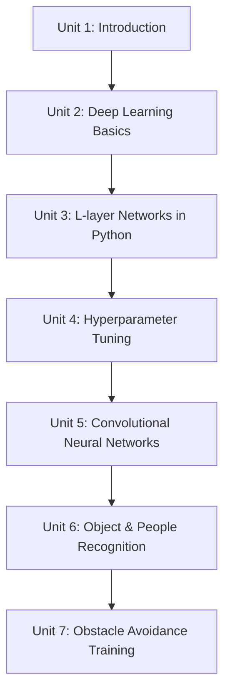

# Mastering Deep Learning with LIMO-Robot

This course builds deep learning skills from first principles up to a working perception-and-control pipeline on the LIMO robot: starting with the math and mechanics of neural networks, moving through practical training skills like hyperparameter tuning, then specializing into convolutional networks for vision, using a pretrained YOLO detector for object and people recognition, and finishing by collecting your own driving data and training an AlexNet-based model to perform learned obstacle avoidance.

The diagram below shows how each unit builds on the vocabulary and skills of the one before it:

1. [Introduction](01-introduction.md) — What deep learning is, how the course is structured, and getting your Python/Keras/ROS/LIMO toolchain ready.
2. [Deep Learning Basics](02-deep-learning-basics.md) — Neuron math, activations, loss functions, and Keras regression/classification examples using robotics sensor data.
3. [How to Program an L-layer Neural Network in Python](03-how-to-program-an-l-layer-neural-network-in-python.md) — Building configurable, multi-layer networks with Keras's Sequential and Functional APIs.
4. [Hyperparameter Tuning](04-hyperparameter-tuning.md) — Train/validation/test splits, reading loss curves, and techniques like dropout, regularization, and early stopping.
5. [Convolutional Neural Networks](05-convolutional-neural-networks.md) — The convolution and pooling operations, CNN architecture, and preparing image datasets.
6. [Object and People Recognition with Convolutional Networks](06-object-and-people-recognition-with-convolutional-networks.md) — Using YOLO-style detectors for real-time object detection and pose estimation.
7. [Obstacle avoidance deep learning training](07-obstacle-avoidance-deep-learning-training.md) — Collecting driving data on LIMO, training an AlexNet-based model, and deploying it as a learned controller.
