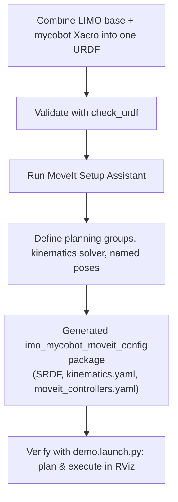

# Mastering Mobile Manipulation with LIMO-Robot — Unit 1: Create a MoveIt2 configuration package

Before you can plan a single motion for the mycobot arm mounted on the LIMO base, MoveIt2 needs a package that describes the robot's geometry, joint groups, and controllers. This unit builds that package from scratch and explains what every generated file is actually for, so you aren't just clicking "Next" in a wizard.

The flow below traces the whole build process, from combining the two Xacro descriptions to a verified, runnable MoveIt2 config package.



## Why a MoveIt2 config package exists

MoveIt2 is generic — it knows nothing about "LIMO" or "mycobot arm" out of the box. It plans motion for *any* robot as long as it's handed three things: a kinematic model (URDF), a semantic description of which joints form which planning group (SRDF), and a way to talk to the hardware/simulation controllers (ros2_control + a controllers YAML). The config package is the glue that bundles these together into a set of launch files MoveIt can consume. Once generated, it is a normal ROS2 package you keep in version control alongside the rest of your robot's software — it is not disposable scaffolding.

## Preparing the URDF/Xacro for the arm-on-base combo

The LIMO base and the mycobot arm each usually ship with their own Xacro description. You combine them into one robot description by including both and attaching the arm's base link to a fixed joint on the LIMO chassis:

```xml
<!-- limo_mycobot.urdf.xacro -->
<robot xmlns:xacro="http://www.ros.org/wiki/xacro" name="limo_mycobot">
  <xacro:include filename="$(find limo_description)/urdf/limo_base.xacro"/>
  <xacro:include filename="$(find mycobot_description)/urdf/mycobot_280.xacro"/>

  <joint name="arm_mount_joint" type="fixed">
    <parent link="base_link"/>
    <child link="arm_base_link"/>
    <origin xyz="0.05 0 0.08" rpy="0 0 0"/>
  </joint>
</robot>
```

Sanity-check it before feeding it to the Setup Assistant:

```bash
ros2 run xacro xacro limo_mycobot.urdf.xacro > /tmp/limo_mycobot.urdf
check_urdf /tmp/limo_mycobot.urdf
```

## Running the MoveIt Setup Assistant

Launch the assistant and point it at your combined URDF:

```bash
ros2 launch moveit_setup_assistant setup_assistant.launch.py
```

Work through the panes in order: generate the self-collision matrix (it samples random joint configurations to find link pairs that can never collide, so planning doesn't waste time checking them), define a **planning group** named something like `mycobot_arm` covering the arm's joints with a kinematics solver (KDL is the safe default; IKFast is faster but needs per-robot generation), add a `gripper` group if the end effector is actuated, define named poses like `home` and `ready`, and list passive/virtual joints (a virtual joint of type `planar` or `floating` if you ever want MoveIt aware of the mobile base's pose, though for a pure-arm pipeline you can leave the base out).

## Understanding what got generated

The assistant writes out a package with a predictable structure worth knowing by heart, because you will hand-edit these files constantly:

```
limo_mycobot_moveit_config/
├── config/
│   ├── limo_mycobot.srdf        # planning groups, named poses, disabled collision pairs
│   ├── kinematics.yaml          # IK solver per group
│   ├── joint_limits.yaml        # velocity/accel scaling overrides
│   ├── moveit_controllers.yaml  # maps planning groups to ros2_control controllers
│   └── initial_positions.yaml
└── launch/
    ├── demo.launch.py           # RViz + fake controllers, no real hardware needed
    └── move_group.launch.py     # the move_group node itself
```

The SRDF is the file you'll revisit most: it's where you add extra `disable_collisions` pairs the sampler missed, and where you define new named poses as your pick-and-place routine matures.

## Verifying the package

Before writing any planning code, confirm the config is self-consistent by bringing up the demo launch, which uses fake joint controllers so no simulator or real robot is required:

```bash
ros2 launch limo_mycobot_moveit_config demo.launch.py
```

In RViz, drag the interactive markers on the arm's end effector and click "Plan & Execute". If a valid trajectory animates, your URDF, SRDF, and kinematics solver are all correctly wired together — everything downstream in this course builds on this working baseline.

## Try it yourself

Add a second named pose called `pre_grasp` to the SRDF (arm raised and gripper open, roughly above where an object would sit on a table in front of LIMO), regenerate the package via the Setup Assistant's SRDF pane, and confirm in the demo launch that you can select `pre_grasp` from RViz's MotionPlanning panel and successfully plan to it.
