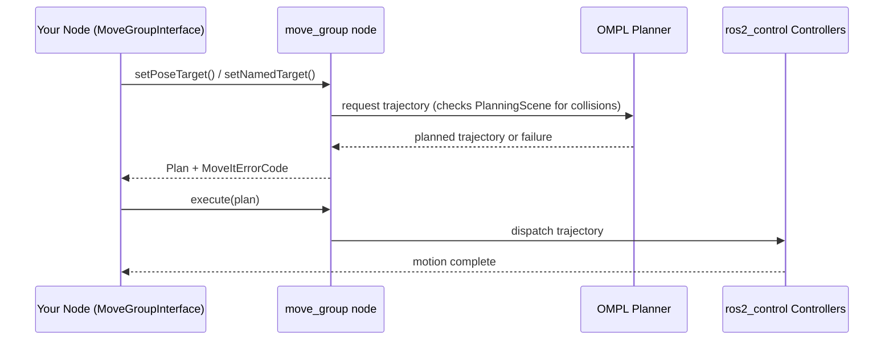

# Mastering Mobile Manipulation with LIMO-Robot — Unit 2: ROS2 Motion Planning with C++

With a working MoveIt2 config package in place, this unit moves you from clicking targets in RViz to commanding the mycobot arm programmatically using the `moveit_cpp`/`MoveGroupInterface` C++ API — the interface your pick-and-place code will actually be built on.

The sequence below shows the round trip a single `plan()`/`execute()` call makes between your node, the `move_group` node, the planner, and the controllers.



## The MoveGroupInterface and where it sits

`MoveGroupInterface` is a client-side C++ class that talks to the `move_group` node over ROS2 actions and services — it doesn't do any planning itself, it packages up your request (a target pose, joint values, or constraints) and sends it to `move_group`, which runs the OMPL (or another) planner and returns a trajectory. Because it's just a client, you can build it into any node: a dedicated "pick and place" node, a behavior tree leaf, or a test script. A minimal node looks like this:

```cpp
#include <rclcpp/rclcpp.hpp>
#include <moveit/move_group_interface/move_group_interface.h>

int main(int argc, char **argv)
{
  rclcpp::init(argc, argv);
  auto node = rclcpp::Node::make_shared(
      "arm_mover", rclcpp::NodeOptions().automatically_declare_parameters_from_overrides(true));

  auto move_group = moveit::planning_interface::MoveGroupInterface(node, "mycobot_arm");
  move_group.setPlanningTime(5.0);
  move_group.setMaxVelocityScalingFactor(0.3);

  // ... planning calls go here, see below

  rclcpp::shutdown();
  return 0;
}
```

Note `automatically_declare_parameters_from_overrides(true)` — `MoveGroupInterface` reads planning parameters (robot description, kinematics) off the node's parameter interface, so this node must be launched alongside those parameters, typically via a launch file that also loads the moveit config.

## Setting targets and planning

Two common target types cover most tasks. A **pose target** for the end effector:

```cpp
geometry_msgs::msg::Pose target_pose;
target_pose.orientation.w = 1.0;
target_pose.position.x = 0.25;
target_pose.position.y = 0.0;
target_pose.position.z = 0.20;
move_group.setPoseTarget(target_pose);

moveit::planning_interface::MoveGroupInterface::Plan plan;
bool ok = (move_group.plan(plan) == moveit::core::MoveItErrorCode::SUCCESS);
if (ok) {
  move_group.execute(plan);
}
```

Or a **named target** you defined in the SRDF in Unit 1:

```cpp
move_group.setNamedTarget("pre_grasp");
move_group.move();  // plan() + execute() combined, blocks until done
```

Always check the return code rather than assuming success — planning fails routinely (unreachable pose, self-collision, joint limits) and executing an unplanned trajectory is undefined behavior.

## Collision objects and the planning scene

Real pick-and-place needs the planner aware of obstacles — the table LIMO is driving up to, the object itself before grasp. You publish these into the `PlanningSceneInterface`:

```cpp
moveit::planning_interface::PlanningSceneInterface planning_scene_interface;

moveit_msgs::msg::CollisionObject table;
table.header.frame_id = move_group.getPlanningFrame();
table.id = "table";

shape_msgs::msg::SolidPrimitive box;
box.type = box.BOX;
box.dimensions = {0.6, 0.9, 0.02};

geometry_msgs::msg::Pose table_pose;
table_pose.position.x = 0.4;
table_pose.position.z = 0.18;
table_pose.orientation.w = 1.0;

table.primitives.push_back(box);
table.primitive_poses.push_back(table_pose);
table.operation = table.ADD;

planning_scene_interface.applyCollisionObject(table);
```

Every subsequent `plan()` call will now route the arm around the table automatically.

## Cartesian paths for straight-line motion

Joint-space planning (above) can produce curved, unpredictable end-effector paths — fine for free-space moves, wrong for the final approach into a grasp, where you want a straight descent onto the object. `computeCartesianPath` interpolates a sequence of waypoints in Cartesian space and asks the planner to follow it as closely as possible:

```cpp
std::vector<geometry_msgs::msg::Pose> waypoints;
auto approach = target_pose;
approach.position.z += 0.10;
waypoints.push_back(approach);   // hover above
waypoints.push_back(target_pose); // descend to grasp

moveit_msgs::msg::RobotTrajectory trajectory;
double fraction = move_group.computeCartesianPath(waypoints, 0.01, 0.0, trajectory);
if (fraction > 0.95) {
  move_group.execute(trajectory);
}
```

`fraction` tells you how much of the path was actually achievable — always check it before executing; a low fraction usually means a waypoint was unreachable or would hit an obstacle.

## Try it yourself

Write a small C++ node that adds a cylindrical collision object representing a "cup" at a fixed pose in front of the arm, plans a pose target that would collide with it if the object were absent, and confirms (by printing the planner's error code) that the plan fails while the object is present — then removes the object with `planning_scene_interface.removeCollisionObjects({"cup"})` and confirms the same plan now succeeds.
