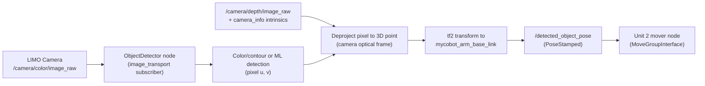

# Mastering Mobile Manipulation with LIMO-Robot — Unit 3: Object Detection with ROS2

The arm can now move wherever you tell it (Unit 2), but a real pick-and-place task needs that target to come from perception, not a hardcoded pose. This unit covers turning LIMO's camera feed into a 3D grasp pose that gets fed straight into the `MoveGroupInterface` code you already wrote.

The diagram below traces the data flow from raw camera pixels to a grasp pose consumed by the Unit 2 motion node.



## Getting the camera stream into ROS2

LIMO ships with an RGB (and on some variants, RGB-D) camera publishing standard `sensor_msgs/Image` topics, typically already bridged by the vendor driver. Confirm the stream and its calibration before writing any detection code:

```bash
ros2 topic list | grep camera
ros2 topic hz /camera/color/image_raw
ros2 run rqt_image_view rqt_image_view
```

For depth-aware grasping you also want `/camera/depth/image_raw` and `/camera/color/camera_info` — the latter carries the intrinsics matrix you'll need to project 2D pixels into 3D rays. Wire your detector node up as a subscriber using `image_transport` (not a raw `Image` subscription) so it transparently benefits from compressed transport when available:

```python
from image_transport_py import ImageTransport
import cv2
from cv_bridge import CvBridge

class ObjectDetector(Node):
    def __init__(self):
        super().__init__('object_detector')
        self.bridge = CvBridge()
        self.it = ImageTransport('object_detector_it')
        self.sub = self.it.subscribe('/camera/color/image_raw', self.on_image, 'raw')

    def on_image(self, msg):
        frame = self.bridge.imgmsg_to_cv2(msg, desired_encoding='bgr8')
        self.detect(frame)
```

## Detecting the object

Two approaches cover most beginner pick-and-place setups, and you can start with the simpler one. For a known, uniquely colored object, classical color-and-contour detection with OpenCV is fast, dependency-light, and easy to debug:

```python
def detect(self, frame):
    hsv = cv2.cvtColor(frame, cv2.COLOR_BGR2HSV)
    mask = cv2.inRange(hsv, (25, 80, 80), (35, 255, 255))  # yellow object
    contours, _ = cv2.findContours(mask, cv2.RETR_EXTERNAL, cv2.CHAIN_APPROX_SIMPLE)
    if not contours:
        return None
    largest = max(contours, key=cv2.contourArea)
    (u, v), radius = cv2.minEnclosingCircle(largest)
    return (u, v) if radius > 5 else None
```

Once color segmentation stops being enough (cluttered scenes, multiple object classes), swap the `detect()` body for a pretrained model — a lightweight ONNX or TorchScript detector run through `cv2.dnn` or a small inference node — while keeping everything downstream identical, since all you need out of this stage is a pixel coordinate (or bounding box) per object.

## From pixel to grasp pose

A 2D pixel alone isn't a grasp target — you need a 3D point in the arm's planning frame. With a depth camera, look up the depth at the detected pixel and deproject using the camera intrinsics from `camera_info`:

```python
def pixel_to_point(self, u, v, depth, K):
    fx, fy, cx, cy = K[0], K[4], K[2], K[5]
    z = depth
    x = (u - cx) * z / fx
    y = (v - cy) * z / fy
    return x, y, z  # in the camera optical frame
```

That point is in the camera's optical frame, not the arm's planning frame — transform it using `tf2` before handing it to MoveIt:

```python
from tf2_geometry_msgs import do_transform_pose

transform = self.tf_buffer.lookup_transform(
    'mycobot_arm_base_link', 'camera_color_optical_frame', rclpy.time.Time())
grasp_pose_in_arm_frame = do_transform_pose(camera_frame_pose, transform)
```

This is why an accurate, measured (or calibrated) camera-to-arm-base transform in your URDF from Unit 1 matters — every detection's accuracy is capped by how correct that static transform is.

## Bridging detection to the pick-and-place motion

Publish the resolved grasp pose as a `geometry_msgs/PoseStamped` on a topic like `/detected_object_pose`, and have your Unit 2 motion node subscribe to it instead of using a hardcoded pose — that's the seam where perception and manipulation meet:

```python
self.pose_pub.publish(grasp_pose_in_arm_frame)
```

```cpp
// in the C++ mover node from Unit 2
sub_ = node->create_subscription<geometry_msgs::msg::PoseStamped>(
    "/detected_object_pose", 10,
    [this](geometry_msgs::msg::PoseStamped::SharedPtr msg) {
      move_group_->setPoseTarget(msg->pose);
      moveit::planning_interface::MoveGroupInterface::Plan plan;
      if (move_group_->plan(plan) == moveit::core::MoveItErrorCode::SUCCESS) {
        move_group_->execute(plan);
      }
    });
```

## Try it yourself

Place a single brightly colored object in front of LIMO's camera, tune the HSV `inRange` bounds in `rqt_image_view` (or `cv2.imshow` on the mask) until only that object survives thresholding, then publish its deprojected 3D position as a `PoseStamped` and verify with `ros2 topic echo /detected_object_pose` that the coordinates change sensibly as you move the object closer to and farther from the camera.
