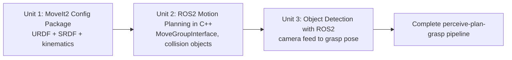

# Mastering Mobile Manipulation with LIMO-Robot

This course walks through the full arm-manipulation stack on top of the LIMO mobile base fitted with a mycobot arm: building the MoveIt2 configuration that describes the robot to the planner, driving that arm programmatically with the MoveGroupInterface C++ API, and closing the loop with a camera-based object detector that hands MoveIt a real grasp target instead of a hardcoded pose. By the end, you can take a mycobot-on-LIMO rig from a bare URDF to a working perceive-plan-grasp pipeline.

The diagram below shows how each unit's output becomes the next unit's foundation, ending in the complete perceive-plan-grasp pipeline.

1. [Create a MoveIt2 configuration package](01-create-a-moveit2-configuration-package.md) — Learn how to create and configure a MoveIt2 configuration package for your LIMO robot with the mycobot arm.
2. [ROS2 Motion Planning with C++](02-ros2-motion-planning-with-cpp.md) — Learn how to use the Move Group C++ Interface to interact with your manipulator robot in order to generate complex motions.
3. [Object Detection with ROS2](03-object-detection-with-ros2.md) — Learn how to perform object detection with ROS2 in order to pick objects with the LIMO mycobot arm setup.
