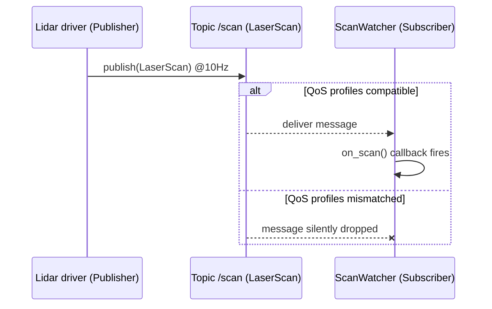

# Mastering ROS 2 with LIMO-Robot — Unit 2: Understanding ROS2 Topics

Topics are how most of LIMO's data flows — wheel odometry, lidar scans, camera frames, velocity commands. This unit covers the publish/subscribe model in depth: what a topic actually is, how to write both ends of the connection, and how message interfaces and QoS settings affect whether your data actually arrives.

The sequence below shows a publisher and subscriber exchanging messages through a topic, and what happens when their QoS profiles don't match.



## What is a topic

A topic is a named, typed data channel. "Named" means it has a string identifier like `/scan` or `/cmd_vel`; "typed" means every message on it must match one message definition (interface). Any number of nodes can publish to a topic and any number can subscribe — publishers and subscribers never need to know about each other directly, they only need to agree on the topic name and type. This decoupling is the whole point: you can swap LIMO's real lidar driver for a simulated one and every downstream node (mapping, obstacle avoidance) keeps working unchanged, because they only depend on `/scan` publishing `sensor_msgs/msg/LaserScan`.

Inspect what's live on a running LIMO:

```bash
ros2 topic list -t          # -t also shows the message type per topic
ros2 topic echo /scan
ros2 topic hz /scan         # publish rate
ros2 topic info /cmd_vel --verbose
```

## Publishers

A publisher creates messages and pushes them onto a topic at whatever rate makes sense for the data (a lidar might publish at 10 Hz, a battery-status node at 1 Hz). Publishing is fire-and-forget — the node doesn't wait for or know about subscribers:

```python
import rclpy
from rclpy.node import Node
from geometry_msgs.msg import Twist

class SpinInPlace(Node):
    def __init__(self):
        super().__init__('spin_in_place')
        self.pub = self.create_publisher(Twist, '/cmd_vel', 10)
        self.timer = self.create_timer(0.1, self.tick)  # 10 Hz

    def tick(self):
        msg = Twist()
        msg.angular.z = 0.5
        self.pub.publish(msg)
```

The `10` is the QoS history depth (queue size) — how many unsent messages the middleware buffers before it starts dropping the oldest ones.

## Subscribers

A subscriber registers a callback that fires whenever a new message arrives on the topic. Callbacks should be fast and non-blocking — heavy processing belongs in a separate thread or a downstream node, otherwise you starve the executor and other callbacks on the same node stall:

```python
class ScanWatcher(Node):
    def __init__(self):
        super().__init__('scan_watcher')
        self.sub = self.create_subscription(
            LaserScan, '/scan', self.on_scan, 10)

    def on_scan(self, msg: LaserScan):
        closest = min(msg.ranges)
        self.get_logger().info(f'closest obstacle: {closest:.2f} m')
```

## Message interfaces and QoS

The message type (e.g. `sensor_msgs/msg/LaserScan`, `geometry_msgs/msg/Twist`) is called an interface, defined in a `.msg` file as a flat list of typed fields. Inspect any interface without leaving the terminal:

```bash
ros2 interface show sensor_msgs/msg/LaserScan
```

Custom interfaces live in their own package (conventionally suffixed `_interfaces` or `_msgs`) with a `.msg` file per type and a couple of `CMakeLists.txt`/`package.xml` lines invoking `rosidl_generate_interfaces`.

Quality of Service (QoS) is the other half of the story and is where ROS2 diverges most from ROS1: publisher and subscriber each declare a QoS profile (reliability, durability, history depth), and if the two profiles are incompatible the connection silently never forms. Sensor data typically uses `best_effort` reliability (drop late frames rather than stall), while commands and state use `reliable`. If `ros2 topic echo` shows nothing despite the publisher clearly running, mismatched QoS is the first thing to check.

## Try it yourself

Write a subscriber node that listens on `/scan`, and whenever the minimum range drops below 0.5 m, publishes a `Twist` with zero linear velocity to `/cmd_vel` (an emergency stop). Run it alongside LIMO (real or simulated) and verify with `ros2 topic echo /cmd_vel` that the stop message fires only when an obstacle gets close.
