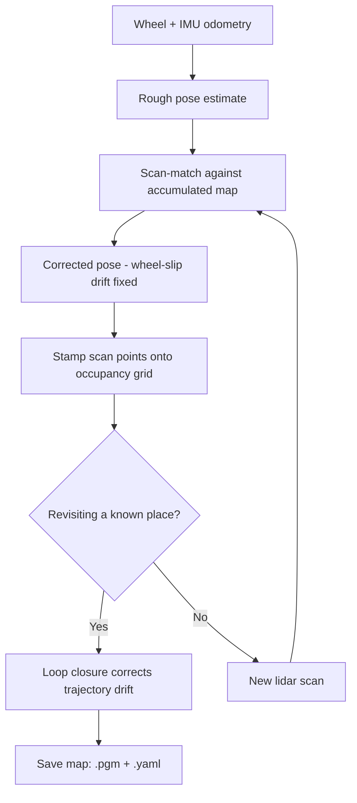

# Mastering ROS 2 with LIMO-Robot — Unit 3: How to build a map

Before LIMO can navigate autonomously it needs to know the shape of the space it's in. This unit covers SLAM (Simultaneous Localization and Mapping) conceptually and walks through actually driving LIMO around to produce a 2D occupancy grid map you'll reuse in the next several units.

The flowchart below walks through the SLAM loop LIMO runs on every scan, from raw odometry to a saved map file.



## Why mapping comes before navigation

Path planning needs to know which cells are free space, which are walls, and which are unknown. A map is that knowledge captured once, offline, so that later the robot doesn't have to build the world model from scratch every time it drives — it just has to figure out where *within* the known map it currently is (that's localization, next unit). Building the map and using the map are deliberately separate phases in this course, even though the underlying algorithms (both estimate the robot's pose from sensor data) overlap.

## SLAM in a nutshell

SLAM solves two coupled problems at once: where is the robot (localization) and what does the environment look like (mapping) — coupled because you need a map to localize against and a pose estimate to place new sensor readings on the map. LIMO's lidar-based SLAM stack typically works like this:

1. Odometry (from wheel encoders, fused with IMU) gives a rough pose estimate between scans.
2. Each new lidar scan is matched ("scanned-matched") against the accumulated map to correct that estimate — this fixes wheel-slip drift.
3. The corrected pose is used to stamp the new scan's points onto the occupancy grid.
4. Loop closure detects when the robot revisits a place it's seen before and corrects accumulated drift across the whole trajectory, not just the last step.

`slam_toolbox` is the commonly used ROS2 package that implements this pipeline for 2D lidar; it exposes both online (map builds live as you drive) and offline/lifelong modes.

## Running SLAM on LIMO

Bring up LIMO's sensor drivers (or the simulation) and the SLAM node together, then drive it around the space with teleop:

```bash
ros2 launch limo_bringup limo_real.launch.py     # or limo_gazebo_sim.launch.py in simulation
ros2 launch slam_toolbox online_async_launch.py

# in another terminal, drive LIMO around manually
ros2 run teleop_twist_keyboard teleop_twist_keyboard
```

Watch the map build live in RViz by adding a `Map` display subscribed to `/map`. Good mapping runs drive slowly, cover every room/corridor at least once, and deliberately close loops (return to a previously visited area) so the SLAM backend can correct drift — a map built by driving in one long straight line with no loop closure will visibly warp over distance.

## Saving the map

Once you're satisfied with the coverage, save the occupancy grid to disk with `nav2_map_server`'s saver utility, which writes both a `.pgm` image (the grid) and a `.yaml` file (resolution, origin, occupied/free thresholds):

```bash
ros2 run nav2_map_server map_saver_cli -f ~/limo_ws/maps/lab_map
```

```yaml
# lab_map.yaml
image: lab_map.pgm
resolution: 0.05
origin: [-10.0, -10.0, 0.0]
occupied_thresh: 0.65
free_thresh: 0.196
negate: 0
```

Keep this map file pair under version control alongside your workspace — it's the input every navigation unit from here on depends on.

## Try it yourself

Drive LIMO (real or simulated) through a small loop — out, around an obstacle, and back to the starting point — with `slam_toolbox` running, save the resulting map, then reopen the `.pgm` in an image viewer and check the loop-closed corridor lines up without a visible seam or offset.
