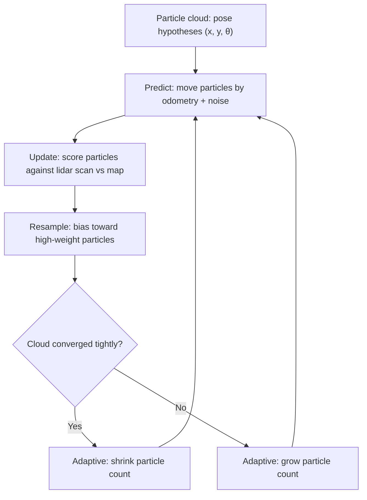

# Mastering ROS 2 with LIMO-Robot — Unit 4: How to localize the robot in the environment

With a saved map in hand, LIMO needs a way to figure out where it is on that map at every moment — that's localization. This unit covers the particle-filter approach ROS2's AMCL implements and how to configure and run it against the map you built in the previous unit.

The diagram below shows AMCL's predict/update/resample cycle and how the particle count adapts based on convergence.



## What localization solves

Odometry alone (integrating wheel encoder ticks over time) drifts — small errors accumulate until the estimated pose is meters away from the true one after enough driving. Localization corrects this by continuously comparing live sensor readings (lidar scans) against the known map and adjusting the pose estimate to the interpretation that best explains what the sensor is actually seeing. Unlike SLAM, the map is fixed here — localization only ever updates the robot's belief about its own pose, never the map itself.

## AMCL and the particle filter

AMCL (Adaptive Monte Carlo Localization) represents "where might the robot be" as a cloud of weighted particles, each a hypothesis `(x, y, θ)`. Every cycle:

1. **Predict** — move every particle according to the latest odometry (plus noise, since odometry itself is imperfect).
2. **Update** — score each particle by how well its hypothesized pose would explain the current lidar scan against the map; particles that predict the scan well get higher weight.
3. **Resample** — draw a new particle set biased toward the high-weight particles, so the cloud converges around the true pose over time.

"Adaptive" refers to AMCL dynamically shrinking or growing the particle count — fewer particles once the filter has converged tightly (cheap to run), more particles when uncertainty is high (e.g. right after a kidnapped-robot event or at startup with an unknown initial pose).

## Configuring and launching AMCL

AMCL ships as part of Nav2 and is configured through a YAML params file — the values worth tuning first are the particle count bounds and the initial pose covariance:

```yaml
amcl:
  ros__parameters:
    min_particles: 500
    max_particles: 2000
    laser_model_type: "likelihood_field"
    odom_model_type: "diff"          # LIMO is a differential-drive base
    update_min_d: 0.1                # min distance (m) traveled before an update
    update_min_a: 0.1                # min rotation (rad) before an update
```

Launch it against the map you saved earlier:

```bash
ros2 launch nav2_bringup localization_launch.py \
    map:=/home/you/limo_ws/maps/lab_map.yaml \
    params_file:=/home/you/limo_ws/config/nav2_params.yaml
```

AMCL starts with a broad particle spread unless told otherwise. Give it an initial guess to converge faster — either publish once to `/initialpose`, or use RViz's "2D Pose Estimate" tool to click-and-drag an arrow at LIMO's actual starting location and heading.

## Watching convergence and diagnosing drift

Add a `PoseArray` display in RViz subscribed to `/particle_cloud` to watch the cloud visually — a tight cluster means the filter is confident; a spread-out cloud means it isn't sure yet (common right after startup, or in a long symmetric corridor where many poses look identical to the lidar). If the estimated pose (`/amcl_pose`) keeps drifting away from LIMO's visible real position, suspect either a stale/inaccurate map, a bad odometry calibration, or `update_min_d`/`update_min_a` set so high that AMCL isn't updating often enough.

## Try it yourself

Launch AMCL against your saved map, deliberately give it a wrong initial pose estimate (click 2D Pose Estimate somewhere off from LIMO's real position), then drive LIMO around and watch in RViz how many meters of travel it takes for the particle cloud to converge back onto the correct pose.
