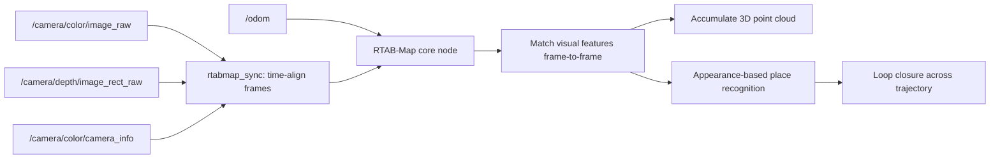

# Mastering ROS 2 with LIMO-Robot — Unit 7: RTAB-Map Basic Concepts

Everything so far assumed a 2D lidar and a flat occupancy grid. RTAB-Map (Real-Time Appearance-Based Mapping) takes a different route — building a 3D point cloud map from a depth or stereo camera — which matters for LIMO variants fitted with an RGB-D sensor and for environments where a flat lidar scan doesn't capture enough (ramps, overhanging obstacles, cluttered shelving). This unit covers the concepts before the next unit puts them to use for autonomous navigation.

The diagram below traces RTAB-Map's data flow from synchronized camera topics to an accumulated point cloud with loop closure.



## Visual/RGB-D SLAM vs lidar SLAM

Lidar SLAM (Unit 3) matches consecutive 2D scans to build a flat grid. RTAB-Map instead matches consecutive **images** — using visual features (distinctive, trackable points like corners) it detects in each RGB-D frame — to estimate how the camera moved between frames, then projects the depth data from each frame into a shared 3D point cloud. The core challenge RTAB-Map is named after and specifically engineered to solve is **loop closure at scale**: appearance-based place recognition (recognizing "I've seen this view before" purely from image similarity) lets it detect loop closures even after long trajectories, without that comparison growing unmanageably slow as the map grows — it uses a memory management scheme that keeps only the most relevant past frames active for real-time comparison.

## What RTAB-Map needs as input

RTAB-Map consumes synchronized RGB image, depth image, and camera calibration info together, plus (ideally) odometry to seed its motion estimate the same way lidar SLAM uses wheel odometry:

```bash
ros2 topic list
# /camera/color/image_raw
# /camera/depth/image_rect_raw
# /camera/color/camera_info
# /odom
```

If LIMO's depth camera driver isn't already publishing synchronized topics, RTAB-Map's `rtabmap_sync` package provides a sync node that time-aligns RGB and depth frames before they reach the core mapping node — a common source of a map that never starts building is unsynchronized or missing depth data, so verify these topics are actually publishing at a healthy rate before troubleshooting further.

## Launching RTAB-Map

```bash
ros2 launch rtabmap_launch rtabmap.launch.py \
    rgb_topic:=/camera/color/image_raw \
    depth_topic:=/camera/depth/image_rect_raw \
    camera_info_topic:=/camera/color/camera_info \
    frame_id:=base_link \
    approx_sync:=true
```

`approx_sync:=true` is usually needed because RGB and depth frames from consumer depth cameras rarely arrive with identical timestamps — RTAB-Map matches them within a small tolerance instead of requiring an exact match.

## Viewing the point cloud

Add a `PointCloud2` display in RViz subscribed to `/rtabmap/cloud_map` (the accumulated map) or `/rtabmap/cloud_obstacles` (just the obstacle points, useful for confirming what will actually block navigation). RTAB-Map also ships its own standalone viewer, `rtabmap-databaseViewer`, for inspecting a saved `.db` map file after the fact — including replaying loop closures frame by frame, which is the fastest way to understand what "appearance-based loop closure" actually looked like for your specific run.

```bash
rtabmap-databaseViewer ~/.ros/rtabmap.db
```

## Try it yourself

Launch RTAB-Map against LIMO's depth camera (real or simulated) and drive a short loop through a visually distinctive space (a room with varied furniture, not a blank hallway). Open the resulting `.db` in `rtabmap-databaseViewer` afterward and find the loop closure event where it recognized the starting area — note which frame pair it matched and how confident the match score was.
