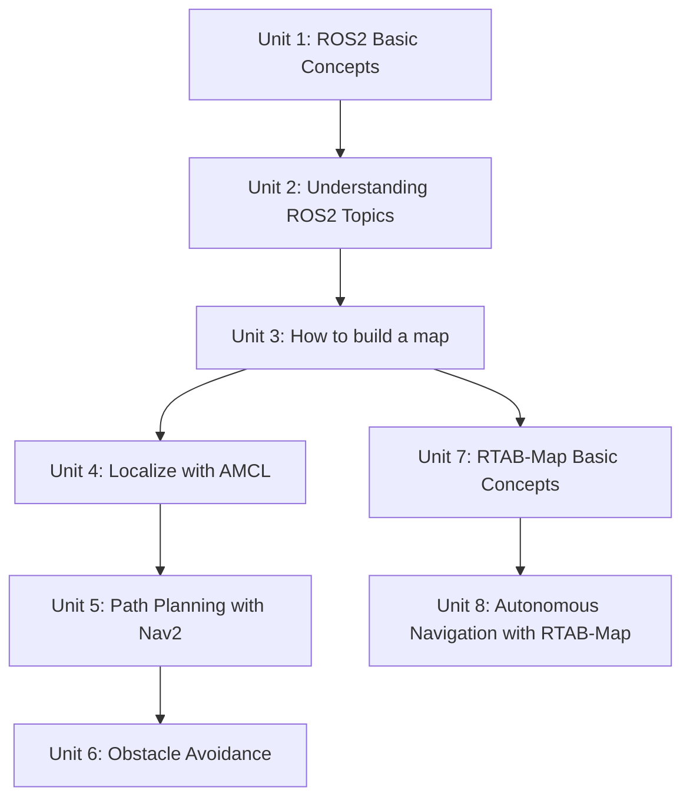

# Mastering ROS 2 with LIMO-Robot

This course is a hands-on path through ROS2 built entirely around the LIMO robot: you start with the fundamentals of packages, nodes, Colcon, and topics, then use those building blocks to make LIMO map its surroundings, localize within that map, plan and follow paths, and avoid obstacles with the Nav2 stack — before finishing with an alternative, camera-based mapping and navigation pipeline built on RTAB-Map. By the end you can take LIMO from a bare ROS2 workspace to fully autonomous point-to-point navigation, via two different mapping approaches.

The diagram below shows how the eight units build on each other, including the fork after mapping into the lidar-based (AMCL/Nav2) and camera-based (RTAB-Map) navigation tracks.

1. [ROS2 Basic Concepts](01-ros2-basic-concepts.md) — Basic ROS2 concepts: packages, nodes, compilation and launch files.
2. [Understanding ROS2 Topics](02-understanding-ros2-topics.md) — What are topics, publishers, subscribers, topic messages (interfaces) and how they work.
3. [How to build a map](03-how-to-build-a-map.md) — Learn how to build a map for navigation.
4. [How to localize the robot in the environment](04-how-to-localize-the-robot-in-the-environment.md) — How to do localization in ROS2 using AMCL.
5. [How to do Path Planning in ROS2](05-how-to-do-path-planning-in-ros2.md) — About the Nav2 planner, controller and bt-navigator.
6. [How Obstacle Avoidance happens in ROS2](06-how-obstacle-avoidance-happens-in-ros2.md) — How to make Nav2 avoid static and dynamic obstacles.
7. [RTAB-Map Basic Concepts](07-rtab-map-basic-concepts.md) — Learn how to initiate RTAB for generating a point cloud map.
8. [Autonomous Navigation with RTAB-Map](08-autonomous-navigation-with-rtab-map.md) — Learn how to localize with a point cloud map and navigate autonomously.
