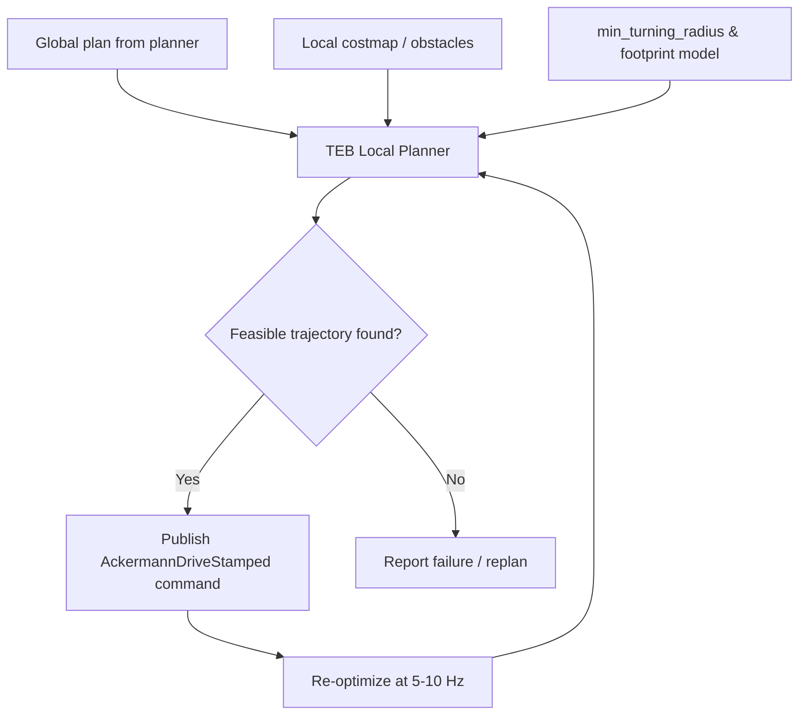

# Mastering ROS: RB-Car — Unit 4: TEB Planning, Part 1

Unit 3 got RB-CAR navigating with a generic local planner. This unit swaps that in for the **Timed Elastic Band (TEB)** local planner, configured specifically for a car-like, non-holonomic vehicle — the piece of the stack that actually respects the fact that RB-CAR can't strafe or spin in place.

The diagram below shows TEB's continuous optimization loop: it balances the global plan, local obstacles, and RB-CAR's Ackermann constraints into a feasible command every cycle.



## Why car-like robots need a kinematics-aware local planner

A local planner's job is to turn the global plan (a coarse, geometry-only path) into a smooth, dynamically-feasible trajectory the robot can actually execute right now, reacting to obstacles the global planner didn't know about. A planner designed around differential-drive robots (like the classic DWA/TrajectoryPlanner) assumes the robot can rotate in place and turn on a dime — assumptions that are simply false for RB-CAR. Point it at a differential-drive local planner and you'll see it repeatedly generate trajectories the vehicle physically cannot follow, or fall back to jerky, timid motion because it's fighting its own kinematic model.

TEB instead represents the trajectory as a sequence of poses connected by time intervals — an "elastic band" that gets deformed by optimization to minimize path length and time while satisfying constraints you give it, including a configurable minimum turning radius. That last part is exactly what an Ackermann vehicle needs.

## TEB local planner overview

TEB ships as a pluginlib plugin for both the ROS 1 `move_base` stack and Nav2, under the `teb_local_planner` package (see its documentation for the exact parameter set for your distro). Swap it in via your navigation stack's local planner plugin configuration:

```yaml
controller_server:
  ros__parameters:
    controller_plugins: ["FollowPath"]
    FollowPath:
      plugin: "teb_local_planner::TebLocalPlannerROS"
```

Once loaded, TEB re-optimizes the local trajectory at a fixed rate (typically 5-10 Hz), continuously re-balancing "get to the goal fast" against "respect my dynamic and kinematic limits" against "stay clear of obstacles in the local costmap."

## Key parameters for Ackermann vehicles

The defaults assume a differential-drive robot, so the first thing you do for RB-CAR is enable car-like mode and set its geometry:

```yaml
FollowPath:
  min_turning_radius: 1.2          # RB-CAR's real minimum turning radius, in meters
  wheelbase: 0.9                   # distance between front and rear axles
  cmd_angle_instead_rotvel: true   # publish steering angle, not angular velocity
  max_vel_x: 1.5
  max_vel_x_backwards: 0.3         # cars reverse more cautiously than they go forward
  acc_lim_x: 0.5
  min_obstacle_dist: 0.4
  footprint_model:
    type: "polygon"
    vertices: "[[-0.3,-0.5],[-0.3,0.5],[1.8,0.5],[1.8,-0.5]]"
```

Two mistakes cost most students the most debugging time here: leaving `min_turning_radius` at 0 (which tells TEB the robot can spin in place, producing plans it then can't execute), and using a circular or otherwise-too-small footprint model that doesn't reflect a real car's rectangular, front-heavy shape — this causes TEB to accept trajectories that clip obstacles with the vehicle's overhang.

## Visualizing and tuning in RViz

Add the TEB markers display in RViz (`/local_plan`, `/teb_poses`, `/teb_markers` depending on version) to watch the elastic band deform live as you drive toward obstacles. Slow the robot down and approach an obstacle at an angle — you should see the band curve around it with a radius no tighter than `min_turning_radius`. If the band instead threads a gap the real car couldn't fit through, your footprint model is too optimistic.

## Try it yourself

Take the navigation stack from Unit 3, swap in TEB with the parameters above, and set up an obstacle course of two or three cones/boxes in a line with gaps slightly narrower than RB-CAR's turning circle would comfortably clear. Send a navigation goal on the far side and confirm TEB either finds a valid weaving path or correctly reports failure — rather than generating a plan the vehicle can't physically drive.
