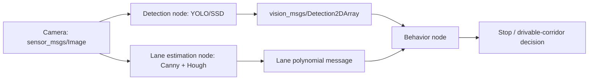

# Mastering ROS: RB-Car — Unit 6: Visual Information Management

Navigation and planning get RB-CAR from A to B; this unit gives it eyes. You'll build a perception pipeline that turns raw camera frames into structured information — detected pedestrians, vehicles, and traffic signals, plus lane geometry — that the rest of the stack can react to.

The diagram below shows the three-stage perception pipeline: independent detection and lane-finding nodes feed structured messages into a behavior node that turns them into a driving decision.



## The perception pipeline for autonomous driving

A useful way to think about this unit is as three stages, each a ROS node subscribing to the camera topic and publishing structured output:

1. **Detection** — find and classify objects of interest in the frame (pedestrians, cars, traffic lights, signs).
2. **Lane estimation** — find the road's lane boundaries relative to the vehicle.
3. **Fusion into a decision-relevant representation** — publish results as ROS messages (bounding boxes, lane polynomials, a "stop" flag) that a behavior node or the navigation stack can consume, rather than leaving them as raw image annotations.

Keep detection and lane-finding as separate nodes even though they share an input topic — it keeps each one simple to test and swap out independently, and lets you run them at different rates (lane-finding usually needs to run faster than object detection).

## Detecting pedestrians, vehicles, and traffic signals

For general object classes (person, car, traffic light) a pretrained deep detector is the practical starting point rather than building one from scratch — this is squarely the domain of models like YOLO or SSD-family networks, run through OpenCV's DNN module or a dedicated inference framework:

```python
import cv2

net = cv2.dnn.readNet("yolov4.weights", "yolov4.cfg")
layer_names = net.getUnconnectedOutLayersNames()

def detect(frame):
    blob = cv2.dnn.blobFromImage(frame, 1/255.0, (416, 416), swapRB=True, crop=False)
    net.setInput(blob)
    outputs = net.forward(layer_names)
    # outputs: per-detection [center_x, center_y, w, h, objectness, class_scores...]
    return outputs
```

Wrap this in a ROS node that subscribes to `sensor_msgs/Image`, runs inference, and republishes results as `vision_msgs/Detection2DArray` — a standard message type other nodes can consume without knowing anything about your detector's internals. For traffic *lights* specifically, add a cheap color-classification pass (crop the detected light's bounding box, check whether red/yellow/green pixels dominate in HSV space) since a generic detector usually only tells you "there's a traffic light here," not its current state.

## Lane detection with classical computer vision

Lanes are geometrically regular enough that classical CV — no deep learning required — is often the more robust and far cheaper choice. A standard pipeline:

```python
import cv2
import numpy as np

def find_lane_lines(frame):
    gray = cv2.cvtColor(frame, cv2.COLOR_BGR2GRAY)
    edges = cv2.Canny(gray, 50, 150)

    h, w = edges.shape
    roi_mask = np.zeros_like(edges)
    roi_vertices = np.array([[(0, h), (w, h), (w * 0.55, h * 0.6), (w * 0.45, h * 0.6)]], dtype=np.int32)
    cv2.fillPoly(roi_mask, roi_vertices, 255)
    masked_edges = cv2.bitwise_and(edges, roi_mask)

    lines = cv2.HoughLinesP(masked_edges, 2, np.pi / 180, 50,
                             minLineLength=40, maxLineGap=100)
    return lines
```

The region-of-interest mask matters as much as the edge detector: without it, Canny picks up horizon clutter, sky, and background objects that have nothing to do with the road surface. From the detected line segments, fit a left and right lane line (e.g. a linear or second-order polynomial fit through the segment endpoints, separated by slope sign) and publish the result as a small custom message or a `PolygonStamped` describing the drivable corridor.

## Publishing perception results for the planner

Both pipelines should feed a single downstream topic the rest of the system can react to — for example, a `Detection2DArray` for objects plus a lane-polynomial message, both timestamped and in the camera frame (or transformed into `base_link` if you've calibrated the camera extrinsics). A simple behavior node can then subscribe to both and, for instance, cancel the current navigation goal and publish a stop command if a red-classified traffic light or a pedestrian bounding box appears inside a defined "danger zone" in the image.

## Try it yourself

Record a short rosbag (or drive live) of RB-CAR's camera feed through an area with visible lane markings and at least one other object class (a person, a cone, a parked car). Run the lane-detection pipeline above against it, overlay the fitted lane lines on the video, and tune the ROI polygon and Hough parameters until the fit stays stable across the whole recording, including frames with shadows or lighting changes.
