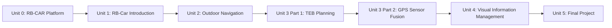

# Mastering ROS: RB-Car

This course teaches autonomous driving on Robotnik's RB-CAR, an Ackermann-steered outdoor research platform, by building up a full self-driving stack layer by layer: getting to know the vehicle's hardware and ROS interfaces, mapping and navigating an outdoor area, swapping in a car-kinematics-aware local planner (TEB), fusing GPS with IMU and wheel odometry so localization survives open, feature-sparse terrain, and adding a perception pipeline that detects pedestrians, vehicles, traffic signals, and lane geometry. The course closes with a final project that integrates all of it into one autonomous run.

The diagram below shows how each unit's skills build directly on the one before it, from hardware fundamentals to the fully integrated final run.

1. [Unit 0: Robotniks Car platfrom](01-unit-0-robotniks-car-platfrom.md) — Meet RB-CAR's hardware, Ackermann kinematics, and simulation setup.
2. [Unit 1: RB-Car Introduction](02-unit-1-rb-car-introduction.md) — Learn RB-CAR's topic/TF graph, its Ackermann command interface, and manual teleoperation.
3. [Unit 2: Autonomous Outdoor Navigation](03-unit-2-autonomous-outdoor-navigation.md) — Build a map with SLAM, localize within it, and send autonomous navigation goals.
4. [Unit 3 Part 1: TEB Planning](04-unit-3-part1-teb-planning.md) — Configure the TEB local planner for RB-CAR's Ackermann kinematics.
5. [Unit 3 Part 2: Autonomous Outdoor Navigation (GPS & Sensor Fusion)](05-unit-3-part2-autonomous-outdoor-navigation.md) — Fuse GPS, IMU, and wheel odometry with `robot_localization` for robust outdoor localization.
6. [Unit 4: Visual Information Management](06-unit-4-visual-information-management.md) — Detect pedestrians, vehicles, traffic signals, and lane lines from the camera feed.
7. [Unit 5: Final Project](07-unit-5-final-project.md) — Integrate navigation, planning, localization, and perception into one autonomous run.
