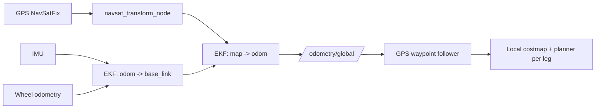

# Mastering ROS : RB-Vogui+ — Unit 1 Part 2: Outdoor navigation and waypoints

Part 1 relied on a lidar map and walls to localize against — outdoors, RB-Vogui+ often has neither. This unit covers the outdoor-navigation half of the platform's dual indoor/outdoor design: fusing GPS into a global localization estimate, and following a sequence of GPS waypoints instead of a single map-frame goal.

The diagram below shows how GPS, IMU, and odometry data flow through the two EKF stages into the global estimate that the waypoint follower consumes.



## Why outdoor navigation is a different problem

Indoors, AMCL matches lidar returns against a static map to correct drift. Outdoors, open fields and roads give the lidar little to match against, maps are impractical to maintain at scale, and GPS becomes the primary source of *global* position instead. But GPS alone is noisy and updates slowly (often 1–10 Hz, with meter-level jitter), so it's fused with the *high-rate, locally-accurate* sensors (wheel odometry, IMU) rather than used on its own. That fusion is the core new idea in this unit — everything else (costmaps, the planner, `cmd_vel`) is the same machinery as Part 1.

## Fusing GPS, IMU, and odometry

The standard approach is an Extended Kalman Filter node — `robot_localization`'s `ekf_node` fuses odometry and IMU into a smooth, continuous `odom -> base_link` estimate, while `navsat_transform_node` converts raw GPS fixes (in lat/lon) into the same local Cartesian frame so a second EKF instance can fuse *that* into a global, drift-free `map -> odom` estimate:

```yaml
# navsat_transform_node
navsat_transform:
  ros__parameters:
    frequency: 10.0
    magnetic_declination_radians: 0.0
    yaw_offset: 1.5707963  # if GPS heading and IMU heading conventions differ, correct here
    zero_altitude: true
    publish_filtered_gps: true
```

```bash
ros2 launch robotnik_localization outdoor_localization.launch.py
ros2 topic echo /gps/filtered            # fused, filtered GPS in a sane frame
ros2 topic echo /odometry/global         # the map-frame estimate Nav2 will consume
```

The practical failure mode to watch for: if the IMU's yaw convention or mounting orientation doesn't match what `navsat_transform_node` expects, the fused heading will be rotated by a fixed offset and the robot will confidently drive in the wrong direction while believing it's on course — always sanity-check `/odometry/global`'s heading against the robot's actual heading before trusting it.

## Coordinate frames: latitude/longitude vs. UTM vs. map

GPS fixes come in as `sensor_msgs/NavSatFix` (latitude, longitude, altitude) — not directly usable by a planner that reasons in Cartesian meters. `navsat_transform_node` projects these into UTM (Universal Transverse Mercator) coordinates and aligns them with the robot's local `map` frame, using the robot's starting fix as the datum. Keep this pipeline in mind whenever you're debugging "the robot thinks it's somewhere impossible": it's almost always a datum/frame mismatch rather than a bad GPS fix.

## Following GPS waypoints

Outdoor missions are usually specified as a sequence of GPS coordinates rather than one map-frame goal. Nav2's waypoint follower (or the GPS-flavored variant, `nav2_gps_waypoint_follower`) takes a list of `NavSatFix`-style waypoints and drives the robot through them in order, running the full local planner and costmap at each leg:

```python
from nav2_simple_commander.robot_navigator import BasicNavigator
from geographic_msgs.msg import GeoPose

nav = BasicNavigator()
nav.waitUntilNav2Active(localizer='robot_localization')

waypoints = [
    GeoPose(position={'latitude': 41.3874, 'longitude': 2.1686, 'altitude': 0.0}),
    GeoPose(position={'latitude': 41.3879, 'longitude': 2.1690, 'altitude': 0.0}),
]
nav.followGpsWaypoints(waypoints)
while not nav.isTaskComplete():
    print(nav.getFeedback())
```

Between waypoints the robot still needs local obstacle avoidance — a costmap built from live lidar/camera data, exactly as indoors, just without a static map layer since there isn't one outdoors.

## Practical outdoor considerations

A few things that don't come up indoors: GPS accuracy degrades near buildings and tree cover (multipath and signal loss), so budget for waypoint tolerances wider than you'd accept indoors; uneven terrain affects wheel odometry's accuracy more than smooth indoor floors do, which is part of why the IMU carries more weight in outdoor fusion; and losing the emergency-stop line of sight matters more outdoors, where the robot may be farther from the operator than indoors.

## Try it yourself

With `robot_localization` and `navsat_transform_node` running, log `/odometry/global` while walking the robot (teleop) in an "L" shape outdoors, and compare the estimated path shape and heading against what you actually did — if the corner angle looks wrong, that's your cue to check the IMU yaw offset before touching anything else in the stack.
