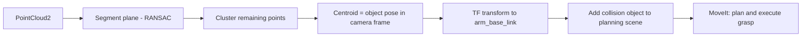

# Mastering ROS : RB-Vogui+ — Unit 2: Grasping and perception

RB-Vogui+'s payload deck is built to carry a manipulator arm, and this unit is where navigation stops being the whole story: the robot needs to see an object, work out where it is in space, and use MoveIt to actually pick it up. This unit connects perception output to MoveIt input, the same seam that shows up in any mobile-manipulation task.

The diagram below traces that seam end to end, from raw point cloud to an executed MoveIt grasp.



## The perception pipeline: from pointcloud to object pose

An RGB-D camera mounted on or near the manipulator gives you two useful streams: a color image for detection/classification, and a depth image (or a combined `sensor_msgs/PointCloud2`) for the 3D geometry. A minimal but complete pipeline looks like:

```bash
ros2 topic list | grep -E 'camera|points'
ros2 run rqt_image_view rqt_image_view          # sanity-check the color stream
ros2 run rviz2 rviz2                             # add a PointCloud2 display, confirm it looks like the scene
```

For a known object on a mostly-flat surface, a practical first pass is: segment the point cloud to remove the dominant plane (the table/deck the object sits on), cluster what's left, and take the centroid of the largest cluster as your candidate grasp target. `pcl_ros`/PCL's `SACSegmentation` (plane fitting via RANSAC) and Euclidean cluster extraction cover this without needing a trained model:

```python
import pcl

def find_object_centroid(cloud):
    seg = cloud.make_segmenter()
    seg.set_model_type(pcl.SACMODEL_PLANE)
    seg.set_method_type(pcl.SAC_RANSAC)
    seg.set_distance_threshold(0.01)
    inliers, _ = seg.segment()
    remaining = cloud.extract(inliers, negative=True)   # everything above the table
    return remaining.to_array().mean(axis=0)             # centroid in the camera frame
```

If the object set is more varied, swap the plane-fit-and-cluster step for a trained 2D detector (as covered in perception-focused courses elsewhere in this repo) and deproject its bounding box center using the camera's depth and intrinsics instead — the rest of this pipeline is identical either way.

## Getting the target into the arm's planning frame

A centroid computed above is in the camera's optical frame, not a frame MoveIt's planner reasons in. Transform it through TF before it's usable — this is exactly why an accurate camera-to-arm static transform (published by `robot_state_publisher` from the URDF, or a hand-eye calibration if the camera isn't rigidly fixed relative to the arm base) matters:

```python
from tf2_geometry_msgs import do_transform_pose
from geometry_msgs.msg import PoseStamped

transform = tf_buffer.lookup_transform(
    'arm_base_link', 'camera_color_optical_frame', rclpy.time.Time())
object_pose_in_arm_frame = do_transform_pose(camera_frame_pose, transform)
```

Every downstream grasp is only as accurate as this transform — if grasps are consistently offset in one direction, recheck the calibration before suspecting the planner.

## Planning the grasp with MoveIt

MoveIt reasons about the world through a **planning scene** — the robot's own links plus any collision objects you tell it about. Add the detected object (and, importantly, the table/deck it's sitting on) as collision objects so the planner won't try to plough through them on the way to the grasp:

```python
from moveit_msgs.msg import CollisionObject
from shape_msgs.msg import SolidPrimitive

obj = CollisionObject()
obj.id = 'target_object'
obj.header.frame_id = 'arm_base_link'
primitive = SolidPrimitive(type=SolidPrimitive.BOX, dimensions=[0.05, 0.05, 0.1])
obj.primitives.append(primitive)
obj.primitive_poses.append(object_pose_in_arm_frame.pose)
obj.operation = CollisionObject.ADD
planning_scene_interface.apply_collision_object(obj)
```

Then set the pose target (usually offset slightly above the object as a pre-grasp pose, then a second, lower pose for the actual grasp) and plan/execute through `MoveGroupInterface`, exactly as in any other MoveIt program.

## A full pick sequence

Grasping is rarely one motion — it's a short state machine: move to a pre-grasp pose above the object, open the gripper, descend to the grasp pose, close the gripper, then retreat back to the pre-grasp pose (now carrying the object) before planning the next motion. Executing these as four discrete `MoveGroupInterface` calls, checking the return code of each before proceeding to the next, is far easier to debug than trying to plan the whole sequence as one Cartesian path — start there before trying to smooth it into a single trajectory.

## Try it yourself

Place a single object on a flat surface in front of RB-Vogui+'s camera, run the plane-segmentation-and-centroid pipeline, transform the resulting pose into the arm's planning frame, and use `ros2 topic echo` on the published pose while nudging the object to confirm the coordinates track it correctly before you ever let MoveIt attempt to plan a grasp toward it.
