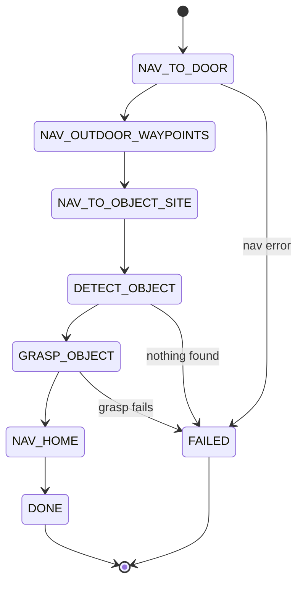

# Mastering ROS : RB-Vogui+ — Unit Project

Every previous unit exercised one capability in isolation — teleop, indoor navigation, outdoor GPS navigation, and grasping. This closing unit asks you to string them into a single mission, which is where the integration bugs (frame mismatches, timing assumptions, state-machine edge cases) that individual units hide tend to surface.

The state diagram below mirrors the `MissionState` enum, showing the mission's happy path alongside the failure transitions each stage must handle.



## The brief

Build a "fetch" mission end to end: RB-Vogui+ starts indoors, navigates out through a door to an outdoor waypoint, then to a second location where an object is placed on a surface within reach of its camera and arm, picks the object up, and returns to its start pose. Each leg reuses a unit you've already built — nothing here should require new navigation or perception techniques, only wiring what exists together and handling the handoffs between stages.

## Architecture: a small state machine

Resist the temptation to write one long script that does everything sequentially with no error handling — a short explicit state machine is both easier to debug and easier to extend:

```python
from enum import Enum, auto

class MissionState(Enum):
    NAV_TO_DOOR = auto()
    NAV_OUTDOOR_WAYPOINTS = auto()
    NAV_TO_OBJECT_SITE = auto()
    DETECT_OBJECT = auto()
    GRASP_OBJECT = auto()
    NAV_HOME = auto()
    DONE = auto()
    FAILED = auto()

state = MissionState.NAV_TO_DOOR
while state not in (MissionState.DONE, MissionState.FAILED):
    state = run_state(state)   # each handler returns the next state, or FAILED
```

Each `run_state` call is essentially one thing you already built: `NAV_TO_DOOR` and `NAV_TO_OBJECT_SITE` call the Nav2 `goToPose` pattern from Unit 1 Part 1, `NAV_OUTDOOR_WAYPOINTS` calls `followGpsWaypoints` from Unit 1 Part 2, and `DETECT_OBJECT`/`GRASP_OBJECT` call the perception-to-MoveIt pipeline from Unit 2.

## The handoffs are where it gets interesting

The individual capabilities are proven; the seams between them are what this project actually tests:

- **Indoor-to-outdoor localization handoff**: does your outdoor GPS-fused estimate agree with where AMCL thought the robot was at the door? A large jump at this transition means your indoor map's origin and your GPS datum aren't consistently aligned — worth checking before the mission ever runs, not after it fails.
- **Arrival tolerance vs. camera field of view**: Nav2 considers a goal "reached" within some position/orientation tolerance — is that tolerance tight enough that the object is reliably still inside the camera's field of view when `DETECT_OBJECT` starts running?
- **Failure handling**: what should happen if `DETECT_OBJECT` finds nothing? A real mission retries with a small repositioning move before giving up, not an infinite loop or a silent crash.

## Suggested milestones

Build and verify in stages rather than attempting the full loop first:

1. Chain just the two navigation legs (indoor door → outdoor waypoints → object site) and confirm the robot arrives at each with a sane, expected pose.
2. Add detection at the final site as a standalone check — log the detected pose without attempting a grasp yet.
3. Add the grasp sequence, tested with the robot already stationary at the object site (skip navigation while iterating on this part).
4. Only then wire all stages together and run the full mission, ideally with a person near the e-stop for the first few attempts.

## Try it yourself

Implement the state machine above with stub handlers that just print their name and return the next state, run it end to end to confirm the control flow is correct, then replace one handler at a time with real navigation/perception/grasp code from the earlier units — verifying the mission still completes after each swap before moving to the next.
