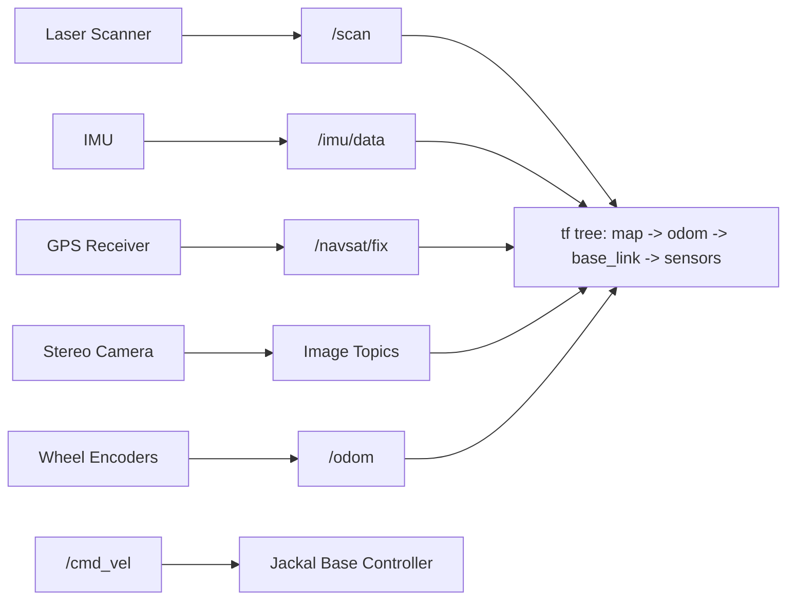

# Mastering with ROS: Jackal — Unit 1: Unit 0: Introducing ClearPath Jackal Robot

This opening unit gets you oriented on the Jackal itself before you write a single line of navigation or perception code — the sensor suite, the coordinate frames, and the safe way to drive it are the foundation everything later in the course builds on.

The diagram below shows how each onboard sensor feeds its own ROS topic, together forming the interface surface that every later unit in this course reads from.



## The Jackal Platform: Chassis and Sensors

Jackal is a compact, skid-steer, four-wheel-drive unmanned ground vehicle (UGV) built by Clearpath Robotics for outdoor and indoor research use. Under the hood it's a differential-drive robot even though it has four wheels — the left pair and right pair are mechanically coupled, so from a control standpoint it behaves exactly like a two-wheeled diff-drive base: you command it with a linear x velocity and an angular z velocity, and the onboard motor controller handles wheel-level details.

A typical Jackal sensor payload for this course includes:
- A planar **laser scanner** (e.g. a SICK or Hokuyo LIDAR) mounted low on the chassis for 2D obstacle detection and SLAM.
- An **IMU** for orientation and angular velocity, fused into odometry.
- A **GPS receiver** for outdoor global positioning.
- An **RGB stereo camera** for person detection and depth/point-cloud generation.
- Wheel encoders feeding a base **odometry** estimate.

Knowing which sensor answers which question is half the battle: the laser tells you "what's near me right now," the camera tells you "what does that near thing look like," the IMU and encoders tell you "how have I moved," and GPS tells you "where am I in the world."

## ROS Interfaces: Topics, TFs, and the URDF

Everything you do on Jackal is mediated through a small set of standard interfaces:
- `/cmd_vel` — a `Twist` message you publish to drive the robot.
- `/odom` — local odometry published by the base driver.
- `/scan` — `LaserScan` messages from the onboard LIDAR.
- `/imu/data` — orientation and angular velocity.
- `/navsat/fix` (or similar) — raw GPS fixes.
- A `tf` tree connecting `map` → `odom` → `base_link` → sensor frames (`laser`, `camera_link`, `imu_link`, ...).

Inspect the robot's kinematic structure any time with the standard CLI tools:

```bash
# list what's currently flowing
ros2 topic list
ros2 topic echo /odom --once

# ROS 1 equivalents, if that's what your Jackal stack targets
rostopic list
rostopic echo /odom -n 1
```

The physical layout — where the laser sits relative to `base_link`, how tall the chassis is, where the camera points — lives in the robot's URDF/Xacro description. Pull it up and visualize the frame tree before you trust any sensor data:

```bash
ros2 run tf2_tools view_frames      # writes frames.pdf
# or, ROS 1:
rosrun tf view_frames
```

## Simulation First, Hardware Second

You will do most of this course's development in simulation before touching the real chassis — it's faster to iterate and there's no risk of driving a 17 kg robot into a wall. Bring up the simulated Jackal with its standard world and confirm the topics above are alive:

```bash
ros2 launch jackal_gazebo jackal_world.launch.py
ros2 topic hz /scan
```

Only after your code behaves correctly in simulation should you point it at the real robot's network namespace or IP address. The topic and TF contracts are identical in both cases — that's the whole point of developing against the interface rather than the hardware.

## Safety and Operating Basics

Two habits will save you real damage later in the course: always keep a hand near a physical or software e-stop when testing on hardware, and always cap `/cmd_vel` velocities in your own code rather than trusting downstream limits alone. A stray `linear.x = 5.0` from a bug in your patrol script is a very different problem in simulation than it is with a real motor controller driving a real chassis.

## Try it yourself

Bring up the simulated Jackal, teleoperate it with your keyboard, and use `ros2 topic echo` (or `rostopic echo`) to answer: how fast does `/odom` update relative to `/scan`? Note the two rates and think about what that implies for how often you can safely check "is something in front of me" inside a control loop.
