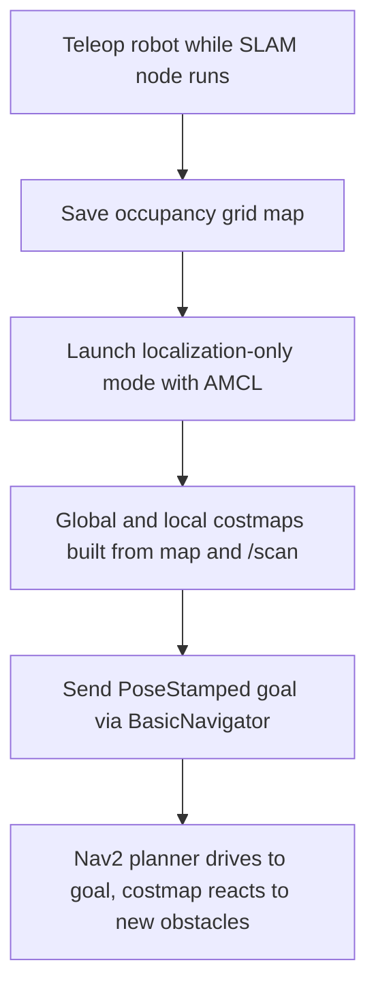

# Mastering with ROS: Jackal — Unit 2: Unit 1: Navigation Indoor

With the platform basics out of the way, this unit builds Jackal's first real autonomous behavior: mapping an indoor space with its own laser scanner, localizing inside that map, and sending it goals it plans and drives to on its own.

The diagram below traces the indoor navigation pipeline from mapping through to an executed navigation goal.



## Building a Map with SLAM

Simultaneous Localization and Mapping (SLAM) lets Jackal build an occupancy grid of a room while simultaneously estimating its own pose within that grid, using nothing but the laser scan and odometry. Bring up a SLAM node against the live robot or simulation and drive it around the space you want mapped:

```bash
ros2 launch slam_toolbox online_async_launch.py
# in another terminal, drive the robot around manually
ros2 run teleop_twist_keyboard teleop_twist_keyboard
```

Cover every room and corridor at a modest speed — fast turns and sparse coverage both produce a map full of ghosting and gaps. Once it looks clean in RViz, save it:

```bash
ros2 run nav2_map_server map_saver_cli -f ~/maps/office
```

(The ROS 1 equivalent workflow is `gmapping` for the mapping node and `map_server`'s `map_saver` for persisting the result — the concepts are identical.)

## Costmaps: Turning Sensor Data into Drivable Space

The navigation stack doesn't plan directly on raw laser scans — it builds **costmaps**, layered grids that combine a static map, live obstacle observations, and an inflation buffer that keeps the robot's footprint away from walls:

```yaml
local_costmap:
  local_costmap:
    ros__parameters:
      global_frame: odom
      robot_base_frame: base_link
      resolution: 0.05
      plugins: ["obstacle_layer", "inflation_layer"]
      obstacle_layer:
        observation_sources: scan
        scan:
          topic: /scan
          data_type: "LaserScan"
      inflation_layer:
        inflation_radius: 0.4
```

The **global costmap** covers the whole known map and drives long-range path planning; the **local costmap** is a small rolling window around the robot used for reactive obstacle avoidance. Tuning `inflation_radius` is the single highest-leverage knob for how cautiously Jackal hugs walls versus how narrow a gap it's willing to squeeze through.

## Localizing with AMCL

Once you have a saved map, Jackal no longer needs to build one — it needs to figure out where it is *within* it. AMCL (Adaptive Monte Carlo Localization) does this with a particle filter: it scatters pose hypotheses, weights each one by how well the current laser scan matches the map from that hypothesis, and resamples toward the best matches over time.

```bash
ros2 launch nav2_bringup localization_launch.py map:=$HOME/maps/office.yaml
ros2 topic echo /amcl_pose --once
```

Give AMCL a rough starting pose first (RViz's "2D Pose Estimate" tool, or the equivalent `initialpose` topic publish) — without it, the particle cloud has to disambiguate a symmetric-looking room from scratch, which can take a while or converge to the wrong spot entirely.

## Sending and Monitoring Navigation Goals

With a map and localization running, you can hand off actual driving to the planner instead of teleoperating:

```python
from nav2_simple_commander.robot_navigator import BasicNavigator
from geometry_msgs.msg import PoseStamped

nav = BasicNavigator()
goal = PoseStamped()
goal.header.frame_id = 'map'
goal.pose.position.x = 2.0
goal.pose.position.y = 1.0
goal.pose.orientation.w = 1.0

nav.goToPose(goal)
while not nav.isTaskComplete():
    feedback = nav.getFeedback()
result = nav.getResult()
```

This pattern — build a `PoseStamped` goal in the `map` frame, hand it to the navigation action interface, poll for completion — is the building block every later unit in this course reuses, from GPS waypoints to the final patrol project.

## Try it yourself

Map a small room with SLAM, save it, then relaunch with localization only and send Jackal to two goals on opposite sides of the room. While it's mid-route, place an obstacle (a box, a chair) in its path and watch how the local costmap forces a re-plan around it without needing a new map.
