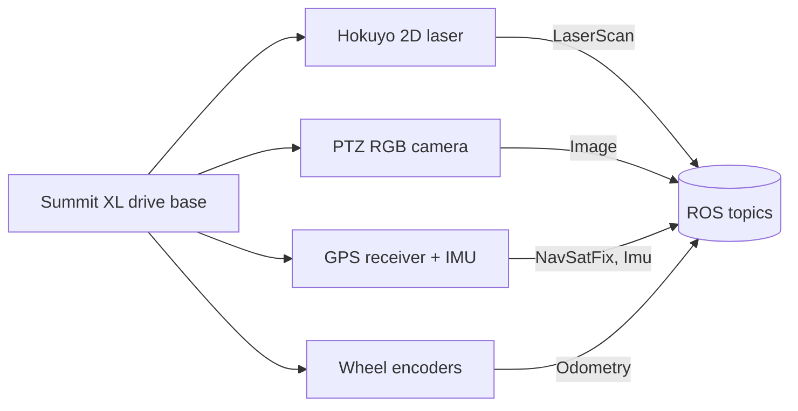

# Mastering with ROS: SUMMIT XL — Unit 0: Robotniks Summit XL platform

This unit introduces the Summit XL, the Robotnik mobile robot you'll work with for the rest of the course, its sensor suite, and how to drive it by hand in simulation before any autonomy is layered on top.

The diagram below shows how each sensor on the base feeds a distinct ROS topic that later units build on.



## The platform itself

The Summit XL is a mid-size, rugged mobile base built by Robotnik for both indoor and outdoor use — the trait that shapes this whole course, since Units 1 and 2 give you two different navigation stacks for the two environments. The stock configuration is a four-wheel skid-steer differential drive (turn by spinning the left and right wheel pairs at different speeds, like a small tank); some Summit XL variants (e.g. the Steel/HL line) swap in Mecanum wheels for true omnidirectional motion, so always check which drive geometry your specific robot description uses before assuming holonomic strafing works.

Two things make this robot a good fit for the "detect and patrol" theme of the course: it's large enough to carry a real sensor payload (laser, PTZ camera, GPS/IMU) without you fighting weight budgets, and Robotnik ships first-party ROS packages for it, so you're learning patterns that transfer directly to the real hardware, not just a toy simulation.

## Sensor suite you'll use all course

- **Hokuyo 2D laser scanner** — a spinning-mirror rangefinder mounted near the base, publishing `sensor_msgs/LaserScan`. It drives obstacle avoidance and indoor SLAM in Unit 1, and doubles as a cheap person detector (via leg-pair clustering) in Unit 3.
- **PTZ RGB camera** — pan-tilt-zoom color camera, publishing `sensor_msgs/Image`. Used for visual person detection and recognition in Unit 3; the pan/tilt axes let you sweep a wider field of view than a fixed camera without moving the whole robot.
- **GPS receiver + IMU** — needed for outdoor localization in Unit 2, since laser-based SLAM doesn't scale to open outdoor areas.
- **Wheel encoders** — feed odometry (`nav_msgs/Odometry`), fused with the IMU (and later GPS) to keep a continuous pose estimate as the robot moves.

## Package layout and launching the simulation

Robotnik-style packages generally split into a robot description package (URDF/xacro model), a Gazebo bring-up package (worlds, spawn logic), and a control/teleop package. The exact package names vary by ROS distro and by which Summit XL variant you're simulating, so treat this as the shape to expect rather than a literal command to copy-paste:

```bash
# Bring up the robot in a simulated world (package name depends on your install)
ros2 launch summit_xl_sim summit_xl_complete.launch.py

# Drive it by hand from the terminal
ros2 run teleop_twist_keyboard teleop_twist_keyboard --ros-args -r cmd_vel:=/summit_xl/cmd_vel
```

Once it's running, get oriented before writing a single line of navigation code:

```bash
ros2 topic list                       # confirm /front_laser/scan, /ptz_camera/image_raw, /odom exist
ros2 topic hz /front_laser/scan       # sanity-check the laser is actually publishing
ros2 run tf2_tools view_frames        # (or rqt_tf_tree) — see how base_link, laser, camera link up
```

If topic names differ from what a tutorial expects, `ros2 topic list` and `ros2 node list` are your fastest way to find the real names on your specific install — don't assume every Summit XL package uses identical namespacing.

## Try it yourself

Launch the simulation, drive the robot with the keyboard teleop node into a wall and back off again, and confirm three things with CLI tools: the laser scan range drops as you approach the wall, `/odom` updates while you move, and the TF tree shows a chain from `map` (or `odom`) down through `base_link` to your laser and camera frames. Write down the exact topic and frame names you found — you'll need them in Unit 1.
