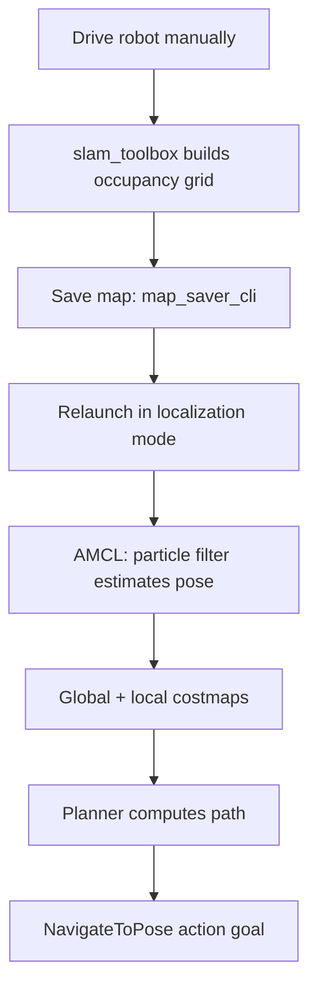

# Mastering with ROS: SUMMIT XL — Unit 1: Set Indoor Navigation Stack

With the platform and sensors covered in Unit 0, this unit turns the Hokuyo laser into a full indoor navigation stack: building a map of a space, localizing the robot inside it, and sending it to goals autonomously.

The diagram below traces the full pipeline from mapping through to an executed navigation goal.



## Building a map with SLAM

Indoors, walls and furniture give the laser plenty of stable features to map against, which is exactly what Simultaneous Localization and Mapping (SLAM) needs. Drive the robot around the space (teleop is fine) while a SLAM node — `slam_toolbox` is the standard modern choice, `gmapping` the older ROS 1 equivalent — builds an occupancy grid from the incoming `LaserScan` and odometry:

```bash
ros2 launch slam_toolbox online_async_launch.py
# drive the robot around every room/corridor you want mapped, then:
ros2 run nav2_map_server map_saver_cli -f my_indoor_map
```

Cover every area you'll navigate later, and close loops where possible (revisit an already-mapped corridor from a different direction) — SLAM uses that overlap to correct accumulated drift. The saved map is a `.pgm` image plus a `.yaml` file describing resolution and origin; both are inputs to the next step.

## Localization against a saved map

Once you have a map, you switch from SLAM to pure localization: the robot no longer edits the map, it just estimates where it is inside the fixed one using **AMCL** (Adaptive Monte Carlo Localization), a particle filter that scores candidate poses against how well the current laser scan matches the map at that pose.

```bash
ros2 launch nav2_bringup localization_launch.py map:=my_indoor_map.yaml
```

AMCL needs a rough starting pose before it converges — publish an initial pose estimate (the "2D Pose Estimate" tool in RViz does this, or publish to `/initialpose` directly) roughly where the robot actually is, then drive it a short distance; the scattered particle cloud should collapse onto the robot's real pose within a few meters of movement.

## The navigation stack: costmaps and planners

The navigation stack (Nav2 in ROS 2, `move_base` in ROS 1) sits on top of the map and the localized pose. Two costmaps do the heavy lifting:

- **Global costmap** — the full map, inflated so cells near obstacles cost more, used by the global planner to find a path across the whole environment.
- **Local costmap** — a small rolling window around the robot, updated live from the laser, used by the local planner/controller to dodge obstacles the static map doesn't know about (a chair someone left in the hallway).

You configure both mostly through inflation radius and robot footprint parameters — get the footprint right (match the Summit XL's real dimensions) or the planner will either clip corners or refuse paths that are actually wide enough.

## Sending navigation goals

With localization and costmaps live, sending a goal is a single action call:

```bash
ros2 action send_goal /navigate_to_pose nav2_msgs/action/NavigateToPose \
  "{pose: {header: {frame_id: 'map'}, pose: {position: {x: 2.0, y: 1.0}}}}"
```

Or from RViz, the "Nav2 Goal" tool click-and-drag publishes the same action goal. Watch the planned global path appear, and the robot should follow it while swerving around anything the local costmap picks up that wasn't on the original map.

## Try it yourself

Map a small indoor space (a couple of rooms and a connecting corridor), save it, relaunch in localization mode, and send three sequential navigation goals — one per room plus one back to the start — confirming the robot replans around at least one obstacle you place after the map was built.
