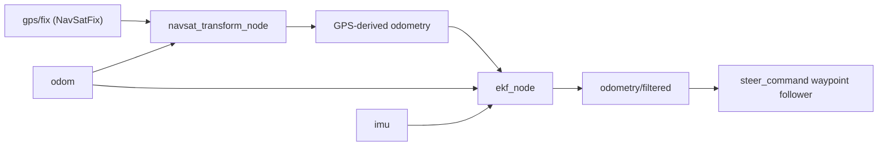

# Mastering with ROS: SUMMIT XL — Unit 2: Set Outdoors Navigation

The indoor stack from Unit 1 leans entirely on laser-matched features against a fixed map. Outdoors, that assumption breaks down — this unit swaps in GPS-based localization and a waypoint follower suited to open ground.

The diagram below shows how GPS, odometry, and IMU data flow through `robot_localization` into the single filtered pose everything else consumes.



## Why the indoor stack doesn't transfer outdoors

Laser SLAM depends on the environment having stable, nearby geometric features to match scans against: walls, doorframes, furniture. A parking lot, a field, or a long straight fence line gives the laser almost nothing distinctive to lock onto, and outdoor spaces are typically far larger than any pre-built occupancy grid you'd want to maintain. What outdoor spaces *do* offer that indoor ones (usually) don't is a GPS signal, so the outdoor stack replaces "match the laser to a stored map" with "read your absolute position off satellites and fuse it with odometry."

## Reading GPS in ROS

A GPS receiver publishes `sensor_msgs/NavSatFix` — latitude, longitude, altitude, plus a status and covariance:

```bash
ros2 topic echo /gps/fix
```

Two fields matter more than the coordinates themselves: `status.status` (a negative value means no valid fix — don't trust the position when this happens) and `position_covariance` (the receiver's own uncertainty; a consumer-grade GPS can easily be off by several meters, so treat it as a confidence signal, not ground truth).

## Converting to a local frame and fusing with odometry

Lat/lon is the wrong coordinate system for path-following math — a degree of longitude covers a different physical distance depending on latitude. The standard fix is projecting into a local flat frame (UTM or a local ENU frame anchored at your start point), and the standard ROS tool for it is the `robot_localization` package's `navsat_transform_node`, which converts GPS fixes plus odometry/IMU into a local-frame odometry estimate — you rarely hand-roll this conversion yourself.

From there, `robot_localization`'s `ekf_node` fuses that GPS-derived odometry with wheel odometry and the IMU through an extended Kalman filter, giving you one smooth, drift-corrected pose estimate rather than three noisy independent ones:

```
/gps/fix ──► navsat_transform_node ──► GPS-derived odometry
/odom, /imu ─────────────────────────► ekf_node ──► /odometry/filtered
```

Everything downstream (waypoint following, later the patrol logic in Unit 4) should subscribe to `/odometry/filtered`, not raw GPS or raw wheel odometry alone.

## Following a GPS waypoint

With a reliable local position, steering toward a target point is ordinary bearing-and-distance geometry:

```python
import math

def bearing_and_distance(x, y, target_x, target_y):
    dx, dy = target_x - x, target_y - y
    return math.atan2(dy, dx), math.hypot(dx, dy)

def steer_command(current_yaw, bearing, distance, arrival_tolerance=1.0):
    if distance < arrival_tolerance:
        return 0.0, 0.0  # arrived: stop
    heading_error = math.atan2(math.sin(bearing - current_yaw),
                                math.cos(bearing - current_yaw))
    linear = min(1.0, distance)      # slow down as you approach
    angular = 1.5 * heading_error    # proportional steering toward the bearing
    return linear, angular
```

This is intentionally minimal — no obstacle awareness yet (that arrives in Unit 3) — but it's the core loop the patrol project in Unit 4 builds on when moving between outdoor waypoints.

## Try it yourself

Set up `navsat_transform_node` and `ekf_node` against the Summit XL's simulated GPS and odometry, confirm `/odometry/filtered` publishes a stable pose while driving, then wire the `steer_command` loop above to a hard-coded target GPS-derived position a few meters away and confirm the robot turns to face it and stops within tolerance.
