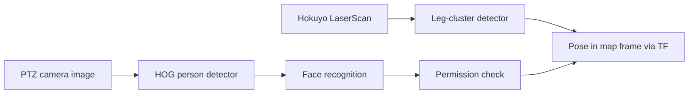

# Mastering with ROS: SUMMIT XL — Unit 3: Detect and localise person

Navigation gets the robot moving; this unit gives it a reason to react to what it finds. You'll detect people with two independent sensors — laser and camera — recognize who they are, and turn a detection into a pose the robot can act on.

The diagram below shows how the two independent sensor pipelines both converge on a single localized, permission-checked pose.



## Detecting legs in the laser scan

A 2D laser scan sees people as a pair of small, roughly circular clusters near leg-width apart, moving relative to the static background. A simple leg detector doesn't need machine learning — it's a clustering pass over the scan:

```python
def find_leg_clusters(ranges, angle_min, angle_increment,
                       max_gap=0.05, min_width=0.05, max_width=0.25):
    clusters, current = [], []
    for i, r in enumerate(ranges):
        if current and abs(r - ranges[i - 1]) > max_gap:
            clusters.append(current)
            current = []
        current.append((i, r))
    if current:
        clusters.append(current)

    legs = []
    for cluster in clusters:
        width = len(cluster) * angle_increment * cluster[0][1]  # arc length approx.
        if min_width < width < max_width:
            legs.append(cluster)
    return legs
```

This is deliberately simple and will false-positive on chair legs and bins — good enough as a fast, low-cost first-pass detector, not as your only signal. That's why the camera detector below exists as a second, independent check.

## Detecting people in the PTZ camera image

The PTZ camera gives you appearance information the laser can't: shape, color, texture. A classic and still-reasonable baseline is OpenCV's built-in HOG (Histogram of Oriented Gradients) person detector, which needs no training of your own:

```python
import cv2

hog = cv2.HOGDescriptor()
hog.setSVMDetector(cv2.HOGDescriptor_getDefaultPeopleDetector())

def detect_people(frame):
    boxes, weights = hog.detectMultiScale(frame, winStride=(8, 8), scale=1.05)
    return boxes  # list of (x, y, w, h) bounding boxes
```

For better accuracy you'd swap this for a modern DNN-based detector, but HOG is enough to learn the pipeline: subscribe to the camera topic, run detection per frame, and use the PTZ's pan/tilt to sweep a wider area than the camera's fixed field of view covers in one shot. See docs.opencv.org for the full detector API and alternatives.

## Recognizing a person and checking permission

Detection answers "is there a person here?"; recognition answers "who is this, and are they allowed to be here?" A practical approach layers on top of detection: crop the detected bounding box, run a face-recognition embedding model against a small database of known/authorized faces, and compare the result to a similarity threshold. Keep the permission check as a simple lookup, separate from the recognition model itself:

```python
def check_permission(identity, authorized_ids):
    return identity in authorized_ids

# pipeline: detect_people(frame) -> crop -> recognize_face(crop) -> check_permission(...)
```

Treat an unrecognized face and a "recognized but not authorized" face as two different outcomes in your patrol logic (Unit 4) — the first might just mean poor lighting or a new visitor, the second is a stronger signal.

## Localising a detection

A bounding box in an image, or a laser cluster in scan coordinates, is only useful once it's a pose the robot can navigate toward or record. For the laser, that's direct: the cluster's range and bearing, transformed from the laser frame into `map` via TF, gives you an (x, y) position immediately. For the camera, you need either a known ground-plane assumption (project the base of the bounding box onto the floor plane using the camera's known height and tilt) or a depth source if the camera provides one; either way the result should end up as a `geometry_msgs/PoseStamped` in the `map` frame so it's directly comparable to laser detections and waypoints.

```bash
ros2 run tf2_ros tf2_echo map front_laser   # confirm the transform chain you need exists
```

## Try it yourself

Combine both detectors on a simulated person: log every laser leg-cluster detection and every camera person-detection as a `PoseStamped` in `map`, and check that the two independent detections of the same person land within a reasonable distance of each other — that agreement is what makes a two-sensor detector trustworthy.
