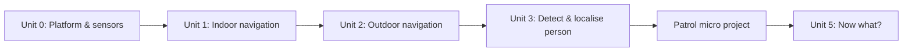

# Mastering with ROS: SUMMIT XL

This course teaches the basics of working with Robotnik's Summit XL mobile robot end to end: getting familiar with the platform and its sensor suite, building an indoor navigation stack that maps and localizes a space on its own, adding an outdoor navigation mode driven by GPS, detecting and recognizing people with both the laser and the PTZ camera, and finally combining all of it into a reactive patrol program that walks a route and responds when it finds someone. The units build in order — each one assumes the sensors, navigation stack, or detection pipeline from the ones before it — culminating in a patrol micro project you run yourself.

The diagram below shows how each unit's output becomes the next unit's input, from bare platform to finished patrol project.

1. [Unit 0: Robotniks Summit XL platform](01-unit-0-robotniks-summit-xl-platform.md) — The robot's drive base and sensor suite (laser, PTZ camera, GPS/IMU), and driving it manually in simulation.
2. [Unit 1: Set Indoor Navigation Stack](02-unit-1-set-indoor-navigation-stack.md) — Building a map with SLAM, localizing against it with AMCL, and sending autonomous navigation goals.
3. [Unit 2: Set Outdoors Navigation](03-unit-2-set-outdoors-navigation.md) — Reading GPS, fusing it with odometry via `robot_localization`, and following outdoor waypoints.
4. [Unit 3: Detect and localise person](04-unit-3-detect-and-localise-person.md) — Detecting people with the Hokuyo laser and the PTZ camera, recognizing identity, checking permissions, and localizing detections in the map frame.
5. [Patrole with Summit XL Micro Project](05-patrole-with-summit-xl-micro-project.md) — Combining navigation and detection into a patrol state machine that reacts to people it finds.
6. [I have finished, now what?](06-i-have-finished-now-what.md) — Where to go next: deeper navigation and perception, safety considerations, and turning the micro project into a portfolio piece.
