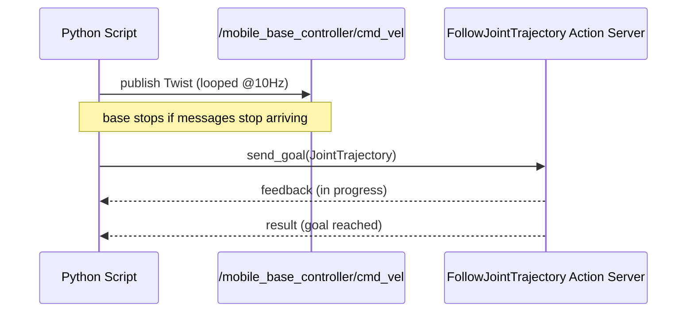

# Mastering with ROS: TIAGo - Melodic — Unit 2: Control

Now that you can identify TIAGo's subsystems, this unit makes them move. You'll drive the base with simple velocity commands, then move the torso, head, and arm through their trajectory controllers — the two fundamentally different control patterns you'll reuse for the rest of the course.

The sequence below contrasts the continuous velocity-publish loop that drives the base with the goal/feedback/result exchange used for torso, head, arm, and gripper trajectories.



## Driving the base

The base accepts velocity commands as a `geometry_msgs/Twist` on a `cmd_vel`-style topic. This is the simplest control interface on the whole robot: you publish a desired linear/angular velocity, and a low-level controller handles wheel speeds.

```bash
rostopic pub -1 /mobile_base_controller/cmd_vel geometry_msgs/Twist \
  '{linear: {x: 0.2, y: 0.0, z: 0.0}, angular: {x: 0.0, y: 0.0, z: 0.3}}'
```

In Python this becomes a tight publish loop rather than a one-shot call, since the controller expects a steady stream of commands (it will stop the robot if messages stop arriving):

```python
import rospy
from geometry_msgs.msg import Twist

rospy.init_node("tiago_base_nudge")
pub = rospy.Publisher("/mobile_base_controller/cmd_vel", Twist, queue_size=1)
rate = rospy.Rate(10)
cmd = Twist()
cmd.linear.x = 0.15
for _ in range(30):          # ~3 seconds of forward motion
    pub.publish(cmd)
    rate.sleep()
```

## Moving torso, head, and gripper via joint trajectories

Everything that isn't the base — torso, head, arm, gripper — is driven by a joint trajectory controller. Instead of a continuous velocity, you send a `trajectory_msgs/JointTrajectory` (directly, or via the `FollowJointTrajectory` action) specifying target joint positions and the time you want to reach them by.

```python
import rospy, actionlib
from control_msgs.msg import FollowJointTrajectoryAction, FollowJointTrajectoryGoal
from trajectory_msgs.msg import JointTrajectoryPoint

rospy.init_node("tiago_torso_up")
client = actionlib.SimpleActionClient(
    "/torso_controller/follow_joint_trajectory", FollowJointTrajectoryAction)
client.wait_for_server()

goal = FollowJointTrajectoryGoal()
goal.trajectory.joint_names = ["torso_lift_joint"]
point = JointTrajectoryPoint(positions=[0.30], time_from_start=rospy.Duration(2.0))
goal.trajectory.points.append(point)

client.send_goal(goal)
client.wait_for_result()
```

The same pattern — action name ending in `follow_joint_trajectory`, a list of joint names, a list of target points with timestamps — works for the head (`head_controller`), the arm (`arm_controller`), and the gripper (`gripper_controller`); only the joint names and sensible position ranges change.

## Reading joint state back

Every controller publishes its current state on `/joint_states` (`sensor_msgs/JointState`), which is how you close the loop and verify a command actually took effect, and how you seed planning with the robot's real current pose in later MoveIt units.

```bash
rostopic echo -n 1 /joint_states
```

## Try it yourself

Write a short script that reads the current torso height from `/joint_states`, then sends a `FollowJointTrajectory` goal that raises the torso by 10 cm relative to that reading. Confirm the change by echoing `/joint_states` again after the action completes.
