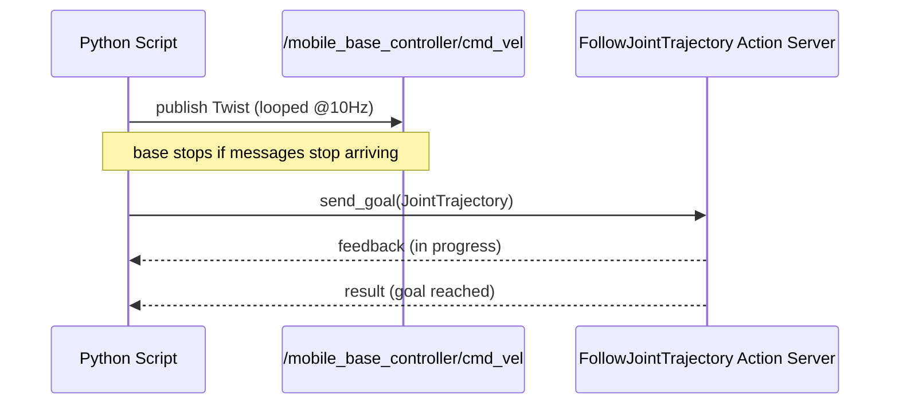

# Mastering with ROS: TIAGo - Melodic — Unit 2: Control

Now that you can identify TIAGo's subsystems, this unit makes them move. You'll drive the base with simple velocity commands, then move the torso, head, arm, and gripper through their trajectory controllers — the two control patterns you'll reuse for the rest of the course, through the `move_base` goals in Unit 3 and the MoveIt plans in Units 4–6.

The sequence below contrasts the continuous velocity-publish loop that drives the base with the goal/feedback/result exchange used for torso, head, arm, and gripper trajectories.



## Two control patterns, one robot

TIAGo's controllers split along one line: things that move continuously through open space (the base) are commanded with velocities, while things with joint limits and a need for coordinated multi-joint motion (torso, head, arm, gripper) are commanded with time-parameterized trajectories. A velocity interface is enough for the base because "how fast, in what direction, right now" is all that matters — there's no joint limit to violate. An arm, by contrast, has seven joints that must arrive together and within physical limits without the elbow sweeping through the torso — exactly what a `JointTrajectory` (joint names plus timestamped target points) is built to describe.

## Driving the base

The base accepts velocity commands as a `geometry_msgs/Twist` on a `cmd_vel`-style topic. This is the simplest control interface on the whole robot: you publish a desired linear/angular velocity, and a low-level controller handles wheel speeds.

```bash
rostopic pub -1 /mobile_base_controller/cmd_vel geometry_msgs/Twist \
  '{linear: {x: 0.2, y: 0.0, z: 0.0}, angular: {x: 0.0, y: 0.0, z: 0.3}}'
```

TIAGo's base is differential-drive, so in practice only `linear.x` (forward/backward) and `angular.z` (turn rate) have any effect — `linear.y` is accepted but ignored, since the base has no way to move sideways.

In Python this becomes a tight publish loop rather than a one-shot call, since the controller expects a steady stream of commands and will stop the robot if messages stop arriving — a safety behavior you want, since a crashed script shouldn't leave the robot rolling:

```python
import rospy
from geometry_msgs.msg import Twist

rospy.init_node("tiago_base_nudge")
pub = rospy.Publisher("/mobile_base_controller/cmd_vel", Twist, queue_size=1)
rate = rospy.Rate(10)
cmd = Twist()
cmd.linear.x = 0.15
for _ in range(30):          # ~3 seconds of forward motion
    pub.publish(cmd)
    rate.sleep()
```

## Finding the right controller and action names

Every controller here is managed by `ros_control`'s `controller_manager`, the same one queried in Unit 1. Before scripting against a new subsystem, list what's actually running rather than guessing at names:

```bash
rosservice call /controller_manager/list_controllers
```

This is where `torso_controller`, `head_controller`, `arm_controller`, and `gripper_controller` come from — each exposes a `.../follow_joint_trajectory` action built on the joint names that controller owns.

## Moving torso, head, and gripper via joint trajectories

Everything that isn't the base — torso, head, arm, gripper — is driven by a joint trajectory controller. Instead of a continuous velocity, you send a `trajectory_msgs/JointTrajectory` (directly, or via the `FollowJointTrajectory` action) specifying target joint positions and the time you want to reach them by.

```python
import rospy, actionlib
from control_msgs.msg import FollowJointTrajectoryAction, FollowJointTrajectoryGoal
from trajectory_msgs.msg import JointTrajectoryPoint

rospy.init_node("tiago_torso_up")
client = actionlib.SimpleActionClient(
    "/torso_controller/follow_joint_trajectory", FollowJointTrajectoryAction)
client.wait_for_server()

goal = FollowJointTrajectoryGoal()
goal.trajectory.joint_names = ["torso_lift_joint"]
point = JointTrajectoryPoint(positions=[0.30], time_from_start=rospy.Duration(2.0))
goal.trajectory.points.append(point)

client.send_goal(goal)
client.wait_for_result()
```

The same pattern — action name ending in `follow_joint_trajectory`, a list of joint names, a list of target points with timestamps — works for the head (`head_controller`), the arm (`arm_controller`), and the gripper (`gripper_controller`); only the joint names and position ranges change. The head is driven by two joints (pan and tilt), so a goal pointing it at a target supplies both:

```python
goal.trajectory.joint_names = ["head_1_joint", "head_2_joint"]
goal.trajectory.points.append(
    JointTrajectoryPoint(positions=[0.4, -0.3], time_from_start=rospy.Duration(1.5)))
```

`points` is a list, not a single value, because a trajectory can describe several waypoints in sequence, each with its own `time_from_start` — useful for smoothing a long motion instead of asking the controller for one abrupt jump. Give a target too little time relative to the distance it has to cover and the controller will reject the goal or execute it jerkily near the joint's velocity limits, so pad `time_from_start` generously while you're still getting a feel for a joint. Because this is an action rather than a fire-and-forget publish, you can also abort mid-flight with `client.cancel_goal()` if a `/joint_states` reading looks wrong.

## Reading joint state back

Every controller publishes its current state on `/joint_states` (`sensor_msgs/JointState`), which is how you verify a command actually took effect, and how you seed planning with the robot's real pose in later MoveIt units.

```bash
rostopic echo -n 1 /joint_states
```

The message holds parallel arrays — `name`, `position`, `velocity`, `effort` — so to read a specific joint's value in code you look up its index in `name` and read the same index out of `position`:

```python
msg = rospy.wait_for_message("/joint_states", JointState)
idx = msg.name.index("torso_lift_joint")
current_height = msg.position[idx]
```

## Try it yourself

Write a short script that reads the current torso height from `/joint_states`, then sends a `FollowJointTrajectory` goal that raises the torso by 10 cm relative to that reading. Confirm the change by echoing `/joint_states` again, then try a deliberately unreasonable `time_from_start` (e.g. 0.05 seconds) to see how the controller responds when asked to move too fast.
